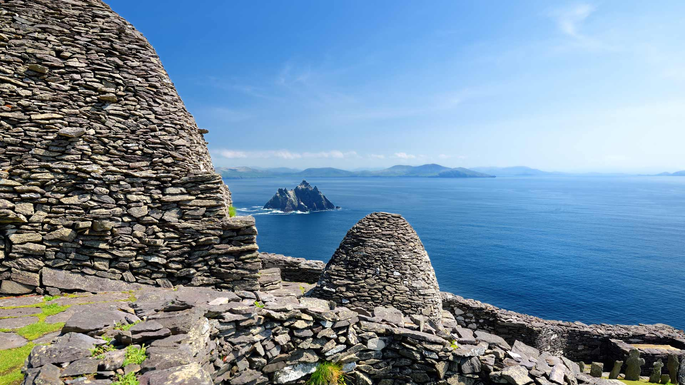
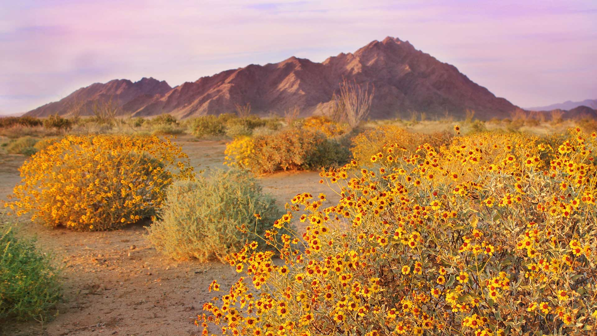

#### 20240507 Titan RT - Fußgänger-Hängebrücke über Rappbodetalsperre und Rappbode im Nationalpark Harz, Sachsen-Anhalt (© Sander Meertins/Getty Images)

#### 20240507 Heidelberg on the river Neckar in Baden-Württemberg, Germany (© Juergen Sack/Getty Images)

#### 20240507 一只小鸭子在水草地上游泳，萨福克郡，英国 (© Nick Hurst/Getty Images)

#### 20240507 ジョードプル, インド ラージャスターン州 (© cinoby/Getty Images)

#### 20240506 The Roaches, Peak District, England (© George W Johnson/Getty Images)

#### 20240505 Colonnade in San Miguel de Allende, Guanajuato, Mexico (© Mint Images/Getty Images)

#### 20240505 大歩危峡に泳ぐ鯉のぼり, 徳島県 (© fz750/Getty Images)

#### 20240504 Ruins of an ancient monastery on the island of Skellig Michael, Ireland (© MNStudio/Getty Images)

#### 20240503 Brittlebushes blooming in springtime, Sonoran Desert, Arizona (© Charles Harker/Getty Images)

#### 20240502 Blue Dragon Lava Flow, Craters of the Moon National Monument, Idaho (© Alan Majchrowicz/Getty Images)

#### 20240501 和束町の茶畑, 京都府 (© Tuul & Bruno Morandi/Getty Images)

#### 20240501 Weg durch den Gespensterwald bei Sonnenaufgang, Nienhagen, Mecklenburg-Vorpommern (© Martin Ruegner/Getty Images)

#### 20240501 Hawaiian lei flower garlands (© Jotika Pun/Shutterstock)

#### 20240430 Cheetah in morning rain, Ndutu Plains, Ngorongoro Conservation Area, Tanzania (© Paul Souders/Getty Images)

#### 20240429 Fujian Tulou complex of historical and cultural heritage buildings in Fujian province, China (© Hongjie Han/Getty Images)

#### all wallpaper

- 2024&emsp;&emsp;[05](images/2024-05/README.md) &emsp;&emsp;[04](images/2024-04/README.md) &emsp;&emsp;[03](images/2024-03/README.md) &emsp;&emsp;[02](images/2024-02/README.md) &emsp;&emsp;[01](images/2024-01/README.md) 

- 2023&emsp;&emsp;[12](images/2023-12/README.md) &emsp;&emsp;[11](images/2023-11/README.md) &emsp;&emsp;[10](images/2023-10/README.md) &emsp;&emsp;[09](images/2023-09/README.md) &emsp;&emsp;[08](images/2023-08/README.md) &emsp;&emsp;[07](images/2023-07/README.md) &emsp;&emsp;[06](images/2023-06/README.md) &emsp;&emsp;[05](images/2023-05/README.md) &emsp;&emsp;[04](images/2023-04/README.md) &emsp;&emsp;[03](images/2023-03/README.md) &emsp;&emsp;[02](images/2023-02/README.md) &emsp;&emsp;[01](images/2023-01/README.md) 

- 2022&emsp;&emsp;[11](images/2022-11/README.md) &emsp;&emsp;[10](images/2022-10/README.md) &emsp;&emsp;[09](images/2022-09/README.md) &emsp;&emsp;[08](images/2022-08/README.md) &emsp;&emsp;[07](images/2022-07/README.md) &emsp;&emsp;[06](images/2022-06/README.md) &emsp;&emsp;[05](images/2022-05/README.md) &emsp;&emsp;[04](images/2022-04/README.md) &emsp;&emsp;[03](images/2022-03/README.md) &emsp;&emsp;[02](images/2022-02/README.md) &emsp;&emsp;[01](images/2022-01/README.md) 

- 2021&emsp;&emsp;[12](https://github.com/janonden/bing-wallpaper/blob/2021/images/2021-12/README.md) &emsp;&emsp;[11](https://github.com/janonden/bing-wallpaper/blob/2021/images/2021-11/README.md) &emsp;&emsp;[10](https://github.com/janonden/bing-wallpaper/blob/2021/images/2021-10/README.md) &emsp;&emsp;[09](https://github.com/janonden/bing-wallpaper/blob/2021/images/2021-09/README.md) &emsp;&emsp;[08](https://github.com/janonden/bing-wallpaper/blob/2021/images/2021-08/README.md) &emsp;&emsp;[07](https://github.com/janonden/bing-wallpaper/blob/2021/images/2021-07/README.md) &emsp;&emsp;[06](https://github.com/janonden/bing-wallpaper/blob/2021/images/2021-06/README.md) &emsp;&emsp;[05](https://github.com/janonden/bing-wallpaper/blob/2021/images/2021-05/README.md) &emsp;&emsp;[04](https://github.com/janonden/bing-wallpaper/blob/2021/images/2021-04/README.md) &emsp;&emsp;[03](https://github.com/janonden/bing-wallpaper/blob/2021/images/2021-03/README.md) &emsp;&emsp;[02](https://github.com/janonden/bing-wallpaper/blob/2021/images/2021-02/README.md) &emsp;&emsp;[01](https://github.com/janonden/bing-wallpaper/blob/2021/images/2021-01/README.md) 

- 2020&emsp;&emsp;[12](https://github.com/janonden/bing-wallpaper/blob/2020/images/2020-12/README.md) &emsp;&emsp;[11](https://github.com/janonden/bing-wallpaper/blob/2020/images/2020-11/README.md) &emsp;&emsp;[10](https://github.com/janonden/bing-wallpaper/blob/2020/images/2020-10/README.md) &emsp;&emsp;[09](https://github.com/janonden/bing-wallpaper/blob/2020/images/2020-09/README.md) &emsp;&emsp;[08](https://github.com/janonden/bing-wallpaper/blob/2020/images/2020-08/README.md) &emsp;&emsp;[07](https://github.com/janonden/bing-wallpaper/blob/2020/images/2020-07/README.md) &emsp;&emsp;[06](https://github.com/janonden/bing-wallpaper/blob/2020/images/2020-06/README.md) &emsp;&emsp;[05](https://github.com/janonden/bing-wallpaper/blob/2020/images/2020-05/README.md) &emsp;&emsp;[04](https://github.com/janonden/bing-wallpaper/blob/2020/images/2020-04/README.md) &emsp;&emsp;[03](https://github.com/janonden/bing-wallpaper/blob/2020/images/2020-03/README.md) &emsp;&emsp;[02](https://github.com/janonden/bing-wallpaper/blob/2020/images/2020-02/README.md) &emsp;&emsp;[01](https://github.com/janonden/bing-wallpaper/blob/2020/images/2020-01/README.md) 

- 2019&emsp;&emsp;[12](https://github.com/janonden/bing-wallpaper/blob/2019/images/2019-12/README.md) &emsp;&emsp;[11](https://github.com/janonden/bing-wallpaper/blob/2019/images/2019-11/README.md) &emsp;&emsp;[10](https://github.com/janonden/bing-wallpaper/blob/2019/images/2019-10/README.md) &emsp;&emsp;[09](https://github.com/janonden/bing-wallpaper/blob/2019/images/2019-09/README.md) &emsp;&emsp;[08](https://github.com/janonden/bing-wallpaper/blob/2019/images/2019-08/README.md) &emsp;&emsp;[07](https://github.com/janonden/bing-wallpaper/blob/2019/images/2019-07/README.md) &emsp;&emsp;[06](https://github.com/janonden/bing-wallpaper/blob/2019/images/2019-06/README.md) &emsp;&emsp;[05](https://github.com/janonden/bing-wallpaper/blob/2019/images/2019-05/README.md) &emsp;&emsp;[04](https://github.com/janonden/bing-wallpaper/blob/2019/images/2019-04/README.md) &emsp;&emsp;[03](https://github.com/janonden/bing-wallpaper/blob/2019/images/2019-03/README.md) &emsp;&emsp;[02](https://github.com/janonden/bing-wallpaper/blob/2019/images/2019-02/README.md) &emsp;&emsp;[01](https://github.com/janonden/bing-wallpaper/blob/2019/images/2019-01/README.md) 

- 2018&emsp;&emsp;[12](https://github.com/janonden/bing-wallpaper/blob/2018/images/2018-12/README.md) &emsp;&emsp;[11](https://github.com/janonden/bing-wallpaper/blob/2018/images/2018-11/README.md) &emsp;&emsp;[10](https://github.com/janonden/bing-wallpaper/blob/2018/images/2018-10/README.md) &emsp;&emsp;[09](https://github.com/janonden/bing-wallpaper/blob/2018/images/2018-09/README.md) &emsp;&emsp;[08](https://github.com/janonden/bing-wallpaper/blob/2018/images/2018-08/README.md) &emsp;&emsp;[07](https://github.com/janonden/bing-wallpaper/blob/2018/images/2018-07/README.md) &emsp;&emsp;[06](https://github.com/janonden/bing-wallpaper/blob/2018/images/2018-06/README.md) &emsp;&emsp;[05](https://github.com/janonden/bing-wallpaper/blob/2018/images/2018-05/README.md) &emsp;&emsp;[04](https://github.com/janonden/bing-wallpaper/blob/2018/images/2018-04/README.md) &emsp;&emsp;[03](https://github.com/janonden/bing-wallpaper/blob/2018/images/2018-03/README.md) &emsp;&emsp;[02](https://github.com/janonden/bing-wallpaper/blob/2018/images/2018-02/README.md) &emsp;&emsp;[01](https://github.com/janonden/bing-wallpaper/blob/2018/images/2018-01/README.md) 

- 2017&emsp;&emsp;[12](https://github.com/janonden/bing-wallpaper/blob/2017/images/2017-12/README.md) &emsp;&emsp;[11](https://github.com/janonden/bing-wallpaper/blob/2017/images/2017-11/README.md) &emsp;&emsp;[10](https://github.com/janonden/bing-wallpaper/blob/2017/images/2017-10/README.md) &emsp;&emsp;[09](https://github.com/janonden/bing-wallpaper/blob/2017/images/2017-09/README.md) &emsp;&emsp;[08](https://github.com/janonden/bing-wallpaper/blob/2017/images/2017-08/README.md) &emsp;&emsp;[07](https://github.com/janonden/bing-wallpaper/blob/2017/images/2017-07/README.md) &emsp;&emsp;[06](https://github.com/janonden/bing-wallpaper/blob/2017/images/2017-06/README.md) &emsp;&emsp;[05](https://github.com/janonden/bing-wallpaper/blob/2017/images/2017-05/README.md) &emsp;&emsp;[04](https://github.com/janonden/bing-wallpaper/blob/2017/images/2017-04/README.md) &emsp;&emsp;[03](https://github.com/janonden/bing-wallpaper/blob/2017/images/2017-03/README.md) &emsp;&emsp;[02](https://github.com/janonden/bing-wallpaper/blob/2017/images/2017-02/README.md) &emsp;&emsp;[01](https://github.com/janonden/bing-wallpaper/blob/2017/images/2017-01/README.md) 

- 2016&emsp;&emsp;[12](https://github.com/janonden/bing-wallpaper/blob/2016/images/2016-12/README.md) &emsp;&emsp;[11](https://github.com/janonden/bing-wallpaper/blob/2016/images/2016-11/README.md) &emsp;&emsp;[10](https://github.com/janonden/bing-wallpaper/blob/2016/images/2016-10/README.md) &emsp;&emsp;[09](https://github.com/janonden/bing-wallpaper/blob/2016/images/2016-09/README.md) &emsp;&emsp;[08](https://github.com/janonden/bing-wallpaper/blob/2016/images/2016-08/README.md) &emsp;&emsp;[07](https://github.com/janonden/bing-wallpaper/blob/2016/images/2016-07/README.md) &emsp;&emsp;[06](https://github.com/janonden/bing-wallpaper/blob/2016/images/2016-06/README.md) &emsp;&emsp;[05](https://github.com/janonden/bing-wallpaper/blob/2016/images/2016-05/README.md) &emsp;&emsp;[04](https://github.com/janonden/bing-wallpaper/blob/2016/images/2016-04/README.md) &emsp;&emsp;[03](https://github.com/janonden/bing-wallpaper/blob/2016/images/2016-03/README.md) &emsp;&emsp;[02](https://github.com/janonden/bing-wallpaper/blob/2016/images/2016-02/README.md) &emsp;&emsp;[01](https://github.com/janonden/bing-wallpaper/blob/2016/images/2016-01/README.md) 

- 2015&emsp;&emsp;[12](https://github.com/janonden/bing-wallpaper/blob/2015/images/2015-12/README.md) &emsp;&emsp;[11](https://github.com/janonden/bing-wallpaper/blob/2015/images/2015-11/README.md) &emsp;&emsp;[10](https://github.com/janonden/bing-wallpaper/blob/2015/images/2015-10/README.md) &emsp;&emsp;[09](https://github.com/janonden/bing-wallpaper/blob/2015/images/2015-09/README.md) &emsp;&emsp;[08](https://github.com/janonden/bing-wallpaper/blob/2015/images/2015-08/README.md) &emsp;&emsp;[07](https://github.com/janonden/bing-wallpaper/blob/2015/images/2015-07/README.md) &emsp;&emsp;[06](https://github.com/janonden/bing-wallpaper/blob/2015/images/2015-06/README.md) &emsp;&emsp;[05](https://github.com/janonden/bing-wallpaper/blob/2015/images/2015-05/README.md) &emsp;&emsp;[04](https://github.com/janonden/bing-wallpaper/blob/2015/images/2015-04/README.md) &emsp;&emsp;[03](https://github.com/janonden/bing-wallpaper/blob/2015/images/2015-03/README.md) &emsp;&emsp;[02](https://github.com/janonden/bing-wallpaper/blob/2015/images/2015-02/README.md) &emsp;&emsp;[01](https://github.com/janonden/bing-wallpaper/blob/2015/images/2015-01/README.md) 

- 2014&emsp;&emsp;[12](https://github.com/janonden/bing-wallpaper/blob/2014/images/2014-12/README.md) &emsp;&emsp;[11](https://github.com/janonden/bing-wallpaper/blob/2014/images/2014-11/README.md) &emsp;&emsp;[10](https://github.com/janonden/bing-wallpaper/blob/2014/images/2014-10/README.md) &emsp;&emsp;[09](https://github.com/janonden/bing-wallpaper/blob/2014/images/2014-09/README.md) &emsp;&emsp;[08](https://github.com/janonden/bing-wallpaper/blob/2014/images/2014-08/README.md) &emsp;&emsp;[07](https://github.com/janonden/bing-wallpaper/blob/2014/images/2014-07/README.md) &emsp;&emsp;[06](https://github.com/janonden/bing-wallpaper/blob/2014/images/2014-06/README.md) &emsp;&emsp;[05](https://github.com/janonden/bing-wallpaper/blob/2014/images/2014-05/README.md) &emsp;&emsp;[04](https://github.com/janonden/bing-wallpaper/blob/2014/images/2014-04/README.md) &emsp;&emsp;[03](https://github.com/janonden/bing-wallpaper/blob/2014/images/2014-03/README.md) &emsp;&emsp;[02](https://github.com/janonden/bing-wallpaper/blob/2014/images/2014-02/README.md) &emsp;&emsp;[01](https://github.com/janonden/bing-wallpaper/blob/2014/images/2014-01/README.md) 

- 2013&emsp;&emsp;[12](https://github.com/janonden/bing-wallpaper/blob/2013/images/2013-12/README.md) &emsp;&emsp;[11](https://github.com/janonden/bing-wallpaper/blob/2013/images/2013-11/README.md) &emsp;&emsp;[10](https://github.com/janonden/bing-wallpaper/blob/2013/images/2013-10/README.md) &emsp;&emsp;[09](https://github.com/janonden/bing-wallpaper/blob/2013/images/2013-09/README.md) &emsp;&emsp;[08](https://github.com/janonden/bing-wallpaper/blob/2013/images/2013-08/README.md) &emsp;&emsp;[07](https://github.com/janonden/bing-wallpaper/blob/2013/images/2013-07/README.md) &emsp;&emsp;[06](https://github.com/janonden/bing-wallpaper/blob/2013/images/2013-06/README.md) &emsp;&emsp;[05](https://github.com/janonden/bing-wallpaper/blob/2013/images/2013-05/README.md) &emsp;&emsp;[04](https://github.com/janonden/bing-wallpaper/blob/2013/images/2013-04/README.md) &emsp;&emsp;[03](https://github.com/janonden/bing-wallpaper/blob/2013/images/2013-03/README.md) &emsp;&emsp;[02](https://github.com/janonden/bing-wallpaper/blob/2013/images/2013-02/README.md) &emsp;&emsp;[01](https://github.com/janonden/bing-wallpaper/blob/2013/images/2013-01/README.md) 

- 2012&emsp;&emsp;[12](https://github.com/janonden/bing-wallpaper/blob/2012/images/2012-12/README.md) &emsp;&emsp;[11](https://github.com/janonden/bing-wallpaper/blob/2012/images/2012-11/README.md) &emsp;&emsp;[10](https://github.com/janonden/bing-wallpaper/blob/2012/images/2012-10/README.md) &emsp;&emsp;[09](https://github.com/janonden/bing-wallpaper/blob/2012/images/2012-09/README.md) &emsp;&emsp;[08](https://github.com/janonden/bing-wallpaper/blob/2012/images/2012-08/README.md) &emsp;&emsp;[07](https://github.com/janonden/bing-wallpaper/blob/2012/images/2012-07/README.md) &emsp;&emsp;[06](https://github.com/janonden/bing-wallpaper/blob/2012/images/2012-06/README.md) &emsp;&emsp;[05](https://github.com/janonden/bing-wallpaper/blob/2012/images/2012-05/README.md) &emsp;&emsp;[04](https://github.com/janonden/bing-wallpaper/blob/2012/images/2012-04/README.md) &emsp;&emsp;[03](https://github.com/janonden/bing-wallpaper/blob/2012/images/2012-03/README.md) &emsp;&emsp;[02](https://github.com/janonden/bing-wallpaper/blob/2012/images/2012-02/README.md) &emsp;&emsp;[01](https://github.com/janonden/bing-wallpaper/blob/2012/images/2012-01/README.md) 

- 2011&emsp;&emsp;[12](https://github.com/janonden/bing-wallpaper/blob/2011/images/2011-12/README.md) &emsp;&emsp;[11](https://github.com/janonden/bing-wallpaper/blob/2011/images/2011-11/README.md) &emsp;&emsp;[10](https://github.com/janonden/bing-wallpaper/blob/2011/images/2011-10/README.md) &emsp;&emsp;[09](https://github.com/janonden/bing-wallpaper/blob/2011/images/2011-09/README.md) &emsp;&emsp;[08](https://github.com/janonden/bing-wallpaper/blob/2011/images/2011-08/README.md) &emsp;&emsp;[07](https://github.com/janonden/bing-wallpaper/blob/2011/images/2011-07/README.md) &emsp;&emsp;[06](https://github.com/janonden/bing-wallpaper/blob/2011/images/2011-06/README.md) &emsp;&emsp;[05](https://github.com/janonden/bing-wallpaper/blob/2011/images/2011-05/README.md) &emsp;&emsp;[04](https://github.com/janonden/bing-wallpaper/blob/2011/images/2011-04/README.md) &emsp;&emsp;[03](https://github.com/janonden/bing-wallpaper/blob/2011/images/2011-03/README.md) &emsp;&emsp;[02](https://github.com/janonden/bing-wallpaper/blob/2011/images/2011-02/README.md) &emsp;&emsp;[01](https://github.com/janonden/bing-wallpaper/blob/2011/images/2011-01/README.md) 

- 2010&emsp;&emsp;[12](https://github.com/janonden/bing-wallpaper/blob/2010/images/2010-12/README.md) &emsp;&emsp;[11](https://github.com/janonden/bing-wallpaper/blob/2010/images/2010-11/README.md) &emsp;&emsp;[10](https://github.com/janonden/bing-wallpaper/blob/2010/images/2010-10/README.md) &emsp;&emsp;[09](https://github.com/janonden/bing-wallpaper/blob/2010/images/2010-09/README.md) &emsp;&emsp;[08](https://github.com/janonden/bing-wallpaper/blob/2010/images/2010-08/README.md) &emsp;&emsp;[07](https://github.com/janonden/bing-wallpaper/blob/2010/images/2010-07/README.md) &emsp;&emsp;[06](https://github.com/janonden/bing-wallpaper/blob/2010/images/2010-06/README.md) &emsp;&emsp;[05](https://github.com/janonden/bing-wallpaper/blob/2010/images/2010-05/README.md) &emsp;&emsp;[04](https://github.com/janonden/bing-wallpaper/blob/2010/images/2010-04/README.md) &emsp;&emsp;[03](https://github.com/janonden/bing-wallpaper/blob/2010/images/2010-03/README.md) &emsp;&emsp;[02](https://github.com/janonden/bing-wallpaper/blob/2010/images/2010-02/README.md) &emsp;&emsp;[01](https://github.com/janonden/bing-wallpaper/blob/2010/images/2010-01/README.md) 

