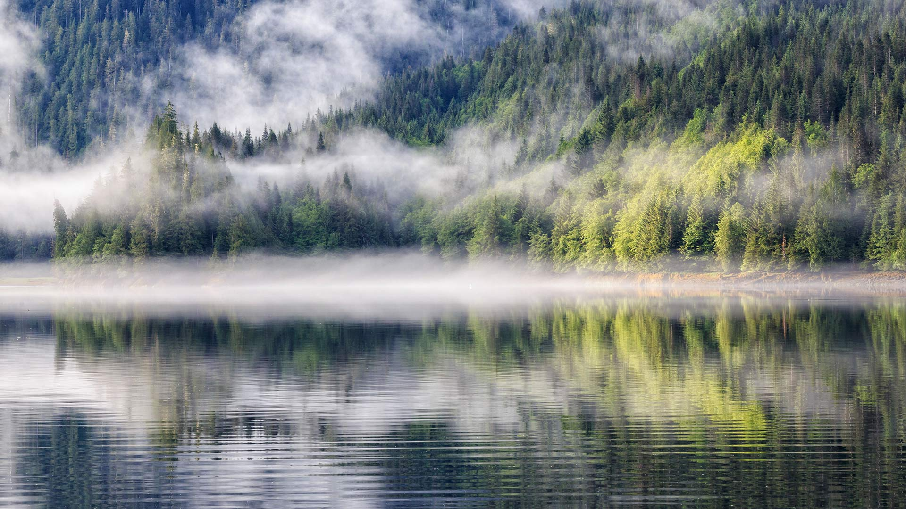
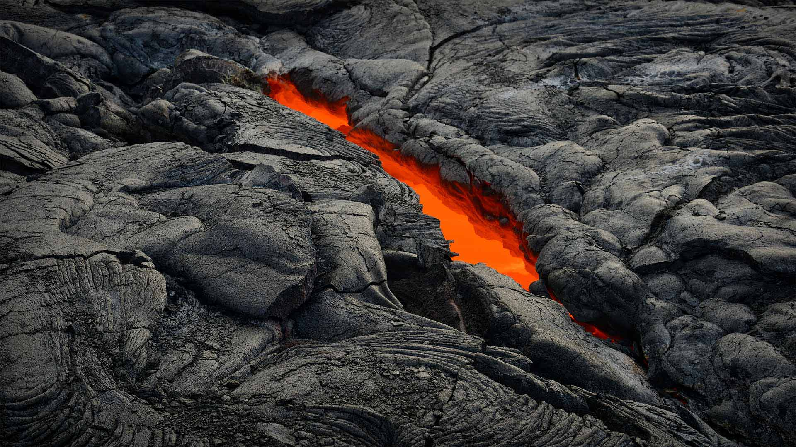

#### 20220803 在德国的赤颈鸊鷉 (© Edo van Uchelen/Minden Pictures)

#### 20220802 Fjord with fog, Khutzeymateen Provincial Park (© Westend61 GmbH/Alamy)

#### 20220802 The Hickman Bridge at Capitol Reef National Park, Utah (© Tim Fitzharris/Minden Pictures)

#### 20220801 Le fort national de Saint-Malo à marée haute (© stevanzz/Adobe Photostock)

#### 20220801 An active lava tube, Hawai'i Volcanoes National Park, Hawaii (© Tom Schwabel/Tandem Stills + Motion)

