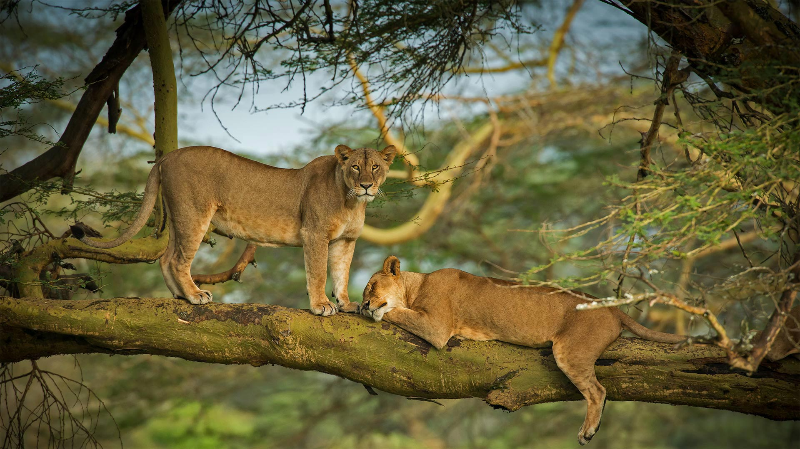
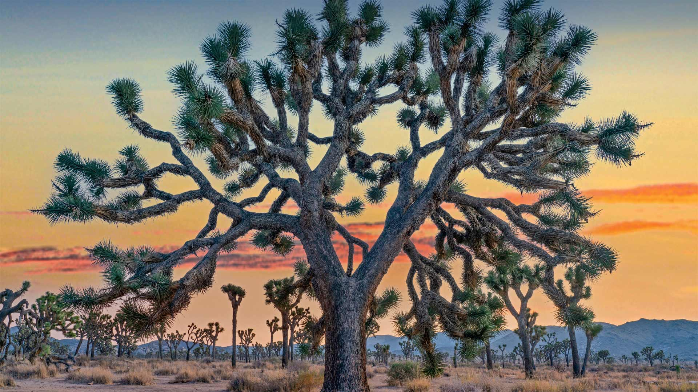
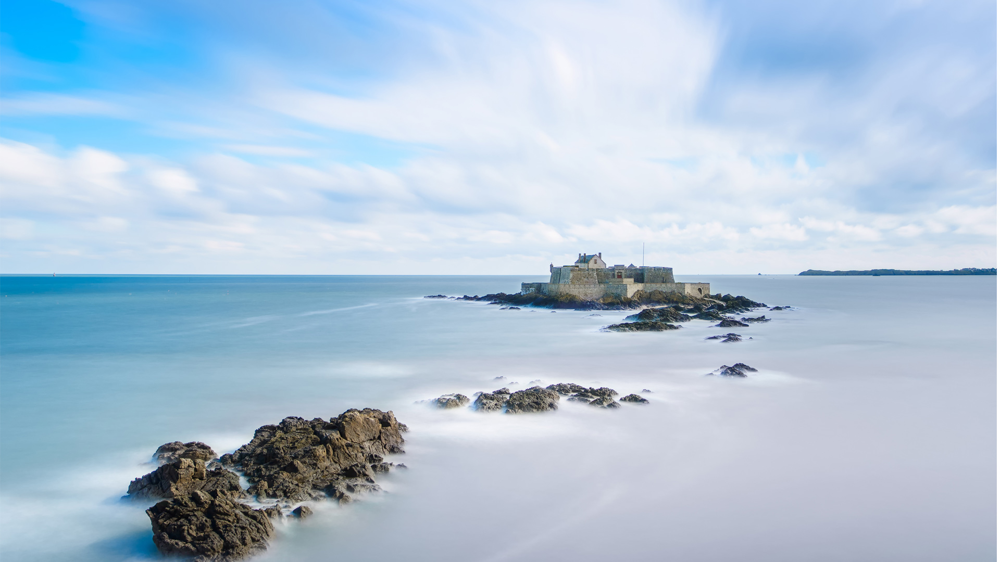

#### 20220810 ナクル湖畔の雌ライオン, ケニア (© Scott Davis/Tandem Stills + Motion)

#### 20220810 Mont Tsubakuro près d’Azumino, Nagano, Japon (© Joshua Hawley/Getty Images)

#### 20220810 约书亚树，加利福尼亚州约书亚树国家公园 (© Tim Fitzharris/Minden Pictures)

#### 20220809 Cueva de las Manos (Cave of the Hands) in Santa Cruz, Argentina (© Adwo/Alamy)

#### 20220808 Riesen-Lauch (Allium giganteum), Hamburg (© Jasmin Sander/plainpicture)

#### 20220807 杭州西湖的古典中国园林 (© DANNY HU/Getty Images)

#### 20220807 Spring Point Ledge Light in South Portland, Maine (© Haizhan Zheng/Getty Images)

#### 20220807 Dusk falls over Vancouver Island viewed from an islet in Nuchatlitz Provincial Park, British Columbia (© plainpicture/Design Pics/Ron Watts)

#### 20220807 風鈴まつり (© blew_i/gettyimages)

#### 20220806 Salt flats in San Francisco Bay (© Jeffrey Lewis/Tandem Stills + Motion)

#### 20220806 原爆ドームと元安川, 広島 (© Sean Pavone/Alamy Stock Photo)

#### 20220806 Aerial view of the island Pantaleu near Sant Elm, Mallorca, Spain (© Dimitri Weber/Amazing Aerial Agency)

#### 20220805 Edinburgh city skyline at night, Scotland (© Suranga Weeratuna/Alamy)

#### 20220805 Marina da Glória and Sugarloaf Mountain, Rio de Janeiro, Brazil (© f11photo/Getty Images)

#### 20220804 上海浦东森林心形洞穴鸟瞰图，中国 (© Yaorusheng/Getty Images)

#### 20220804 Farmers collecting water lilies in the Satla marshland near Bagdha, Barisal, Bangladesh (© Mustasinur Rahman Alvi/Future Publishing via Getty Images)

#### 20220803 Red-necked grebes in Germany (© Edo van Uchelen/Minden Pictures)

#### 20220803 Boote im Fischereihafen, Boltenhagen, Mecklenburg-Vorpommern (© iStock/Getty Images)

#### 20220802 Fjord with fog, Khutzeymateen Provincial Park (© Westend61 GmbH/Alamy)

#### 20220802 The Hickman Bridge at Capitol Reef National Park, Utah (© Tim Fitzharris/Minden Pictures)

#### 20220801 Le fort national de Saint-Malo à marée haute (© stevanzz/Adobe Photostock)

#### 20220801 An active lava tube, Hawai'i Volcanoes National Park, Hawaii (© Tom Schwabel/Tandem Stills + Motion)

