#### 20220917 オクトーバーフェスト, ドイツ ミュンヘン (© Karl-Josef Hildenbrand/Getty Images)

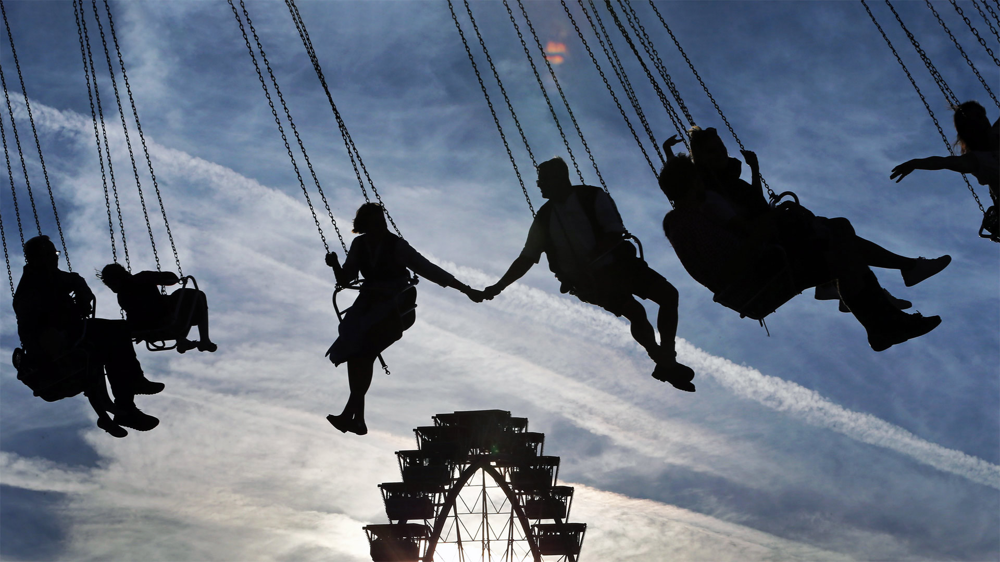

#### 20220917 布莱克浦塔和中央码头，英国兰开夏郡 (© Bailey-Cooper Photography/Alamy)

#### 20220916 Puma in Torres del Paine National Park, Patagonia, Chile (© Ingo Arndt/Minden Pictures)

#### 20220915 カステルメッツァーノ, イタリア バシリカータ州 (© Roberto Moiola/Getty Images)

#### 20220915 罗兰豁口上空的银河，法国上比利牛斯省 (© SPANI Arnaud/Alamy)

#### 20220915 Water flows through Johnston Canyon in Banff National Park (© Jason Hatfield/TANDEM Stills + Motion)

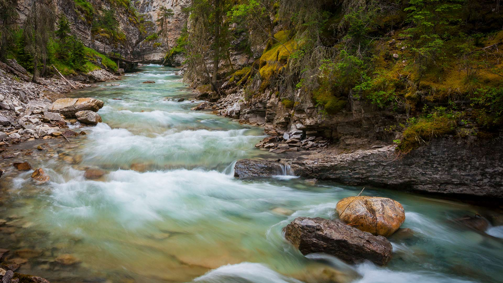

#### 20220915 Mural by Betsy Casañas in Buffalo, New York (© Tom Loonan)

#### 20220914 Navajo Bridge over the Colorado River at the Glen Canyon National Recreation Area in northern Arizona (© trekandshoot/Alamy)

#### 20220913 Great Sand Dunes National Park and Preserve, Colorado (© Y Paudel/Getty Images)

#### 20220912 H-IIB ロケット打ち上げ, 鹿児島 (© The Asahi Shimbun/Getty Images)

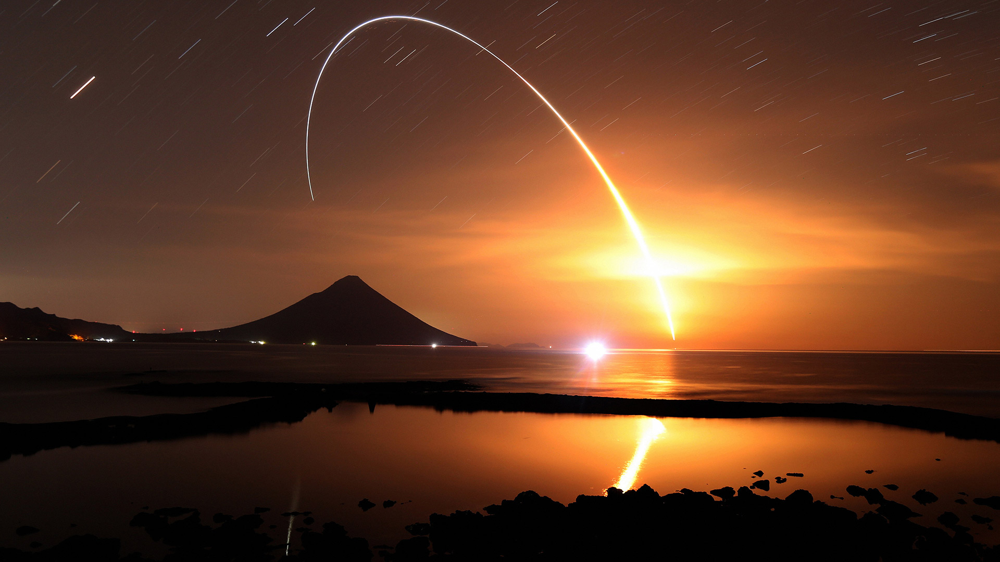

#### 20220912 Chestnut-eared aracari in the Pantanal region of Brazil (© Ana Gram/Shutterstock)

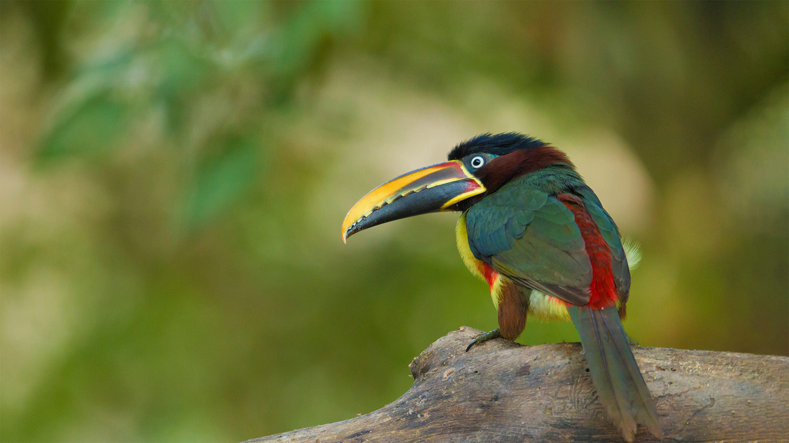

#### 20220911 Statue of Liberty seen behind US flags at half-staff for the anniversary of September 11 in 2014, New York City (© Adam Parent/Shutterstock)

#### 20220911 Massif du Mont Blanc au coucher du soleil se reflétant sur l’un des lacs de Chéserys, Chamonix, France (© Stefan Huwiler/imageBROKER/Alamy)

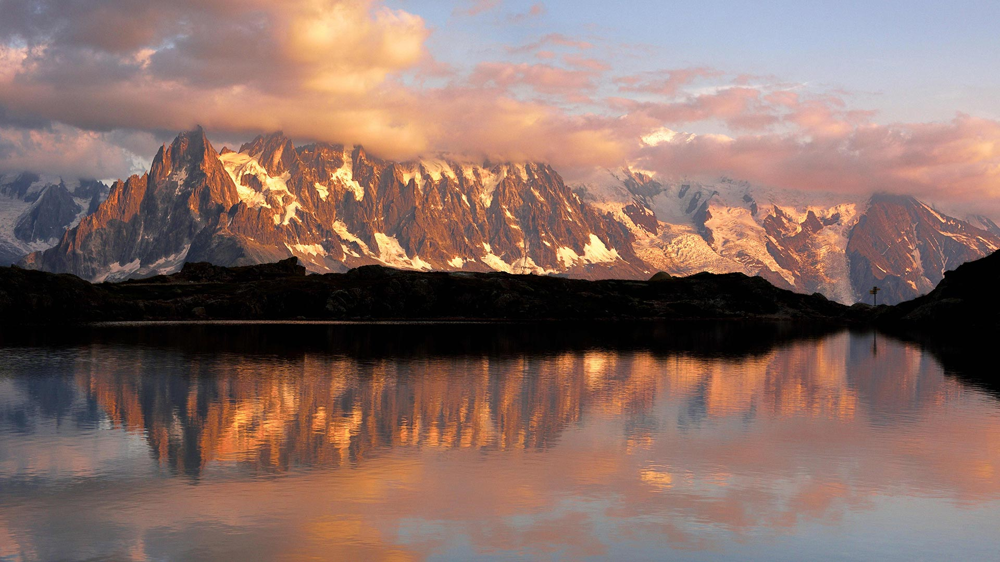

#### 20220911 在喀拉拉邦河流中行驶的一艘小船，印度 (© Shutterstock)

#### 20220911 Emerald Lake, Yoho National Park, British Columbia, Canada (© Cavan Images/Offset)

#### 20220911 Treppenhaus im Schloss Augustusburg, Brühl, Nordrhein-Westfalen (© Florian Monheim/age fotostock)

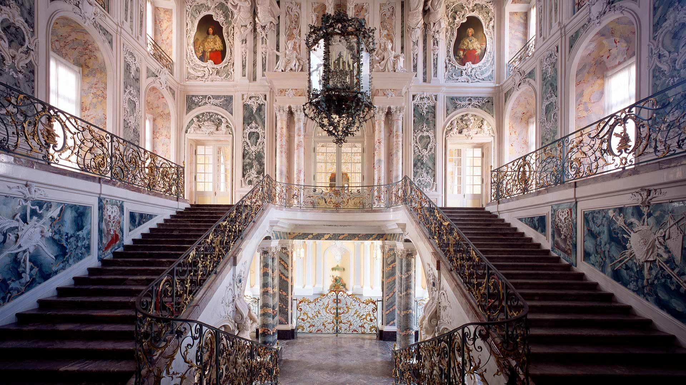

#### 20220910 東京スカイツリー, 東京 墨田区 (© Krzysztof Baranowski/Getty Images)

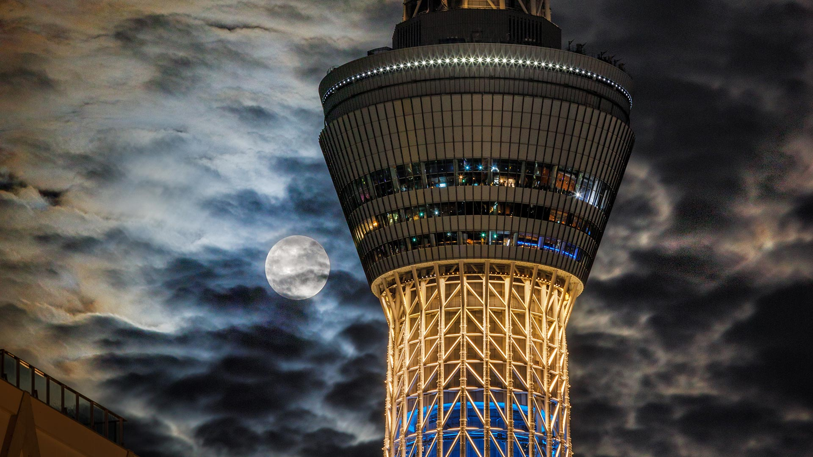

#### 20220910 中秋之夜, 上海豫园 (© Zyxeos30/Getty images)

#### 20220910 Moon installation for the Mid-Autumn Festival in Kuala Lumpur, Malaysia (© Lim Huey Teng/Reuters)

#### 20220909 Toronto skyline and its reflection, Toronto (© Istvan Kadar Photography/Getty Images)

#### 20220909 Lighthouse Reef, Blue Hole Natural Monument, Belize (© Tom Till/Alamy)

#### 20220908 View of the city from the Setas de Sevilla (Metropol Parasol) in Seville, Spain (© LucVi/Shutterstock)

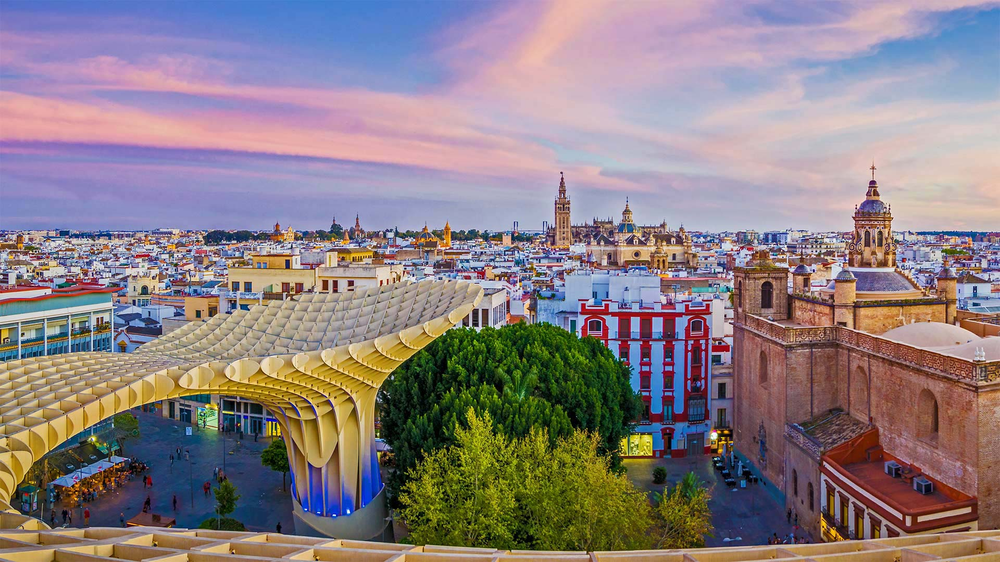

#### 20220907 英格兰怀特岛上的尼德尔斯白垩岩石和19世纪的灯塔。 (© CBCK Christine/iStock/Getty Images Plus)

#### 20220907 Museu do Amanhã (Museum of Tomorrow) in Rio de Janeiro, Brazil (© Nido Huebl/Shutterstock)

#### 20220906 Red squirrel carrying a mushroom (© Michael Quinton/Minden Pictures)

#### 20220906 Emerald Lake, Yoho National Park, B.C. (© Cavan Images/Offset)

#### 20220905 北魁北克的公路，加拿大 (© Posnov/Getty Images)

#### 20220905 Plage de Seitan Limania en Crète, Grèce (© Georgios Tsichlis/Alamy)

#### 20220905 Labor Day parade in 1934, Gastonia, North Carolina (© Bettmann/Getty Images)

#### 20220905 Luftaufnahme der Bréhat-Inseln im Ärmelkanal, Bretagne, Frankreich (© LECLERCQ Olivier/hemis.fr/Alamy)

#### 20220904 Arambol Beach in Goa, India (© Ben Pipe/Alamy)

#### 20220903 Lake Braies, Prags Dolomites, South Tyrol, Italy  (© Daniel Dickman/Getty Images)

#### 20220903 眠るタテゴトアザラシ, 米国 ニューヨーク州  (© Vicki Jauron, Babylon and Beyond Photography/Getty Images)

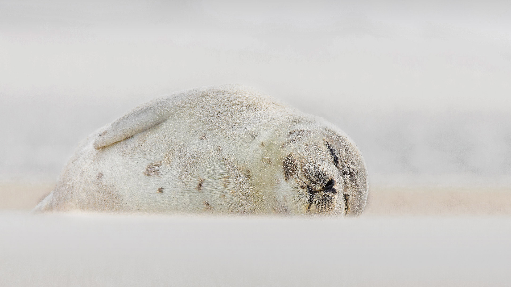

#### 20220902 Les planches de Deauville et les cabines aux noms de personnalités du cinéma américain, Calvados (© Rene Mattes/mauritius images GmbH/Alamy Stock Photo)

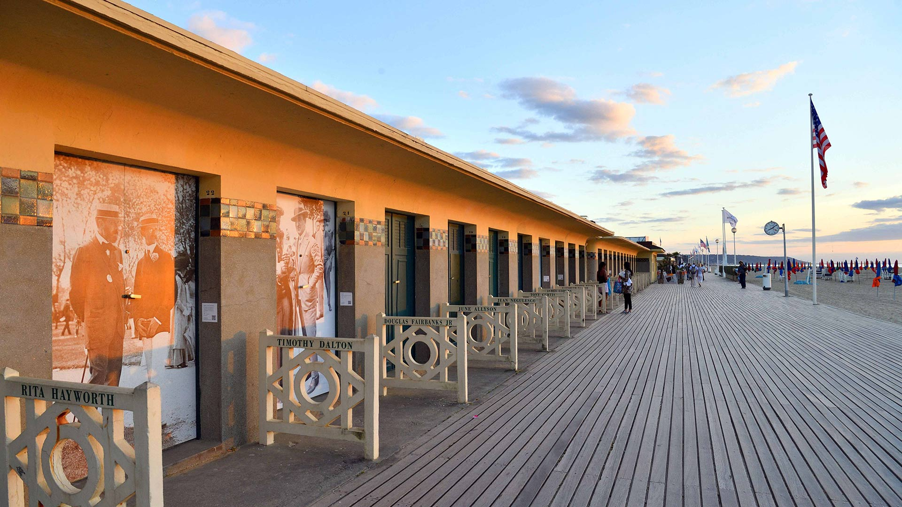

#### 20220902 Petronas Twin Towers, Kuala Lumpur, Malaysia (© tampatra/Getty Images)

#### 20220902 Nahaufnahme des Berliner Fernsehturms (© Nico Gel/Getty Images)

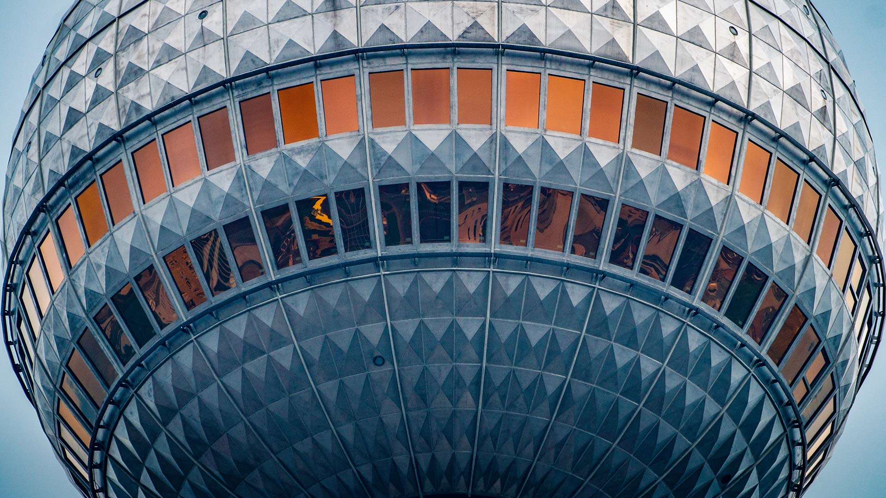

#### 20220901 Seitan Limania Beach in Crete, Greece (© Georgios Tsichlis/Alamy)

#### 20220901 Clôture en bois en forme de crayons de couleur devant une école de Bretagne (© PeterAprahamian/Getty Images)

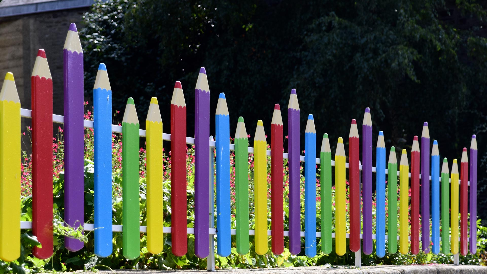

