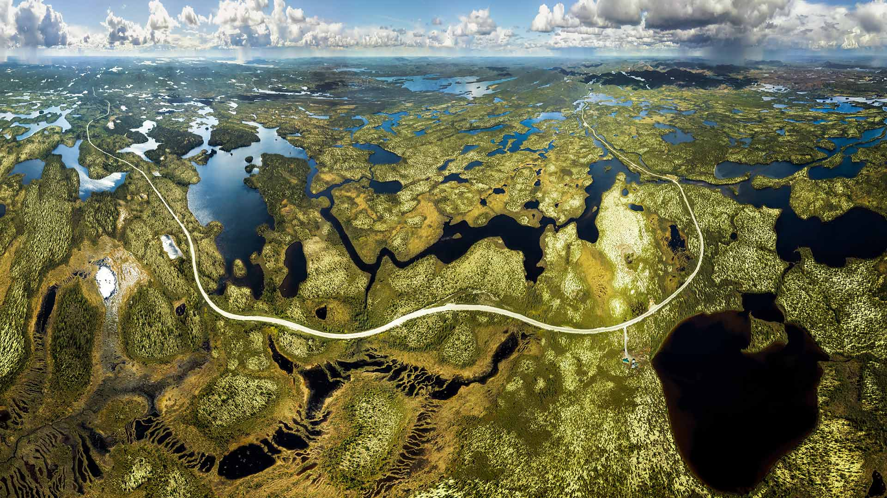
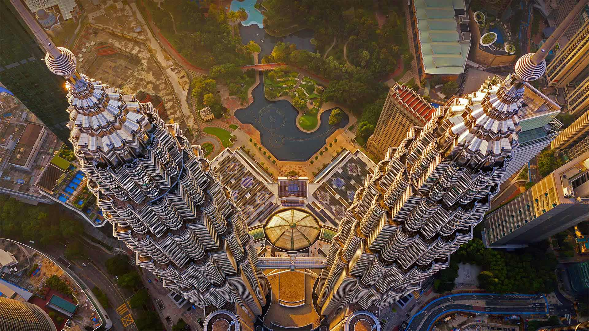

#### 20220906 Red squirrel carrying a mushroom (© Michael Quinton/Minden Pictures)

#### 20220906 Emerald Lake, Yoho National Park, B.C. (© Cavan Images/Offset)

#### 20220905 北魁北克的公路，加拿大 (© Posnov/Getty Images)

#### 20220905 Labor Day parade in 1934, Gastonia, North Carolina (© Bettmann/Getty Images)

#### 20220905 Luftaufnahme der Bréhat-Inseln im Ärmelkanal, Bretagne, Frankreich (© LECLERCQ Olivier/hemis.fr/Alamy)

#### 20220904 Arambol Beach in Goa, India (© Ben Pipe/Alamy)

#### 20220903 Lake Braies, Prags Dolomites, South Tyrol, Italy  (© Daniel Dickman/Getty Images)

#### 20220903 眠るタテゴトアザラシ, 米国 ニューヨーク州  (© Vicki Jauron, Babylon and Beyond Photography/Getty Images)

#### 20220902 Les planches de Deauville et les cabines aux noms de personnalités du cinéma américain, Calvados (© Rene Mattes/mauritius images GmbH/Alamy Stock Photo)

#### 20220902 Petronas Twin Towers, Kuala Lumpur, Malaysia (© tampatra/Getty Images)

#### 20220902 Nahaufnahme des Berliner Fernsehturms (© Nico Gel/Getty Images)

#### 20220901 Seitan Limania Beach in Crete, Greece (© Georgios Tsichlis/Alamy)

#### 20220901 Clôture en bois en forme de crayons de couleur devant une école de Bretagne (© PeterAprahamian/Getty Images)

