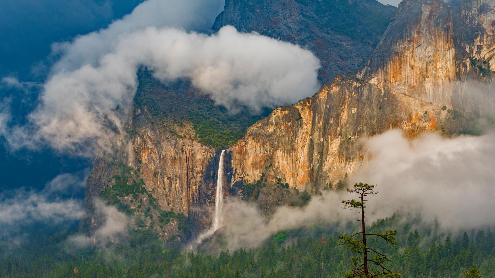
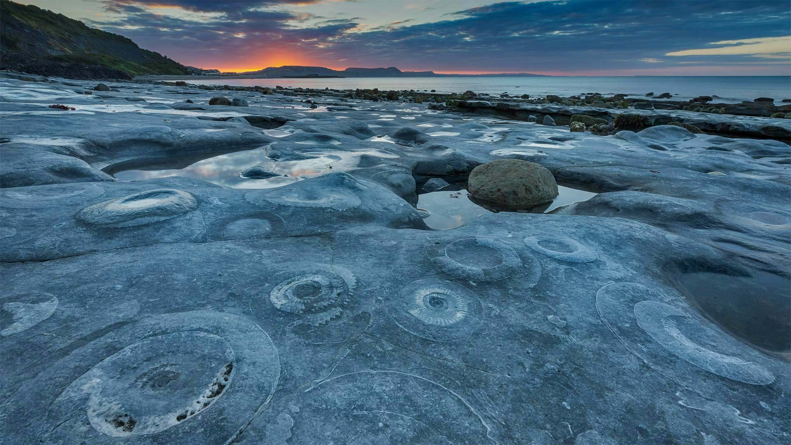
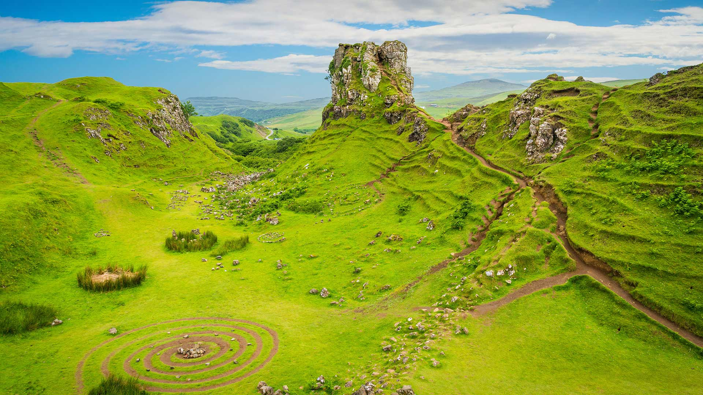
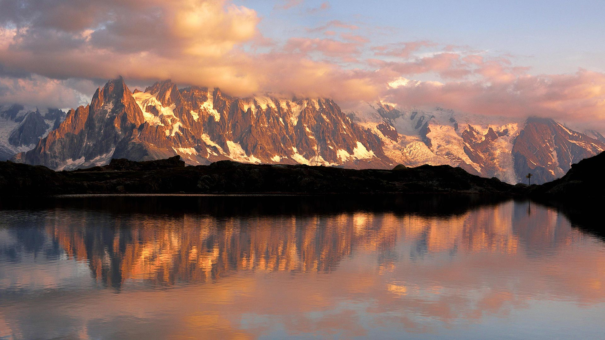

#### 20221020 塔拉曼卡旧港的霍氏树懒母子，哥斯达黎加 (© Suzi Eszterhas/Minden Pictures)

#### 20221019 Thuringian Forest in autumn with Wartburg Castle, Germany (© ezypix/Getty Images)

#### 20221019 Blue tiger butterflies, Bangalore, India (© Amith Nag Photography/Getty Images)

#### 20221018 Guggenheim Museum Bilbao, Spain (© Jeremy Horner/Getty Images)

#### 20221018 Bridalveil Fall, Yosemite National Park, California (© Jeff Foott/Minden Pictures)

#### 20221017 Long-eared owl in the Bohemian-Moravian Highlands of the Czech Republic (© Ondrej Prosicky/Alamy)

#### 20221016 Prince Christian Sound in southern Greenland (© Posnov/Getty Images)

#### 20221015 Naqsh-e Rostam archaeological site near Persepolis, Iran (© mshirani/Shutterstock)

#### 20221014 Waterfall on the Río Arazas in Ordesa y Monte Perdido National Park, Pyrenees, Spain (© David Santiago Garcia/Cavan Images)

#### 20221014 The Milky Way and galactic core area over Mount Andromeda (centre), Mount Athabasca (left) and the Athabasca Glacier (right) at the Columbia Icefields (© Alan Dyer/VW PICS/Universal Images Group via Getty Images)

#### 20221014 Blick auf die Burg Hohenzollern in der Nähe von Hechingen, Schwäbische Alb, Baden-Württemberg (© Cornelia Dorr/eStock Photo)

#### 20221013 Bull and female moose in Denali National Park, Alaska (© Yva Momatiuk and John Eastcott/Minden Pictures)

#### 20221012 Ammonite Pavement at Monmouth Beach, Jurassic Coast World Heritage Site, Dorset, England (© AWL Images/Danita Delimont)

#### 20221011 Wall screw-moss glistening with water droplets, Netherlands (© Arjan Troost/Minden Pictures)

#### 20221011 Cyprès chauves aux couleurs d’automne en Isère (© Jean-Philippe Delobelle/Minden Images)

#### 20221010 瓦伦蒂诺大坝，意大利伦巴第大区布雷西亚省 (© wmaster890/Getty Images)

#### 20221010 Herzförmiger Starenschwarm bei Lembruch, Naturpark Dümmer, Niedersachsen (© Christian Kosanetzky/Getty Images)

#### 20221010 The 'Circle of Sacred Smoke' sculpture by Junkyu Muto frames Devils Tower in Wyoming (© Nagel Photography/Shutterstock)

#### 20221010 Vue aérienne de Paris en automne (© encrier/iStock/Getty Images Plus)

#### 20221010 Close up image of colourful Indian corn kernels in Mississauga, ON (© Nancybelle Gonzaga Villarroya/Getty Images)

#### 20221009 Phytoplankton blooming in the Chukchi Sea off the coast of Alaska (© Norman Kuring/Kathryn Hansen/U.S. Geological Survey/NASA)

#### 20221008 赤く染まるコキア, 茨城 (© Taro_since2017/shutterstock)

#### 20221008 Glass octopus in the Atlantic Ocean off Cabo Verde (© Solvin Zankl/Minden Pictures)

#### 20221007 温德米尔湖的风景，坎布里亚湖区，英格兰 (© Chris Warren/eStock Photo)

#### 20221007 Designs projected on the Oberbaum Bridge during the yearly Festival of Lights in Berlin, Germany (© John MacDougall/AFP via Getty Images)

#### 20221006 Basque Coast Geopark in the Bay of Biscay near Bilbao, Spain (© Olimpio Fantuz/eStock Photo)

#### 20221005 Caribbean flamingos, Ría Lagartos Biosphere Reserve, Yucatán Peninsula, Mexico (© Claudio Contreras/Minden Pictures)

#### 20221004 Cosmic Cliffs in the Carina Nebula (© NASA, ESA, CSA, and STScI)

#### 20221004 黄山的日出，中国 (© zhouyousifang/Getty Images)

#### 20221003 The Port House, designed by Zaha Hadid Architects, Antwerp, Belgium (© Dmitry Rukhlenko/Alamy)

#### 20221003 Kugelpanorama-Luftbild (Little Planet) der Glienicker Brücke, Potsdam, Brandenburg (© 360b/Alamy)

#### 20221003 仙女谷，苏格兰斯凯岛 (© e55evu/Getty Images)

#### 20221002 Hot air balloons at the Albuquerque International Balloon Fiesta in Albuquerque, New Mexico (© gmeland/Shutterstock)

#### 20221002 倒映在湖中的勃朗峰山脉，法国霞慕尼市 (© Stefan Huwiler/Alamy)

#### 20221001 Swedish ESO Submillimeter Telescope (SEST) am La-Silla-Observatorium, Chile (© Alberto Ghizzi Panizza/Getty Images)

#### 20221001 Art installation, ‘breath of life’ by Floria Sigismondi at Nuit Blanche 2016, Nathan Phillips Square, Toronto (© TorontoNews/Alamy Stock Photo)

#### 20221001 山上的日出，河北蔚县 (© zhao zhenhao/Getty Images)

#### 20221001 "Bouquet of tulips" de Jeff Koons, Paris (© Kiran Ridley/Stringer/getty images)

#### 20221001 Bridalveil Fall, Yosemite National Park, California (© Jeff Foott/Minden Pictures)

