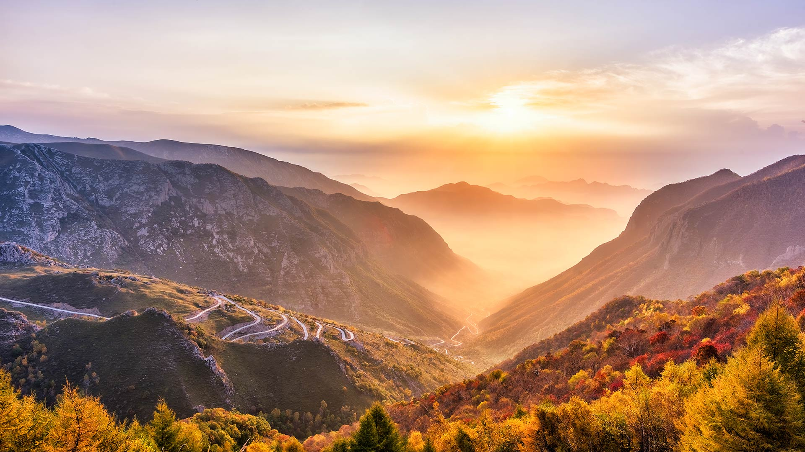

#### 20221001 Swedish ESO Submillimeter Telescope (SEST) am La-Silla-Observatorium, Chile (© Alberto Ghizzi Panizza/Getty Images)

#### 20221001 Art installation, ‘breath of life’ by Floria Sigismondi at Nuit Blanche 2016, Nathan Phillips Square, Toronto (© TorontoNews/Alamy Stock Photo)

#### 20221001 山上的日出，河北蔚县 (© zhao zhenhao/Getty Images)

#### 20221001 "Bouquet of tulips" de Jeff Koons, Paris (© Kiran Ridley/Stringer/getty images)

