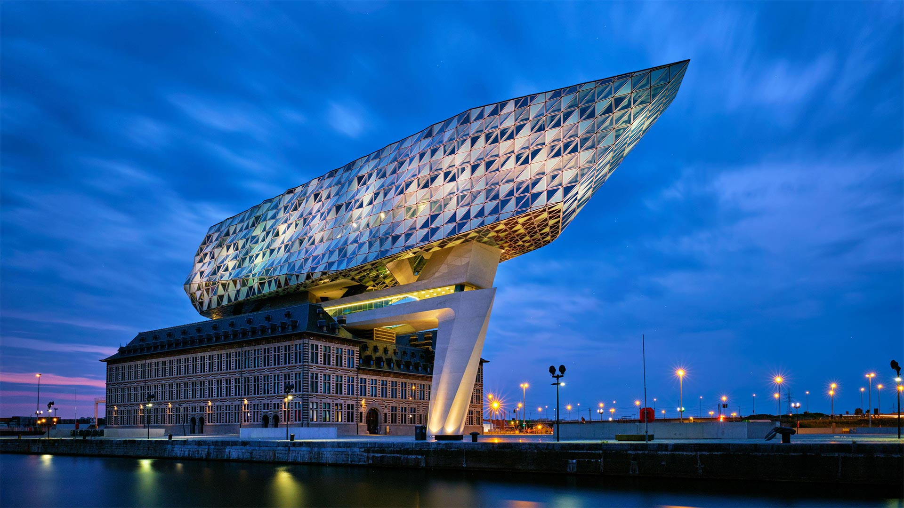

#### 20221005 Caribbean flamingos, Ría Lagartos Biosphere Reserve, Yucatán Peninsula, Mexico (© Claudio Contreras/Minden Pictures)

#### 20221004 Cosmic Cliffs in the Carina Nebula (© NASA, ESA, CSA, and STScI)

#### 20221004 黄山的日出，中国 (© zhouyousifang/Getty Images)

#### 20221003 The Port House, designed by Zaha Hadid Architects, Antwerp, Belgium (© Dmitry Rukhlenko/Alamy)

#### 20221003 Kugelpanorama-Luftbild (Little Planet) der Glienicker Brücke, Potsdam, Brandenburg (© 360b/Alamy)

#### 20221003 仙女谷，苏格兰斯凯岛 (© e55evu/Getty Images)

#### 20221002 Hot air balloons at the Albuquerque International Balloon Fiesta in Albuquerque, New Mexico (© gmeland/Shutterstock)

#### 20221002 倒映在湖中的勃朗峰山脉，法国霞慕尼市 (© Stefan Huwiler/Alamy)

#### 20221001 Swedish ESO Submillimeter Telescope (SEST) am La-Silla-Observatorium, Chile (© Alberto Ghizzi Panizza/Getty Images)

#### 20221001 Art installation, ‘breath of life’ by Floria Sigismondi at Nuit Blanche 2016, Nathan Phillips Square, Toronto (© TorontoNews/Alamy Stock Photo)

#### 20221001 山上的日出，河北蔚县 (© zhao zhenhao/Getty Images)

#### 20221001 "Bouquet of tulips" de Jeff Koons, Paris (© Kiran Ridley/Stringer/getty images)

