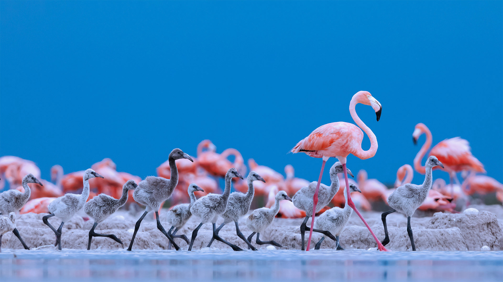
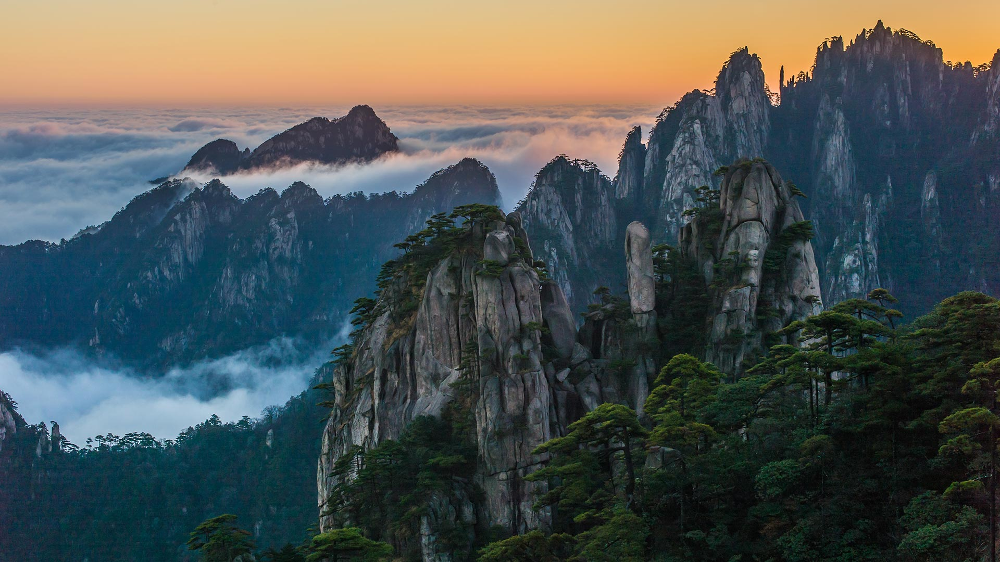

#### 20221009 楚科奇海的浮游植物水华，美国阿拉斯加州海岸附近 (© Norman Kuring/Kathryn Hansen/U.S. Geological Survey/NASA)

#### 20221008 赤く染まるコキア, 茨城 (© Taro_since2017/shutterstock)

#### 20221008 Glass octopus in the Atlantic Ocean off Cabo Verde (© Solvin Zankl/Minden Pictures)

#### 20221007 温德米尔湖的风景，坎布里亚湖区，英格兰 (© Chris Warren/eStock Photo)

#### 20221007 Designs projected on the Oberbaum Bridge during the yearly Festival of Lights in Berlin, Germany (© John MacDougall/AFP via Getty Images)

#### 20221006 Basque Coast Geopark in the Bay of Biscay near Bilbao, Spain (© Olimpio Fantuz/eStock Photo)

#### 20221005 Caribbean flamingos, Ría Lagartos Biosphere Reserve, Yucatán Peninsula, Mexico (© Claudio Contreras/Minden Pictures)

#### 20221004 Cosmic Cliffs in the Carina Nebula (© NASA, ESA, CSA, and STScI)

#### 20221004 黄山的日出，中国 (© zhouyousifang/Getty Images)

#### 20221003 The Port House, designed by Zaha Hadid Architects, Antwerp, Belgium (© Dmitry Rukhlenko/Alamy)

#### 20221003 Kugelpanorama-Luftbild (Little Planet) der Glienicker Brücke, Potsdam, Brandenburg (© 360b/Alamy)

#### 20221003 仙女谷，苏格兰斯凯岛 (© e55evu/Getty Images)

#### 20221002 Hot air balloons at the Albuquerque International Balloon Fiesta in Albuquerque, New Mexico (© gmeland/Shutterstock)

#### 20221002 倒映在湖中的勃朗峰山脉，法国霞慕尼市 (© Stefan Huwiler/Alamy)

#### 20221001 Swedish ESO Submillimeter Telescope (SEST) am La-Silla-Observatorium, Chile (© Alberto Ghizzi Panizza/Getty Images)

#### 20221001 Art installation, ‘breath of life’ by Floria Sigismondi at Nuit Blanche 2016, Nathan Phillips Square, Toronto (© TorontoNews/Alamy Stock Photo)

#### 20221001 山上的日出，河北蔚县 (© zhao zhenhao/Getty Images)

#### 20221001 "Bouquet of tulips" de Jeff Koons, Paris (© Kiran Ridley/Stringer/getty images)

#### 20221001 Bridalveil Fall, Yosemite National Park, California (© Jeff Foott/Minden Pictures)

