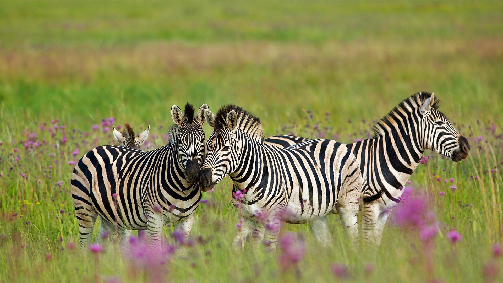
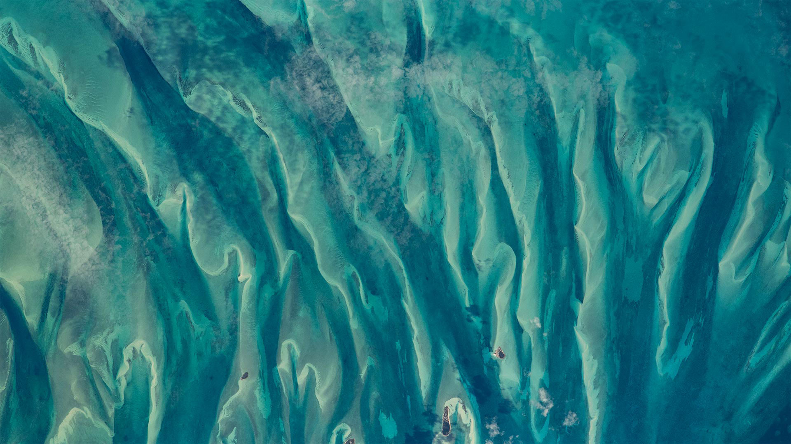

#### 20230131 南非自然保护区的斑马 (© Richard Du Toit/Minden Pictures)

#### 20230131 Samenköpfe der Kanadischen Goldrute im Raureif im Morgenlicht, Wasgau, NP Pfälzerwald, Biosphärenreservat Pfälzerwald-Nordvogesen, Rheinland-Pfalz (©  mauritius images GmbH/Alamy Stock Photo)

#### 20230130 卡纳塔克邦的纳加尔霍雷国家公园，印度 (© Vivek BR/Shutterstock)

#### 20230130 Ice and Snow Sailing European Championships on Lake Balaton in Hungary (© mauritius images GmbH/Alamy Stock Photo)

#### 20230129 Blackbird in Essex, England (© Bill Coster/Alamy)

#### 20230128 Blue-green waters around the Bahamas as seen from the International Space Station (© NASA)

#### 20230127 Red mangrove tree seedlings in Guanahacabibes National Park, Cuba (© Claudio Contreras/Minden Pictures)

#### 20230126 Heaven's Gate Cave in Tianmen Mountain National Park, China (© Shane P. White/Minden Pictures)

#### 20230126 Rainforest trails along Cypress Creek, West Vancouver, BC (© Jason Wilde/TANDEM Stills + Motion)

#### 20230125 Statue of Robert Burns in the Birks of Aberfeldy, Perth and Kinross, Scotland (© Dennis Barnes/Getty Images)

#### 20230124 Colle Santa Lucia in the Dolomites, Italy (© mauritius images GmbH/Alamy)

#### 20230123 Moai statues on Easter Island, Chile (© Karine Aigner/Tandem Stills + Motion)

#### 20230122 Mountain hare in Derbyshire, England (© Ben Hall/Minden Pictures)

#### 20230122 春节的桃花和红灯笼 (© David Ng+EyeEm/Getty Images)

#### 20230121 Waschbär (Procyon Lotor) zwei Babys klettern auf den Baum (© Tim Fitzharris/Minden)

#### 20230121 Kangaroo mother and baby (© Belle Ciezak/Shutterstock)

#### 20230121 除夕夜的中国新年灯笼 (© Toa55/Getty Images)

#### 20230120 King penguins in the Falkland Islands (© Elmar Weiss/Getty Images)

#### 20230120 雪に覆われた清水寺, 京都 (© Paitoon Pornsuksomboon/Shutterstock)

#### 20230119 Park City, Utah (© Kruck20/Getty Images)

#### 20230118 White Sands National Park, New Mexico (© Andrea Harrell/Tandem Stills + Motion)

