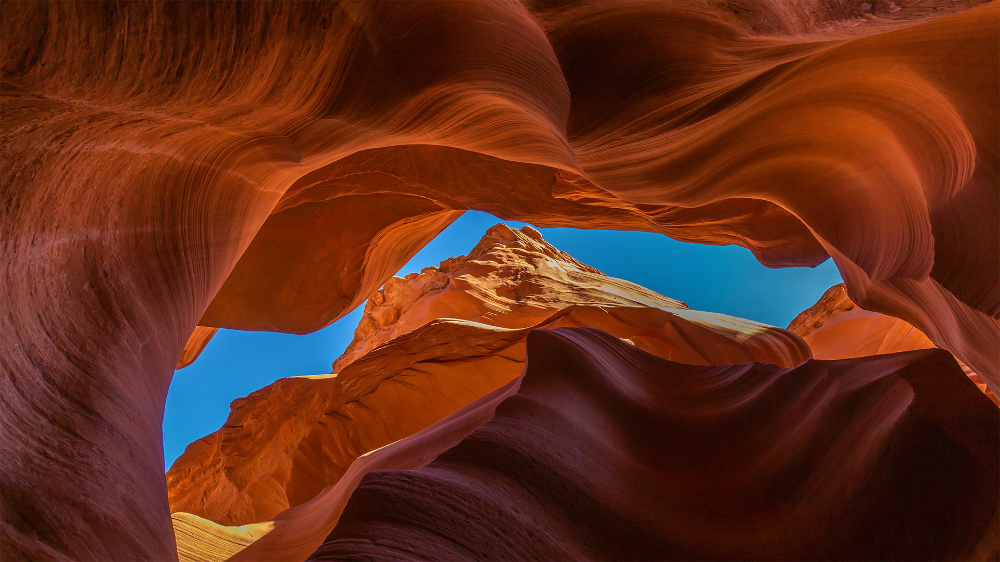
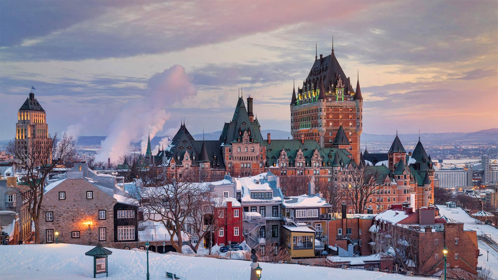
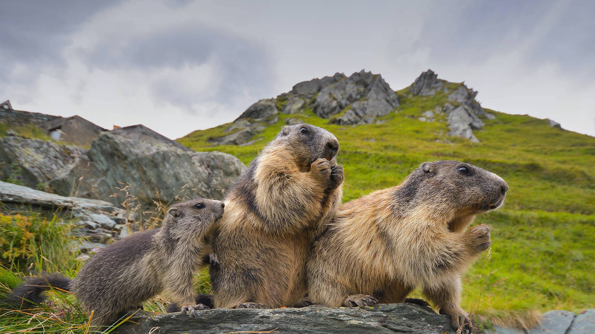

#### 20230216 “火流”马尾瀑布，约塞米蒂国家公园，美国加利福尼亚州 (© Jeff Lewis/Tandem Stills + Motion)

#### 20230215 Hippopotamus mother and baby, Chobe National Park, Botswana (© jacobeukman/Getty Images)

#### 20230214 Igloo at Otaru Snow Light Path Festival, Hokkaido, Japan (© T Photography/Shutterstock)

#### 20230213 Achaches lookout, El Valle de la Luna, Chile (© Ignacio Palacios/Getty Images)

#### 20230212 Blue-footed booby, Galápagos Islands, Ecuador (© Tui De Roy/Minden Pictures)

#### 20230211 Temple chinois Fête du Citron de 2015, Menton, Cote d'Azur, France (© Peter Seyfferth/imageBROKER/Shutterstock)

#### 20230211 The Milky Way over Zabriskie Point, Death Valley, California (© Matt Anderson Photography/Getty Images)

#### 20230210 Ancient theater of Epidaurus in Argolis province, Greece (© George Pachantouris/Getty Images)

#### 20230209 Lower Antelope Canyon near Page, Arizona (© AZCat/Getty Images)

#### 20230208 Ureddplassen, a rest area on the Helgelandskysten scenic route, Norway (© Eyesite/Alamy)

#### 20230208 艾琳多南堡，苏格兰高地 (© VisualCommunications/Getty Images)

#### 20230207 Ski hors-piste, Courchevel, France (© Andrew Lloyd/Alamy Stock Photo)

#### 20230206 Fiordland National Park in South Island, New Zealand (© WitR/Adobe Stock)

#### 20230205 毛茸茸又可爱的山兔 (© Ben Hall/Minden Pictures)

#### 20230205 Monarch butterflies at Pismo Beach, California (© Mimi Ditchie/Getty Images)

#### 20230204 Rosa Parks sits in the front of a bus in Montgomery, Alabama, Dec 21, 1956 (© Bettmann Archive/Getty Images)

#### 20230204 初春の梅に飛来したメジロ (© tahirsphotography/Shutterstock)

#### 20230204 Village of Labro, Rieti Province, Italy (© Marco Ilari/Shutterstock)

#### 20230204 永福樱花园，福建省龙岩市, 中国 (© SEN LI/Getty Images)

#### 20230204 Feldbergturm im Schwarzwald, Baden-Württemberg (© Hemis/Alamy)

#### 20230203 枡いっぱいの節分の福豆 (© Nishihama/Shutterstock)

#### 20230203 Château Frontenac, Quebec City, Canada (© Romiana Lee/Shutterstock)

#### 20230202 Alpine marmots in Hohe Tauern National Park, Austria (© Michaela Walch/Alamy)

#### 20230201 ジャスパー国立公園, カナダ アルバータ州 (© Jeff Foott/Minden Pictures)

#### 20230201 皮埃尔丰城堡，皮卡第大区，法国 (© Hemis/Alamy)

#### 20230201 'Testament: The Little Rock Nine Monument,' Little Rock, Arkansas (© Rex Lisman/Getty Images)

