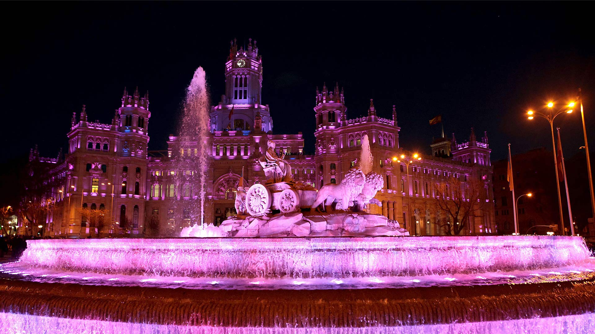
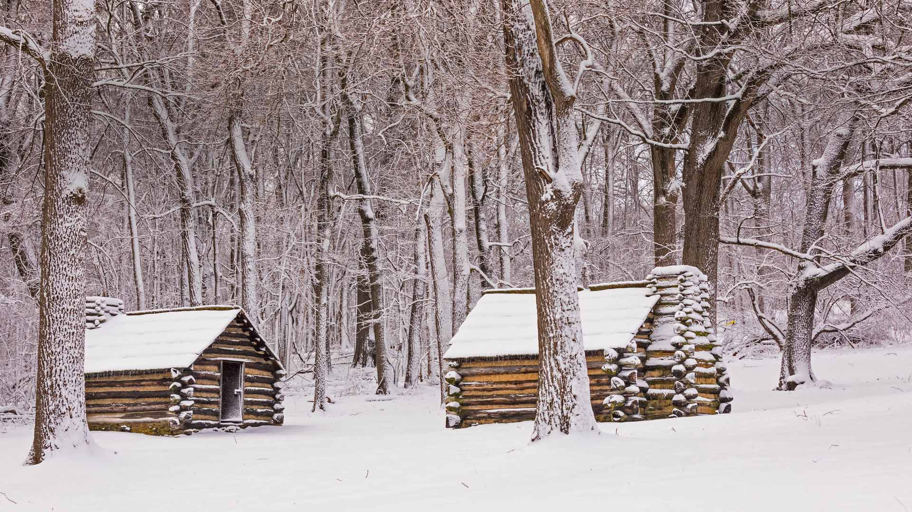
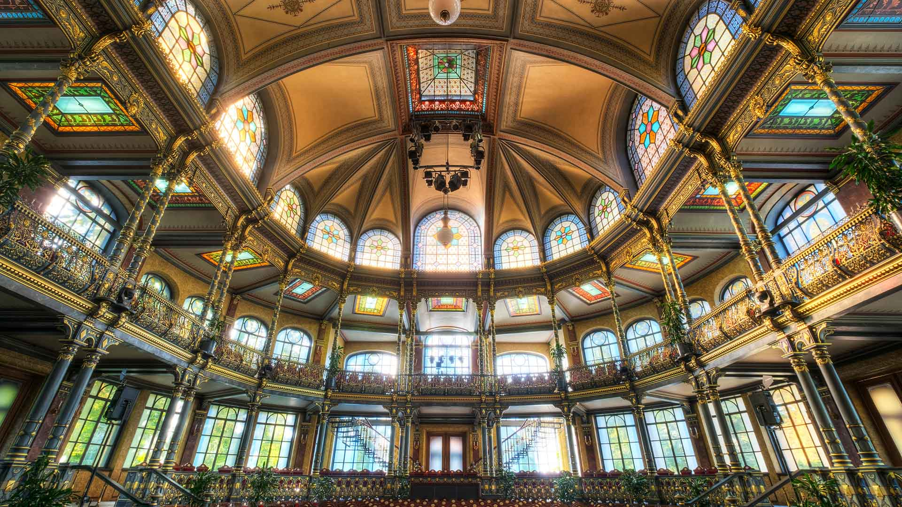
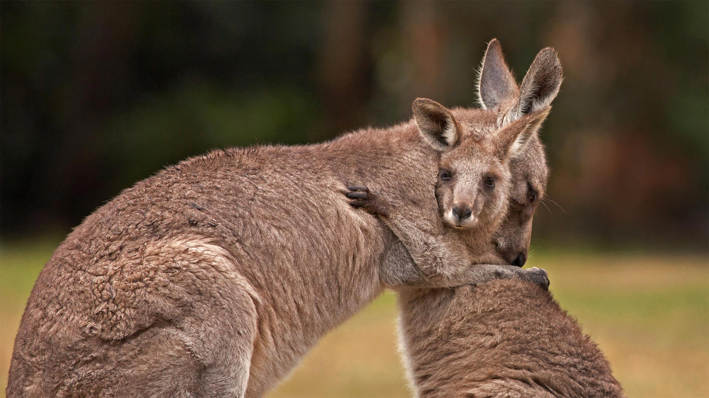
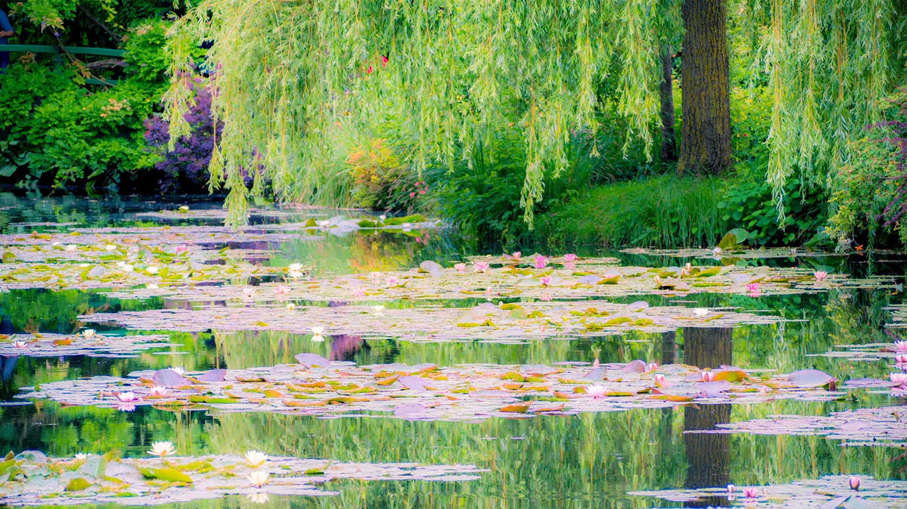
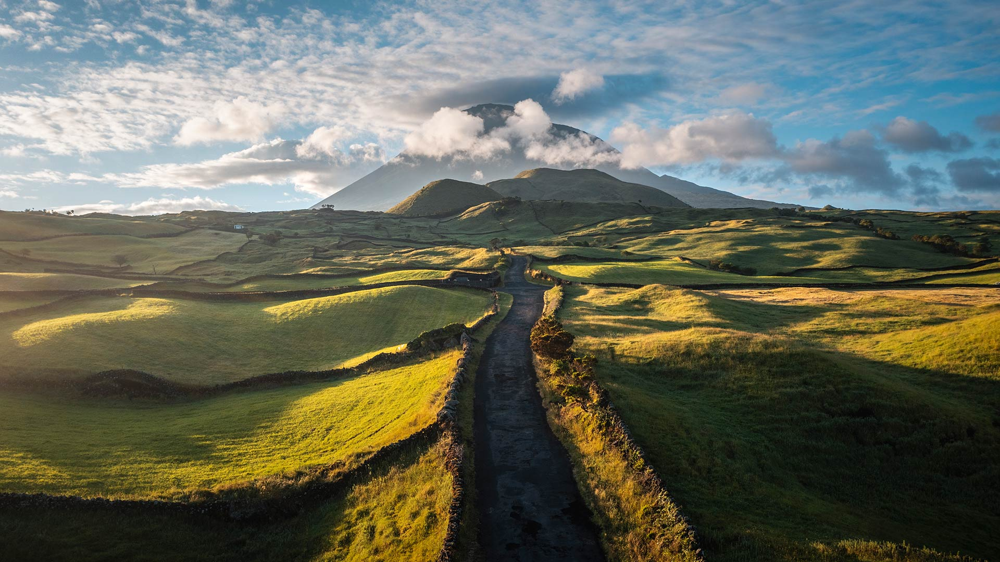
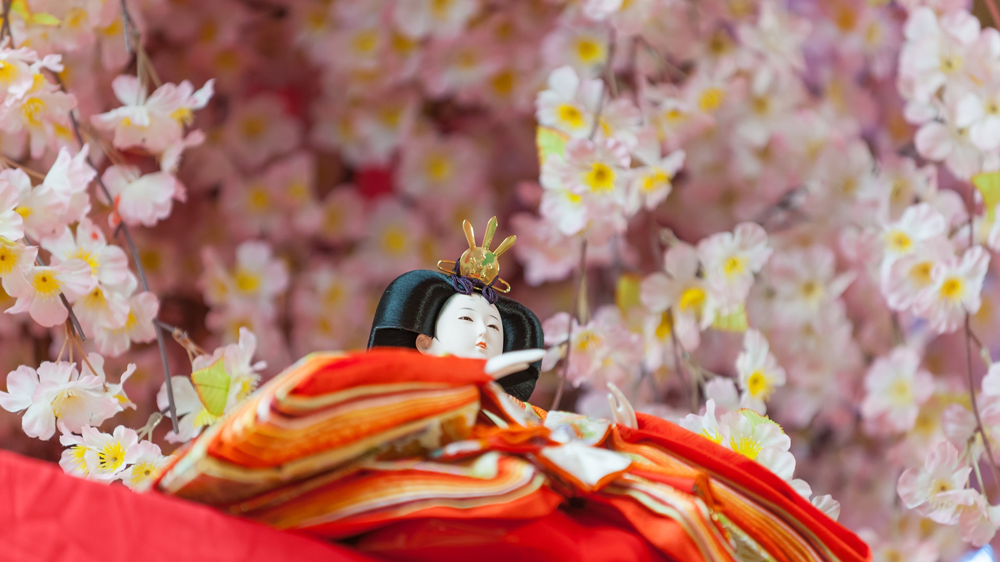
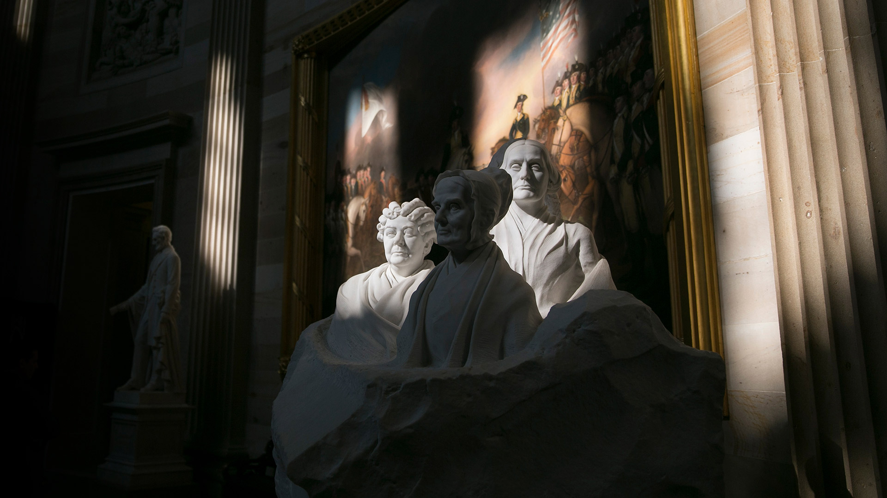
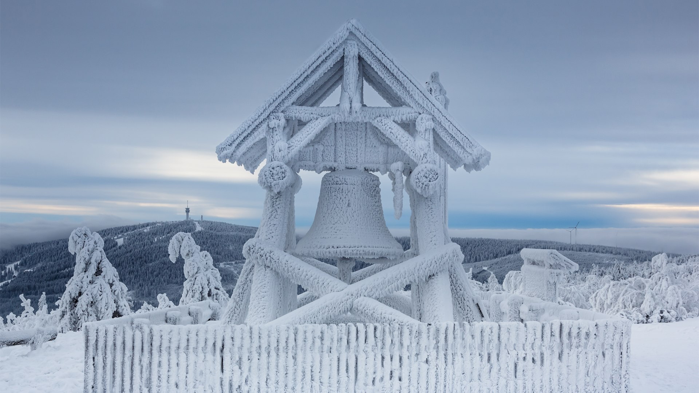

#### 20230308 极光展示，怀特霍斯，育空地区，加拿大 (© John Hyde/plainpicture/Design Pics)

#### 20230308 Cibeles Fountain and Madrid City Hall lit for International Women's Day, Madrid, Spain (© dpa picture alliance/Alamy)

#### 20230307 Cabins in Valley Forge National Historic Site, Pennsylvania (© Mark C. Morris/Shutterstock)

#### 20230307 Parktheater im Kurhaus Göggingen, Architekt Jean Keller, Bayern (© imageBROKER/Alamy Stock Photo)

#### 20230306 Icelandic horses standing in a field, Iceland (© Rodrigo Lourezini/Shutterstock)

#### 20230305 Aerial view of terraced rice fields, Yuanyang County, China (© AlexGcs/Getty Images)

#### 20230305 アムステルダムのウォーターライディングドゥイネン自然保護区, オランダ (© Edwin Giesbers/Minden Pictures)

#### 20230305 Cherry trees in full bloom near the Imperial Palace with Tokyo Tower in the background, Tokyo, Japan (© Jon Arnold/Danita Delimont)

#### 20230305 袋鼠妈妈和宝宝 (© Belle Ciezak/Shutterstock)

#### 20230305 Le jardin de Monet à Giverny, France (© Simon Kirwan/Alamy Stock Photo)

#### 20230304 Road to Mount Pico, Portugal (© Marco Bottigelli/Getty Images)

#### 20230303 Killer whales in the waters off Spildra, Norway (© Alex Mustard/Minden Pictures)

#### 20230303 ひな人形 (© Masayoshi Hirose/Shutterstock)

#### 20230302 Negratín Reservoir, Granada, Spain (© Andres Martinez Olmedo/Getty Images)

#### 20230301 Portrait Monument of women's suffrage pioneers, Capitol Rotunda, Washington, DC (© Andrew Harrer/Bloomberg/Getty Images)

#### 20230301 吕贝克的霍尔斯滕门，德国 (© Harald Nachtmann/Getty Images)

#### 20230301 フィヒテルベルク, ドイツ (© Jan Drahokoupil/Getty Images)

#### 20230301 Aventure dans la canopée péruvienne, réserve naturelle de Tambopata, Pérou (© Pere Rubi/Getty Images)

#### 20230301 Bridalveil Fall, Yosemite National Park, California (© Jeff Foott/Minden Pictures)

