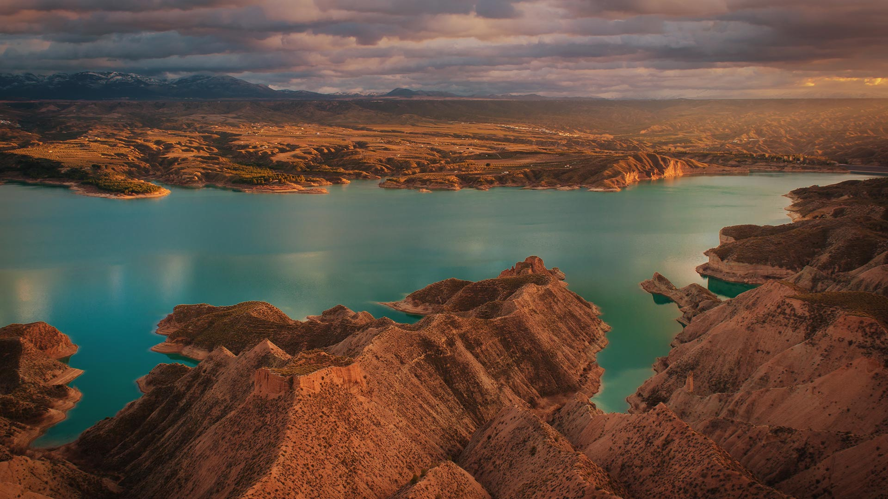
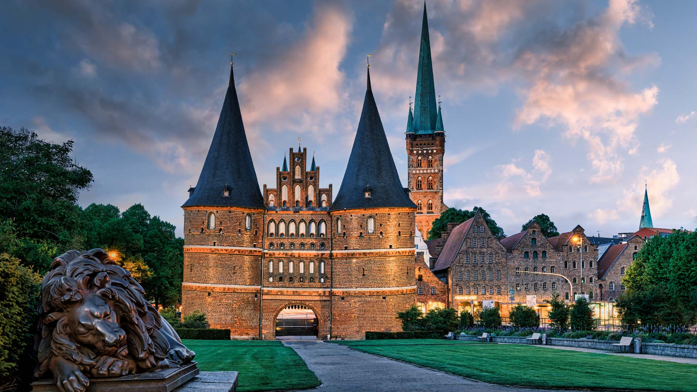

#### 20230303 斯皮尔德拉的虎鲸，挪威 (© Alex Mustard/Minden Pictures)

#### 20230303 ひな人形 (© Masayoshi Hirose/Shutterstock)

#### 20230302 Negratín Reservoir, Granada, Spain (© Andres Martinez Olmedo/Getty Images)

#### 20230301 Portrait Monument of women's suffrage pioneers, Capitol Rotunda, Washington, DC (© Andrew Harrer/Bloomberg/Getty Images)

#### 20230301 吕贝克的霍尔斯滕门，德国 (© Harald Nachtmann/Getty Images)

#### 20230301 Bridalveil Fall, Yosemite National Park, California (© Jeff Foott/Minden Pictures)

