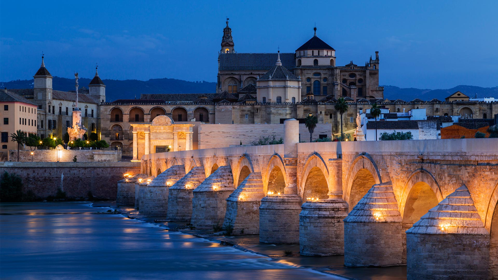
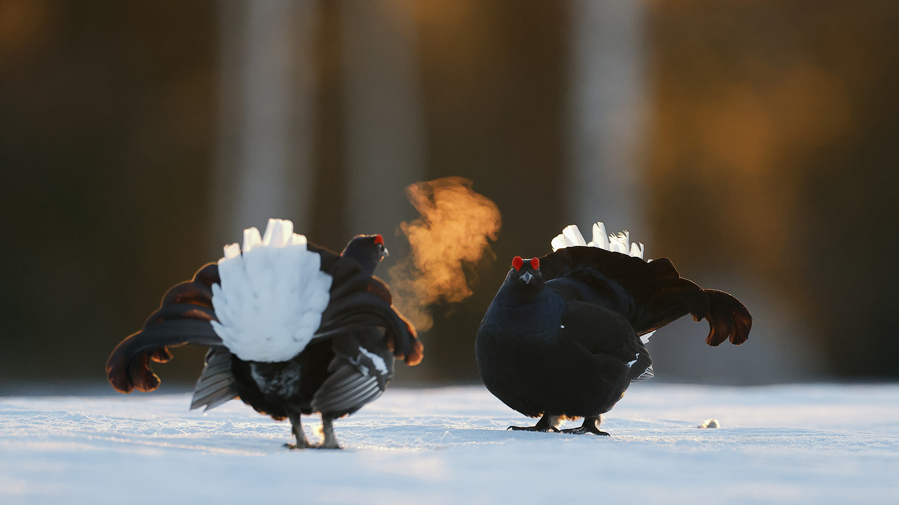
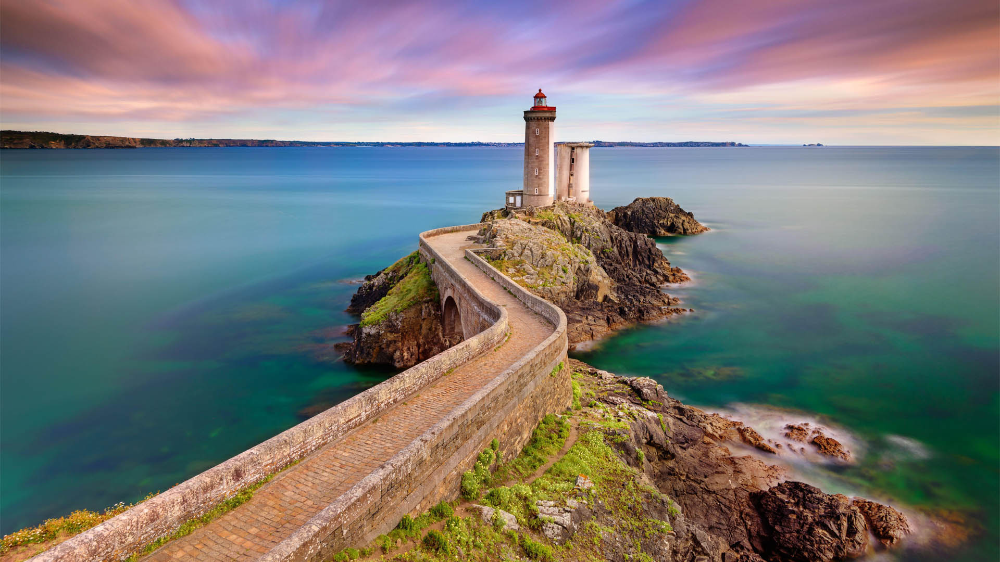

#### 20230404 科尔多瓦的古罗马桥，西班牙 (© Jeremy Woodhouse/Getty Images)

#### 20230404 The Canadian Museum for Human Rights, Winnipeg (© Cavan Images/Alamy Stock Photo)

#### 20230403 Insel Helgoland, Schleswig-Holstein (© Iurii Buriak/Alamy Stock Photo)

#### 20230403 Pu'uhonua o Hōnaunau National Historical Park, Big Island, Hawaii (© Westend61/Getty Images)

#### 20230402 Coureurs lors du Marathon de Paris, Obélisque de la place de la Concorde, Paris (© REUTERS/Regis Duvignau)

#### 20230402 クーサモの春, フィンランド (© Markus Varesvuo/Minden Pictures)

#### 20230401 Phare du Petit-Minou, Plouzané, France (© RooM the Agency/Alamy Stock Photo)

#### 20230401 Javan tree frog (© kuritafsheen/Getty Images)

