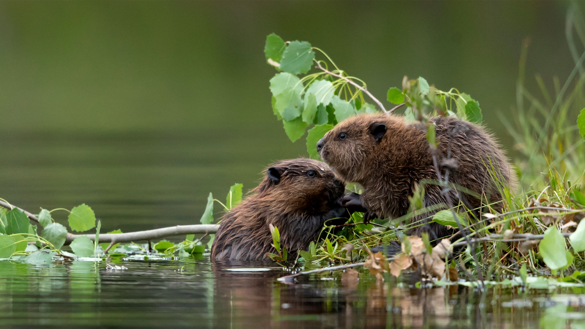
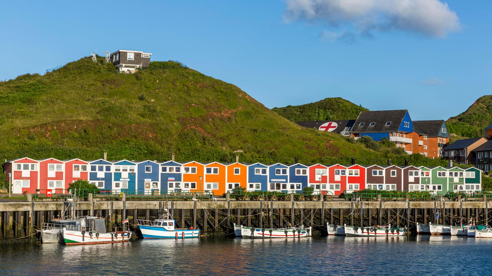
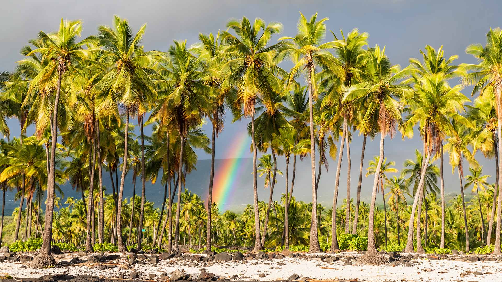
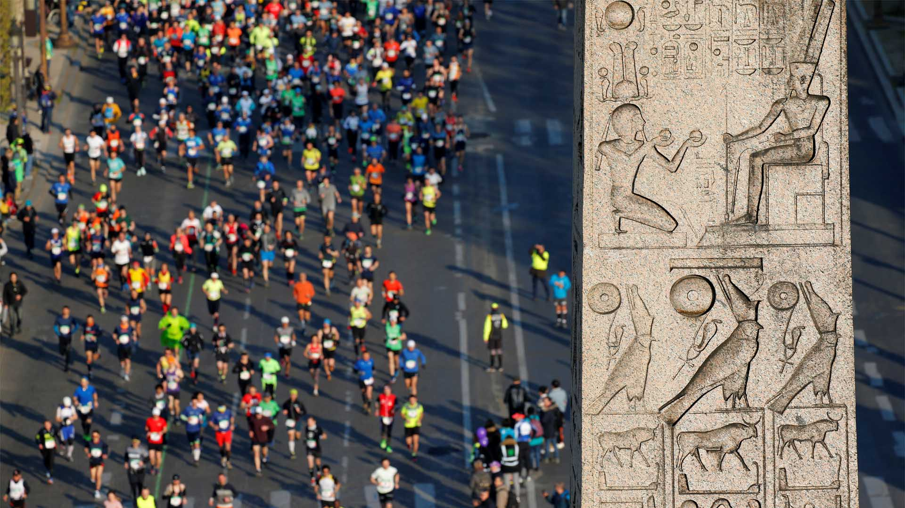

#### 20230410 Aurora at Two Jack Lake, Banff National Park, Alberta, Canada (© Jesús M. García/Getty Images)

#### 20230410 安博塞利国家公园的大象，肯尼亚 (© Diana Robinson/Getty Images)

#### 20230409 Lithuanian Easter eggs (© fotomem/Getty Images)

#### 20230408 The Giant's Causeway, County Antrim, Northern Ireland (© Dieter Meyrl/Getty Images)

#### 20230408 池に咲く睡蓮 (© Masahiro Noguchi/GettyImages)

#### 20230407 Baby Eurasian beavers, Finland (© Danny Green/Minden Pictures)

#### 20230406 姫路城, 兵庫県 姫路市 (© Sean Pavone/Alamy Stock Photo)

#### 20230405 杭州西湖水墨意境般的风景，浙江省，中国 (© zhangshuang/Getty Images)

#### 20230405 Moon rising, Tucson, Arizona (© Tim Murphy/Shutterstock)

#### 20230404 Roman bridge, Córdoba, Spain (© Jeremy Woodhouse/Getty Images)

#### 20230404 The Canadian Museum for Human Rights, Winnipeg (© Cavan Images/Alamy Stock Photo)

#### 20230403 Insel Helgoland, Schleswig-Holstein (© Iurii Buriak/Alamy Stock Photo)

#### 20230403 Pu'uhonua o Hōnaunau National Historical Park, Big Island, Hawaii (© Westend61/Getty Images)

#### 20230402 Coureurs lors du Marathon de Paris, Obélisque de la place de la Concorde, Paris (© REUTERS/Regis Duvignau)

#### 20230402 Bromo Tengger Semeru National Park, East Java, Indonesia (© Bento Fotography/Getty Images)

#### 20230402 Black grouse males in Kuusamo, Finland (© Markus Varesvuo/Minden Pictures)

#### 20230401 Phare du Petit-Minou, Plouzané, France (© RooM the Agency/Alamy Stock Photo)

#### 20230401 Javan tree frog (© kuritafsheen/Getty Images)

