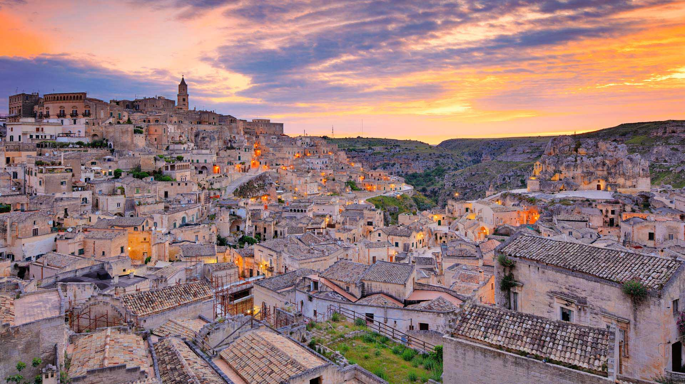
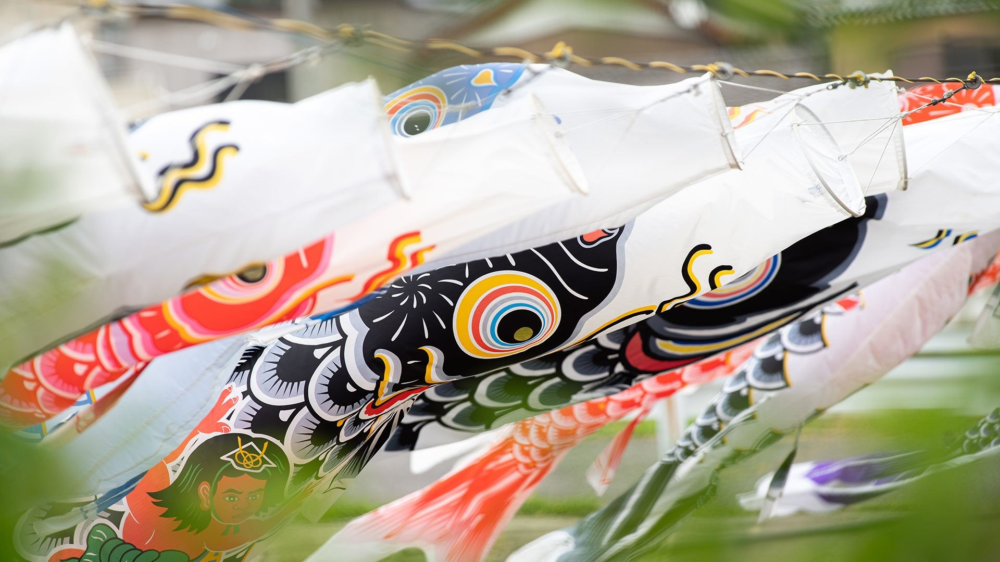
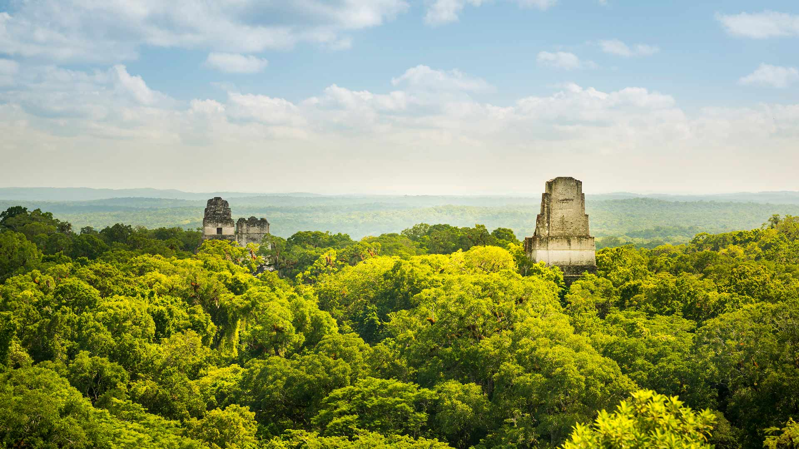
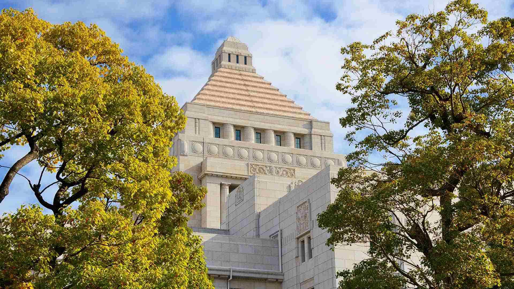
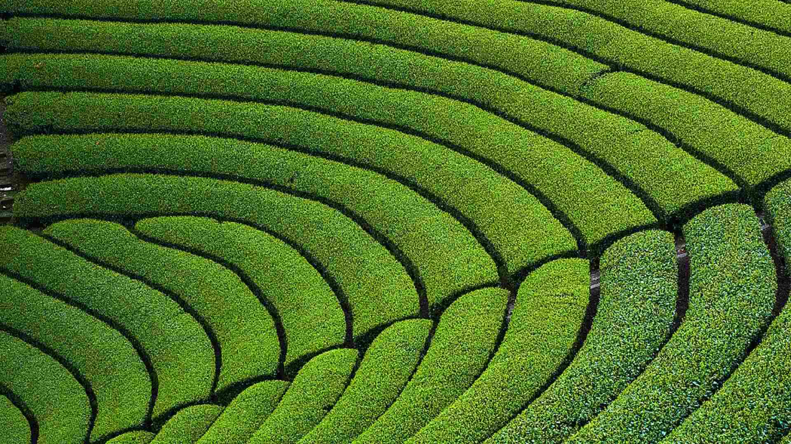

#### 20230506 Sasso Caveoso, Basilicata, Matera, Italy (© Riccardo Spila/eStock)

#### 20230505 Church of Nuestra Señora de los Remedios and Popocatépetl, Puebla, Mexico (© Radius Images/Shutterstock)

#### 20230505 風に泳ぐ鯉のぼり (© rai/Adobe Stock)

#### 20230504 Mayan ruins in Tikal, Guatemala (© THP Creative/Getty Images)

#### 20230503 Wildebeests in the Maasai Mara National Reserve, Kenya (© Matt Polski/Getty Images)

#### 20230503 国会議事堂, 東京都 千代田区 (© Sean Pavone/Alamy Stock Photo)

#### 20230502 円形茶畑, 京都府 相楽郡 (© Tuul and Bruno Morandi/Alamy Stock Photo)

#### 20230501 Biene im Sonnenblumenfeld bei Fresdorf (© Ralf Hirschberger/dpa-Zentralbild/dpa/Alamy Live News)

#### 20230501 横跨圣劳伦斯河下游的魁北克大桥，加拿大 (© Ronald Santerre/Getty Images)

#### 20230501 Muguet de mai en fleurs (© shapencolour/Alamy Stock Photo)

#### 20230501 Korean Bell of Friendship, Los Angeles (© Carlos Marin/Getty Images)

#### 20230501 Jöriseen lakes in the Silvretta Alps, Switzerland (© Florin Baumann/Getty Images)

