#### 20230518 拉曼加，穆尔西亚，西班牙 (© SOMATUSCANI/Getty Images)

#### 20230518 ソウマヤ美術館プラザカルソ館, メキシコ メキシコシティ (© Juan Romero/Alamy)

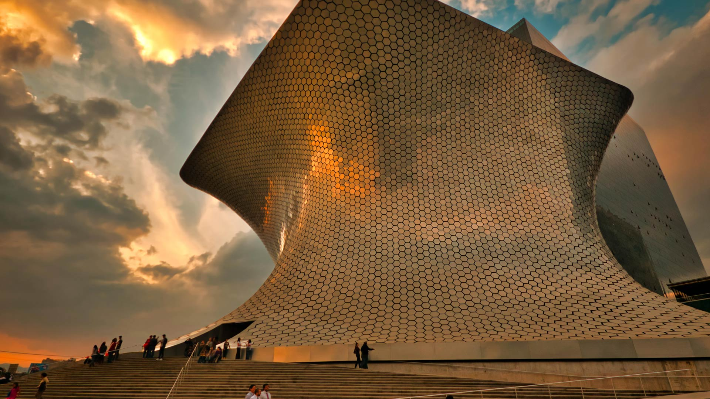

#### 20230517 Natural Bridges State Beach in Santa Cruz, California (© Jim Patterson/Tandem Stills + Motion)

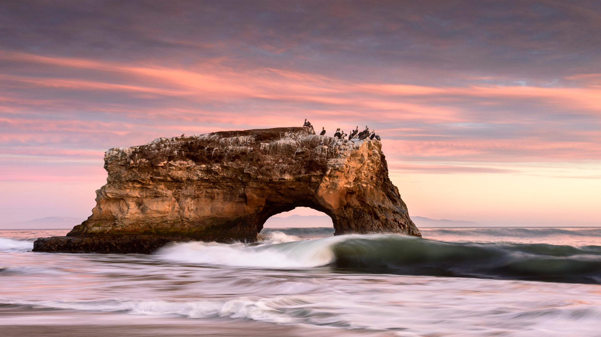

#### 20230516 Îles de Lerins, Cannes, Côtes d’Azur (© Hemis/Alamy Stock Photo)

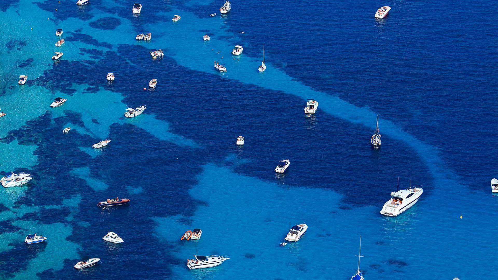

#### 20230516 Canoeing in Okefenokee National Wildlife Refuge, Georgia (© Brad Beck/Tandem Stills + Motion)

#### 20230515 葵祭, 京都 下鴨神社 (© The Asahi Shimbun/Getty Images)

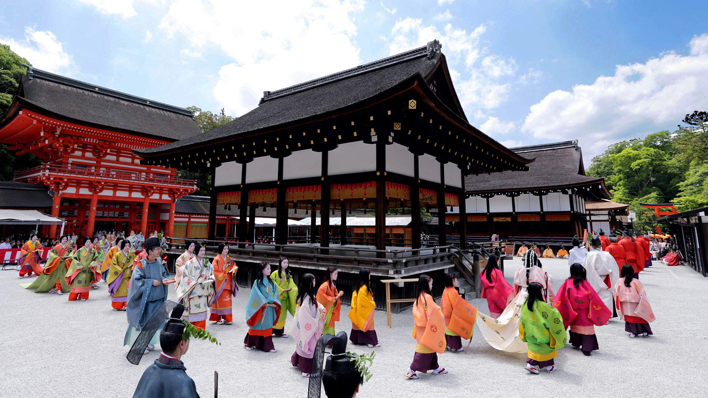

#### 20230514 Procida, Italie (© Sean Pavone/Shutterstock)

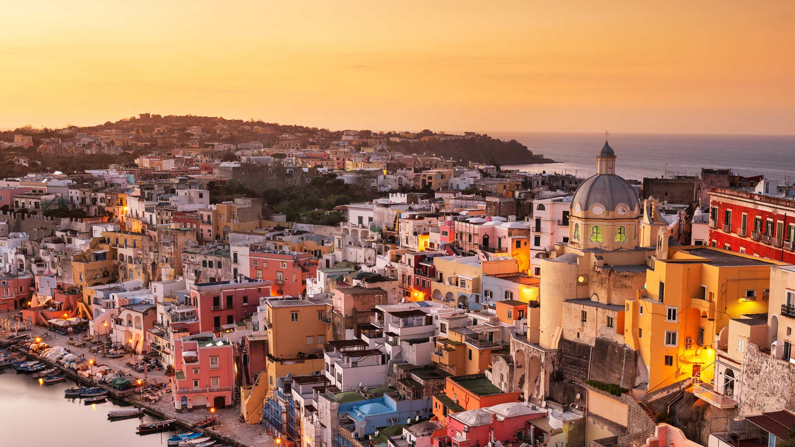

#### 20230514 White-tailed deer doe and newborn fawn, Montana (© Donald M. Jones/Minden Pictures)

#### 20230513 Pelicans at Sonny Bono Salton Sea National Wildlife Refuge, California (© David McNew/Getty Images)

#### 20230513 曼海姆水塔，德国 (© tichr/Getty Images)

#### 20230512 Wild lupines in bloom (© silverjohn/Getty Images Plus)

#### 20230512 Tulip festival Ottawa Canada (© Jean-Claude Caprara/iStock/Getty Images Plus)

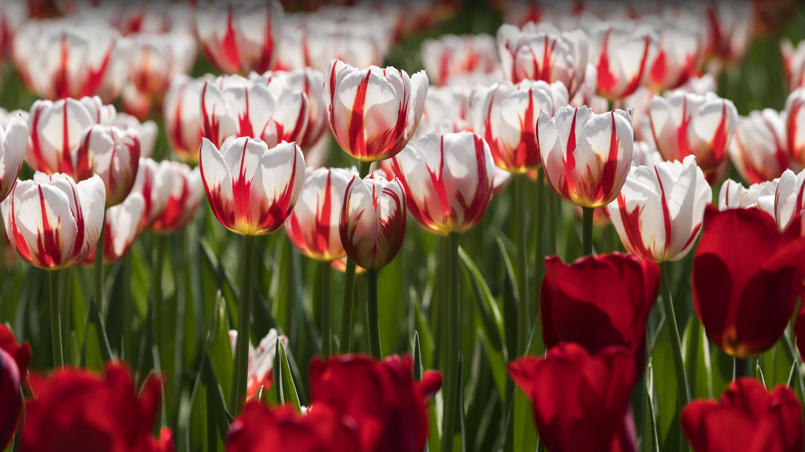

#### 20230511 Henningsvær Stadion, Norway (© Morten Falch Sortland/Getty Images)

#### 20230510 Cordouan Lighthouse, Royan, Charente, France (© FRTimelapse/Getty Images)

#### 20230509 Muttart Conservatory, Alberta, Canada (© Tetra Images Photography/Shutterstock)

#### 20230509 Poenari Castle on Mount Cetatea, Făgăraș Mountains, Romania (© porojnicu/Getty Images)

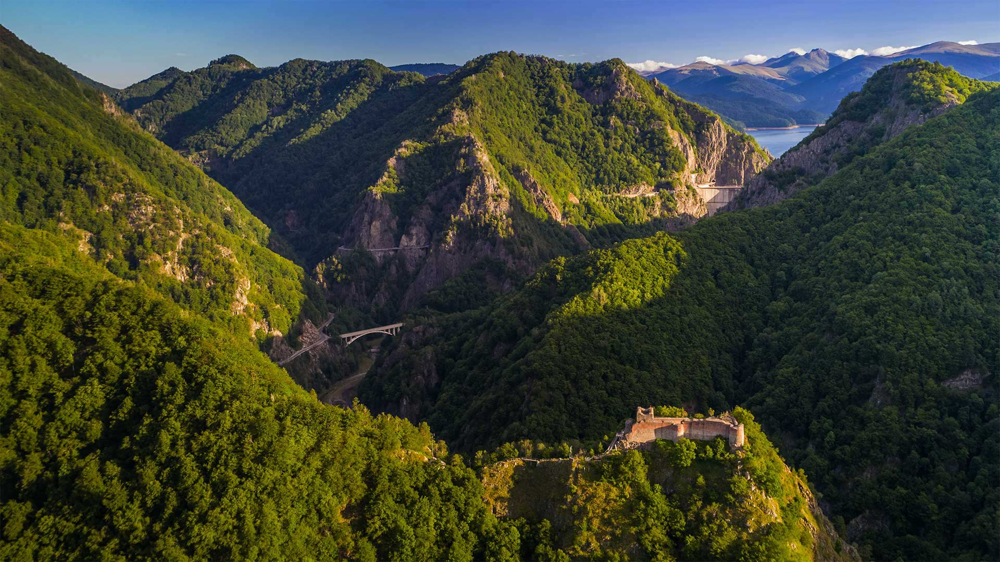

#### 20230509 Morro Jable and Playa del Matorral, Fuerteventura, Canary Islands, Spain (© Gavin Hellier/Getty Images)

#### 20230509 卡韦希环礁，土阿莫土群岛，法属波利尼西亚 (© WaterFrame/Alamy)

#### 20230508 Delicate Arch, Arches National Park, Utah (© Mark Brodkin Photography/Getty Images)

#### 20230508 Port Vieux-Bassin de Honfleur, Calvados, Normandie (© Francesco Carovillano/SOPA Collection/Shutterstock)

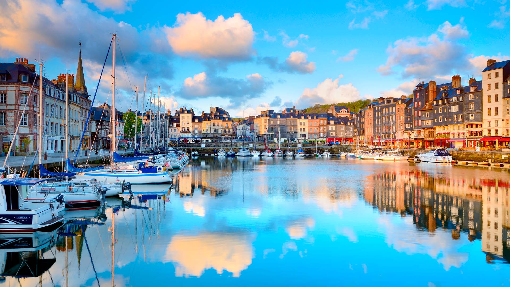

#### 20230507 Gray seal pup, Lundy Island, England (© Henley Spiers/Minden Pictures)

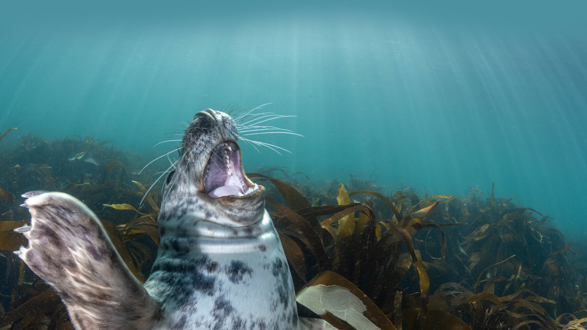

#### 20230506 Feuerwerk in Speyer Rheinland-Pfalz (© Janny2/iStock/Getty Images Plus)

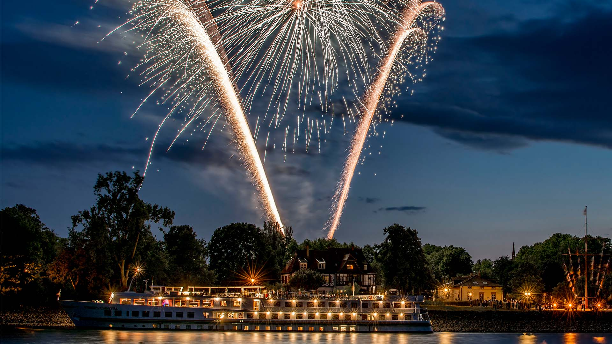

#### 20230506 大麦和矢车菊, 诺德豪森, 德国 (© Mandy Tabatt/Getty Images)

#### 20230506 Royal azaleas in bloom on Hwangmaesan Mountain, South Korea (© Stock for you/Shutterstock)

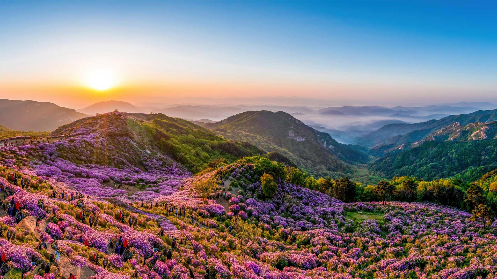

#### 20230506 Sasso Caveoso, Basilicata, Matera, Italy (© Riccardo Spila/eStock)

#### 20230505 Church of Nuestra Señora de los Remedios and Popocatépetl, Puebla, Mexico (© Radius Images/Shutterstock)

#### 20230505 風に泳ぐ鯉のぼり (© rai/Adobe Stock)

#### 20230504 Mayan ruins in Tikal, Guatemala (© THP Creative/Getty Images)

#### 20230503 Wildebeests in the Maasai Mara National Reserve, Kenya (© Matt Polski/Getty Images)

#### 20230503 国会議事堂, 東京都 千代田区 (© Sean Pavone/Alamy Stock Photo)

#### 20230502 円形茶畑, 京都府 相楽郡 (© Tuul and Bruno Morandi/Alamy Stock Photo)

#### 20230501 Biene im Sonnenblumenfeld bei Fresdorf (© Ralf Hirschberger/dpa-Zentralbild/dpa/Alamy Live News)

#### 20230501 横跨圣劳伦斯河下游的魁北克大桥，加拿大 (© Ronald Santerre/Getty Images)

#### 20230501 Muguet de mai en fleurs (© shapencolour/Alamy Stock Photo)

#### 20230501 Korean Bell of Friendship, Los Angeles (© Carlos Marin/Getty Images)

#### 20230501 Jöriseen lakes in the Silvretta Alps, Switzerland (© Florin Baumann/Getty Images)

