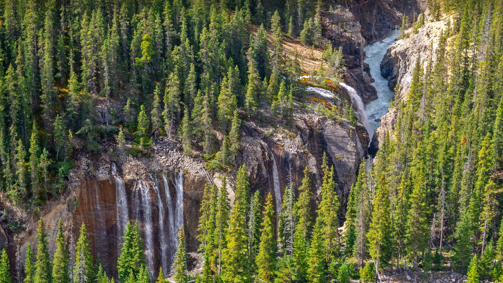
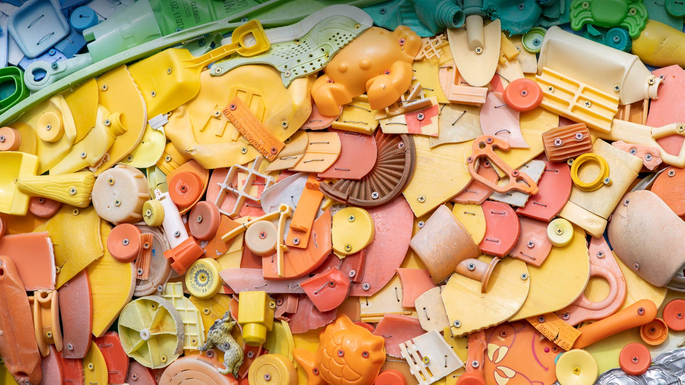
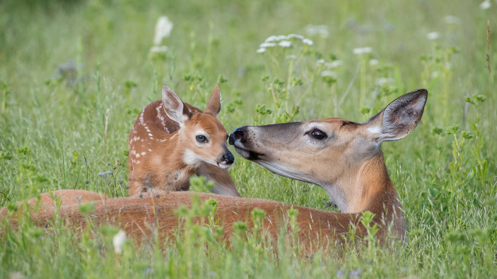
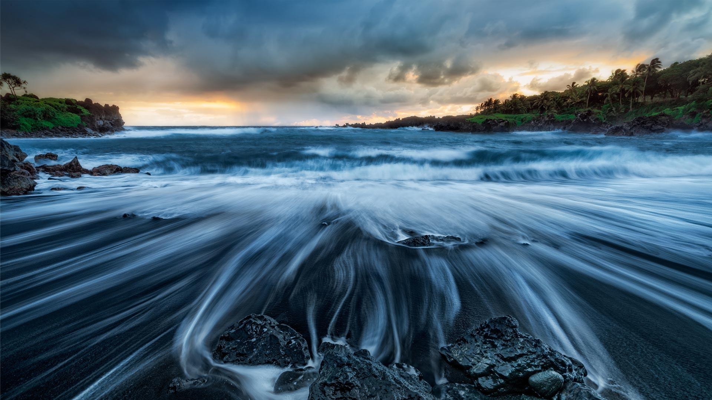

#### 20230605 辛华达峡谷的瀑布，贾斯珀国家公园，加拿大 (© Delpixart/Getty Images)

#### 20230605 プラスチックごみで構成されたインスタレーション (© Michael Siluk/UCG/Universal Images Group via Getty Images)

#### 20230604 Biche de Virginie et son faon, Montana  (© Donald M. Jones/Minden Pictures)

#### 20230604 Black sand beach at Wai'ānapanapa State Park, Maui, Hawaii (© Matt Anderson Photography/Getty Images)

#### 20230603 South Kaibab Trail in Grand Canyon National Park, Arizona (© Roman Khomlyak/Getty Images)

#### 20230602 Gemsbok (Oryx gazella) in sand dunes, Namibia (© Sergey Gorshkov/Minden)

#### 20230601 Aerial image of the Great Barrier Reef, Australia (© AirPano LLC/Amazing Aerial Agency)

