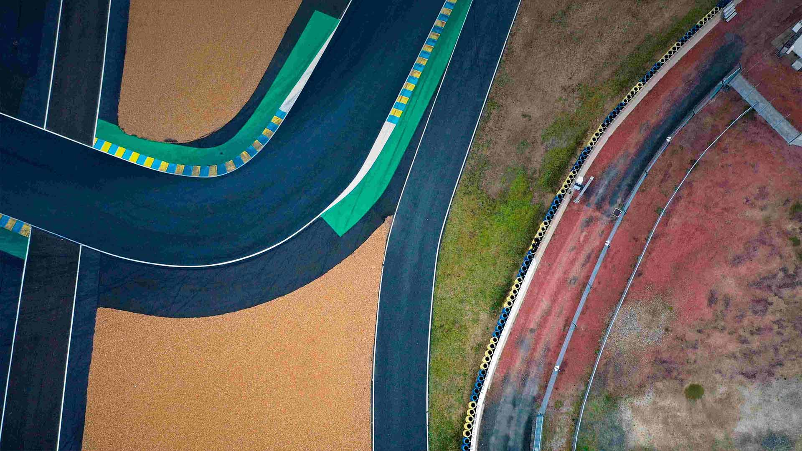
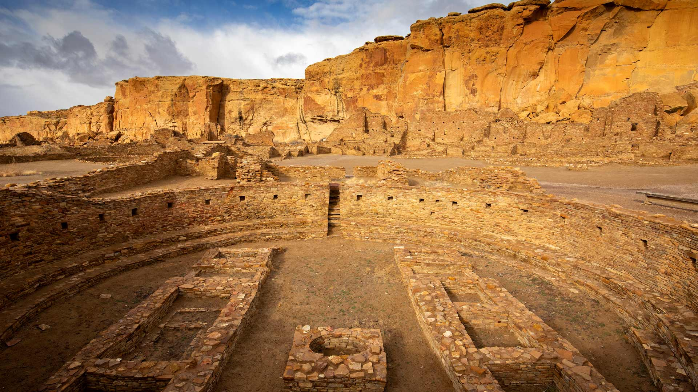
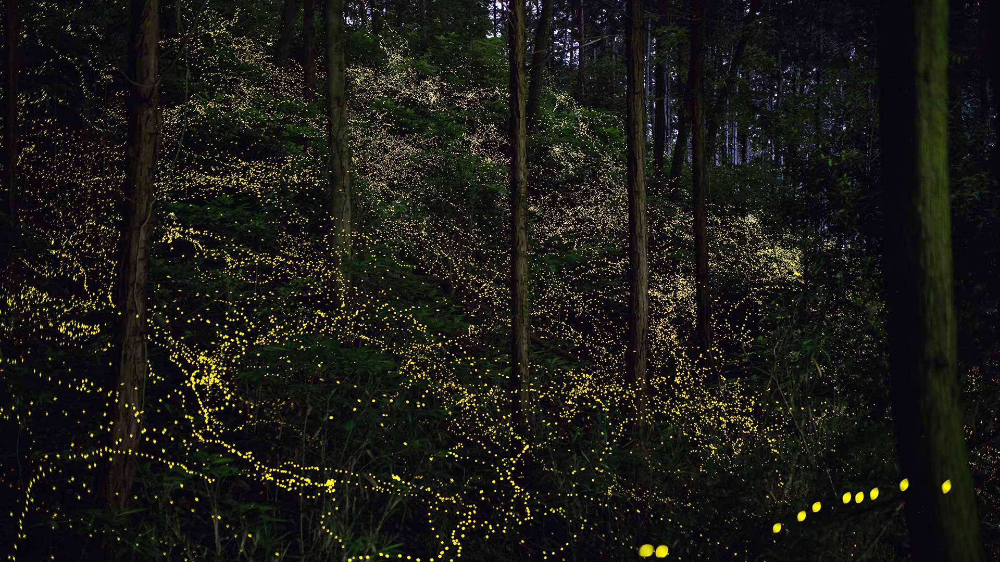
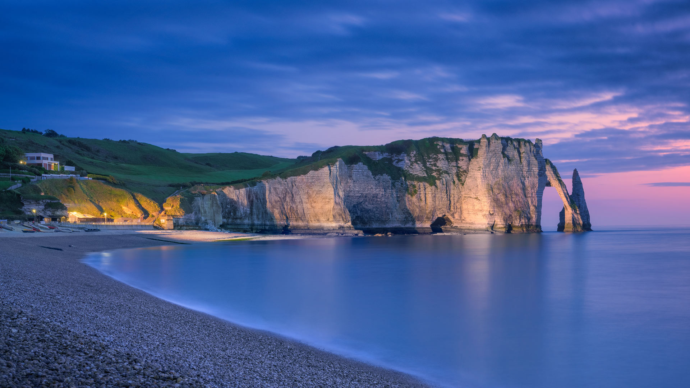

#### 20230610 Porto Cathedral, Portugal (© Reinhard Schmid/Huber/eStock Photo)

#### 20230610 Vue aérienne du circuit Bugatti, Le Mans (© Lou Benoist/AFP via Getty Images)

#### 20230609 Hot air balloons in Cappadocia, Türkiye (© Anton Petrus/Getty Images)

#### 20230608 Humpback whale (© Philip Thurston/Getty Images)

#### 20230607 Pueblo Bonito, Chaco Culture National Historical Park, New Mexico (© Ian Shive/Tandem Stills + Motion)

#### 20230606 森の中で輝く蛍たち (© Trevor Williams/Getty images)

#### 20230606 The chalk cliffs of Étretat, Normandy, France (© MarcelloLand/Getty Images)

#### 20230605 辛华达峡谷的瀑布，贾斯珀国家公园，加拿大 (© Delpixart/Getty Images)

#### 20230605 'Priscilla the Parrotfish' art installation at Como Park Zoo & Conservatory, St. Paul, Minnesota (© Michael Siluk/UCG/Universal Images Group via Getty Images)

#### 20230604 Biche de Virginie et son faon, Montana  (© Donald M. Jones/Minden Pictures)

#### 20230604 Black sand beach at Wai'ānapanapa State Park, Maui, Hawaii (© Matt Anderson Photography/Getty Images)

#### 20230603 South Kaibab Trail in Grand Canyon National Park, Arizona (© Roman Khomlyak/Getty Images)

#### 20230602 Gemsbok (Oryx gazella) in sand dunes, Namibia (© Sergey Gorshkov/Minden)

#### 20230601 Aerial image of the Great Barrier Reef, Australia (© AirPano LLC/Amazing Aerial Agency)

