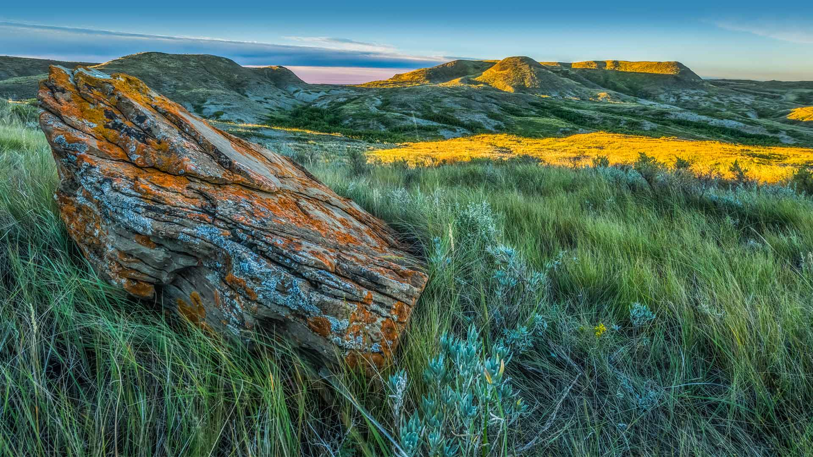
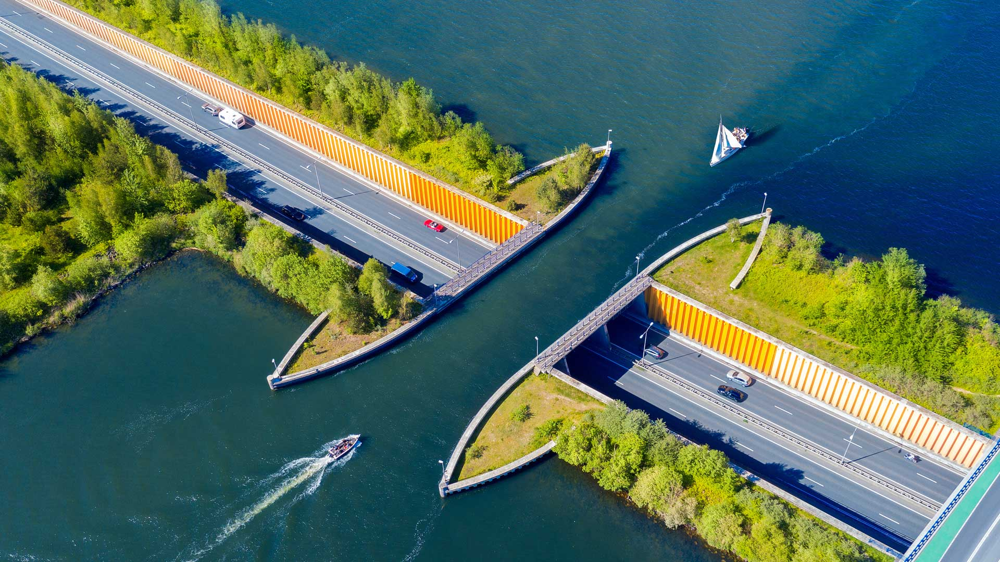

#### 20230706 南跳岩企鹅，福克兰群岛 (© Tony Beck/Getty Images)

#### 20230706 Row of boats at Hintersee lake, Bavaria, Germany (© Achim Thomae/Getty Images)

#### 20230705 Porto Timoni beach, Corfu, Greece (© nantonov/Getty Images)

#### 20230704 サマセットのラベンダー畑, イギリス  (© Doug Chinnery/Getty Images)

#### 20230704 草原国家公园，萨斯喀彻温省，加拿大 (© Robert Postma/Getty Images)

#### 20230704 Empire State Building on the Fourth of July, New York City (© Tetra Images/Getty Images)

#### 20230704 Mildred B. Cooper Memorial Chapel, Bella Vista, Arkansas (© Eddie Brady/Getty Images)

#### 20230703 A coyote in Banff, Alberta, Canada (© Harry Collins/Getty Images)

#### 20230703 トゥアモトゥ諸島にあるカウエヒ環礁, フランス領ポリネシア (© WaterFrame/Alamy)

#### 20230702 Veluwemeer Aqueduct, Netherlands (© Frolova_Elena/Getty Images)

#### 20230701 从意大利圣天使城堡俯瞰罗马 (© sborisov/Getty Images)

#### 20230701 Tour de France cyclists crossing the Pont du Gard, France (© Gonzalo Fuentes/Reuters)

#### 20230701 Parliament Hill in Ottawa, Ontario, Canada (© f11photo/Shutterstock)

