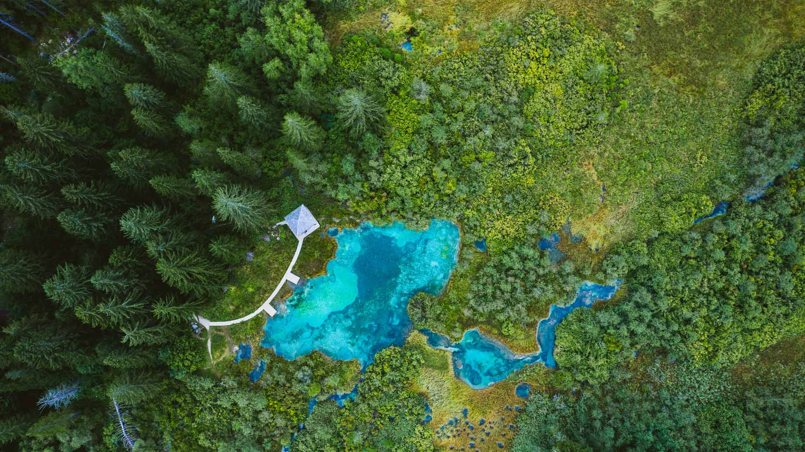
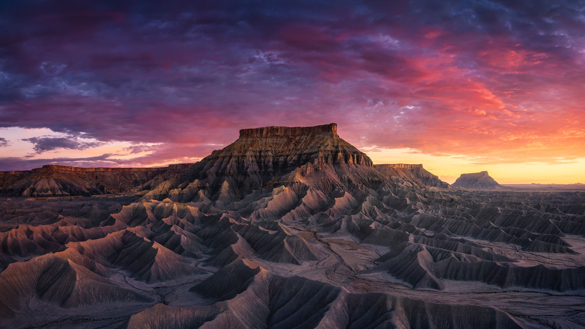

#### 20230806 原爆ドーム前元安川のとうろう流し, 広島県 広島市 (© Anadolu Agency/Getty Images)

#### 20230805 Rakotzbrücke in Kromlau, Landkreis Görlitz, Sachsen (© DieterMeyrl/Getty Images)

#### 20230805 Atlantic puffin, Iceland (© Peter Hering/Minden Pictures)

#### 20230804 鏡池, 長野県 長野市 (© Shoji Fujita/Getty Images)

#### 20230804 Tintern Abbey, Wales (© matthibcn/Getty Images)

#### 20230803 Zelenci Nature Reserve, Slovenia (© Andrey Danilovich/Getty Images)

#### 20230803 Helmcken waterfall in Wells Gray Provincial Park, British Columbia, Canada (© Laurens Verhoeven/iStock/Getty Images)

#### 20230802 Sandstone butte in Capitol Reef National Park, Utah (© Amazing Aerial Premium/Shutterstock)

#### 20230801 絢爛華麗な弘前ねぷた, 青森県 弘前市 (© David Parker/Alamy Stock Photo)

#### 20230801 Climber on Denali, Denali National Park, Alaska (© Andrew Peacock/Tandem Stills + Motion)

#### 20230801 Plage de Rondinara et sa réserve naturelle, Bonifacio, Corse (© Hemis/Alamy Stock Photo)

#### 20230801 Confederation Bridge, Prince Edward Island, Canada (© Henryk Sadura/Getty Images)

