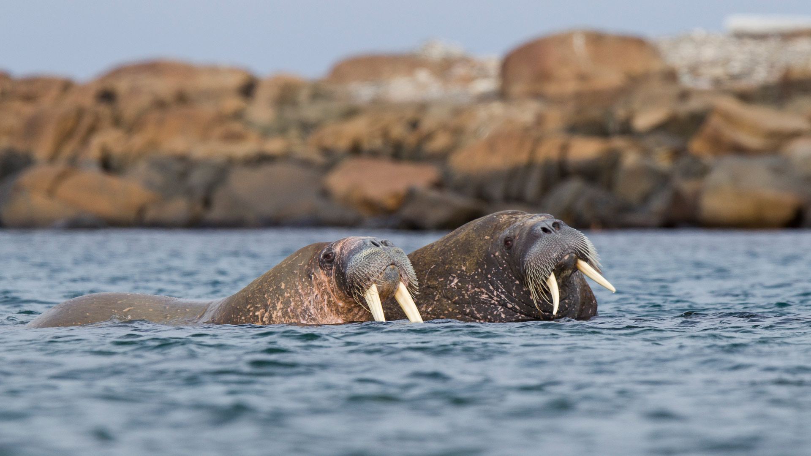
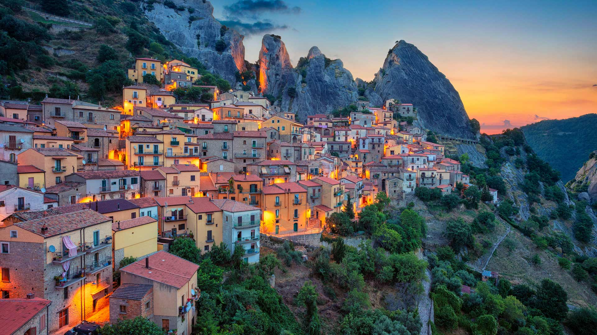

#### 20230911 波尔多葡萄园的日出，法国 (© Esperanza33/Getty Images)

#### 20230911 French River, Ontario, Canada (© Tim Fitzharris/Minden)

#### 20230911 Brooklyn Bridge with the 'Tribute in Light' installation for 9/11, New York (© ANDREY DENISYUK/Getty Images)

#### 20230910 Walrus pair at sea in Svalbard, Norway (© Mark Smith/Getty Images)

#### 20230910 Castelmezzano, Italie (© Rudy Balasko/Shutterstock)

#### 20230909 菊の花 (© Maciej Figiel/Alamy Stock Photo)

#### 20230909 Wat Chaiwatthanaram temple, Ayutthaya Historical Park, Thailand (© Weerasak Saeku/Getty Images)

#### 20230908 Parc Olympique Lyonnais, Groupama Stadium OL Vallée, Lyon (© dpa picture alliance/Alamy Stock Photo)

#### 20230908 The Circus townhouses in Bath, Somerset, England (© Gavin Hellier/Getty Images)

#### 20230907 Scenic view at Toronto city waterfront skyline at sunset (© Elena Elisseeva/Shutterstock)

#### 20230907 Der Reichstag unter einem Sternenhimmel, Berlin (© MarioGuti/Getty Images)

#### 20230906 Old Venetian harbor, Rethymno, Crete Island, Greece (© Gatsi/Getty Images)

#### 20230905 Mount Segla, Senja Island, Troms og Finnmark, Norway (© imageBROKER/Moritz Wolf/Getty Images)

#### 20230904 パッサウ, ドイツ バイエルン州 (© Scott Wilson/Alamy)

#### 20230904 Construction workers on scaffolding (© Bits and Splits/Shutterstock)

#### 20230904 Camels in the desert, United Arab Emirates (© Amazing Aerial Premium/Shutterstock)

#### 20230904 布尔日的沼泽，法国 (© Tuul & Bruno Morandi/Getty Images)

#### 20230903 Aerial view of Manhattan, New York City (© Wojtek Zagorski/Getty Images)

#### 20230902 Allen's hummingbird, Santa Cruz, California (© mallardg500/Getty Images)

#### 20230901 Turkey tail mushroom, Brevard, North Carolina (© Bill Gozansky/Alamy)

#### 20230901 草原を走るノロジカの子鹿, フランス ノルマンディー (© Gerard Lacz/Minden)

