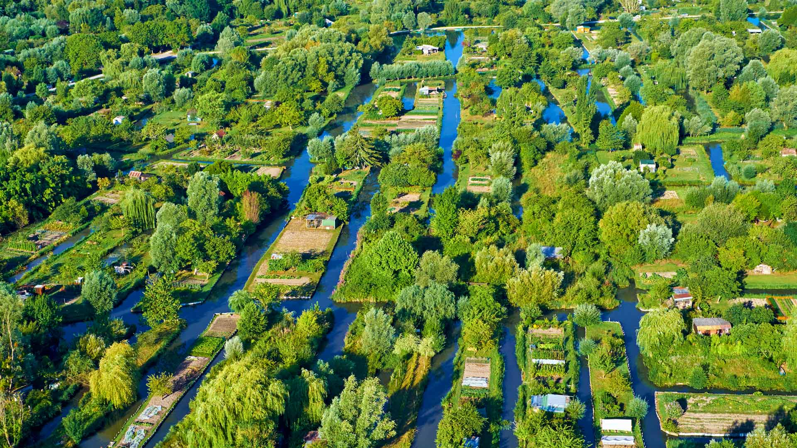
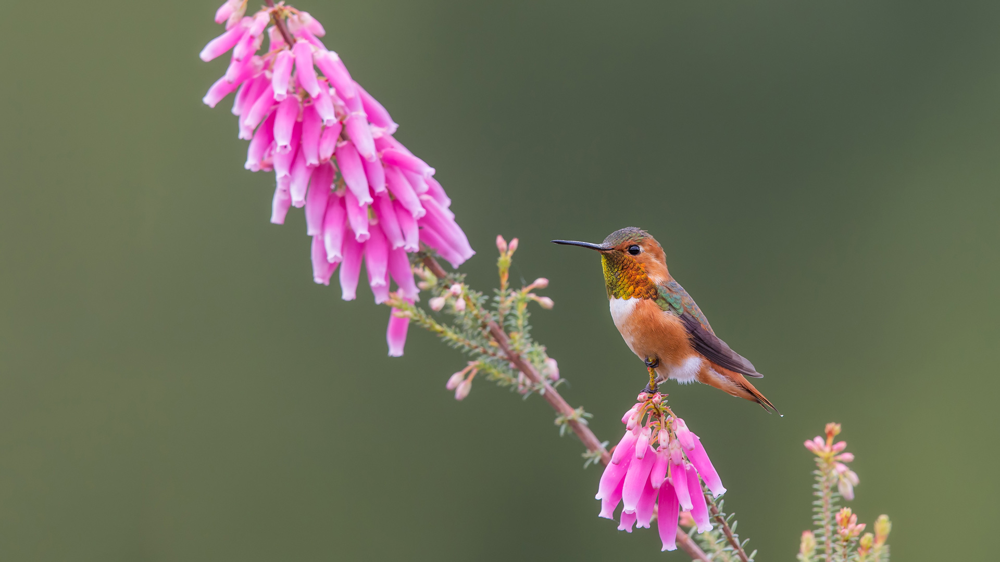

#### 20230904 パッサウ, ドイツ バイエルン州 (© Scott Wilson/Alamy)

#### 20230904 布尔日的沼泽，法国 (© Tuul & Bruno Morandi/Getty Images)

#### 20230903 Aerial view of Manhattan, New York City (© Wojtek Zagorski/Getty Images)

#### 20230902 Allen's hummingbird, Santa Cruz, California (© mallardg500/Getty Images)

#### 20230901 Turkey tail mushroom, Brevard, North Carolina (© Bill Gozansky/Alamy)

#### 20230901 草原を走るノロジカの子鹿, フランス ノルマンディー (© Gerard Lacz/Minden)

