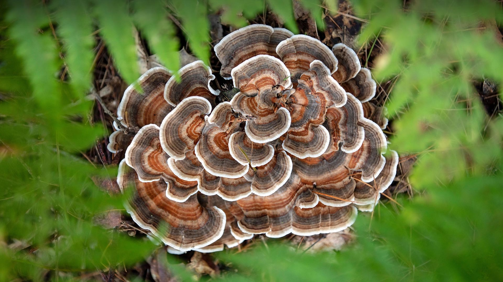

#### 20230903 曼哈顿鸟瞰图，纽约市，美国 (© Wojtek Zagorski/Getty Images)

#### 20230902 Allen's hummingbird, Santa Cruz, California (© mallardg500/Getty Images)

#### 20230901 Turkey tail mushroom, Brevard, North Carolina (© Bill Gozansky/Alamy)

#### 20230901 草原を走るノロジカの子鹿, フランス ノルマンディー (© Gerard Lacz/Minden)

