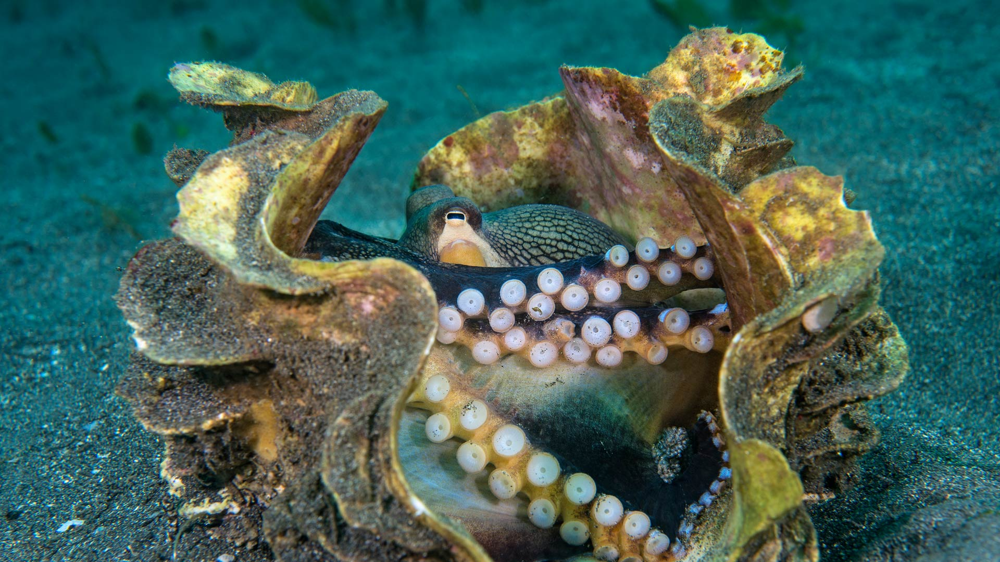
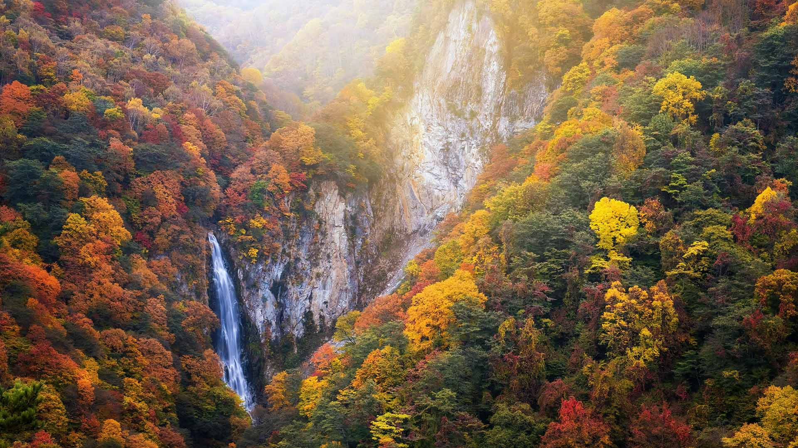
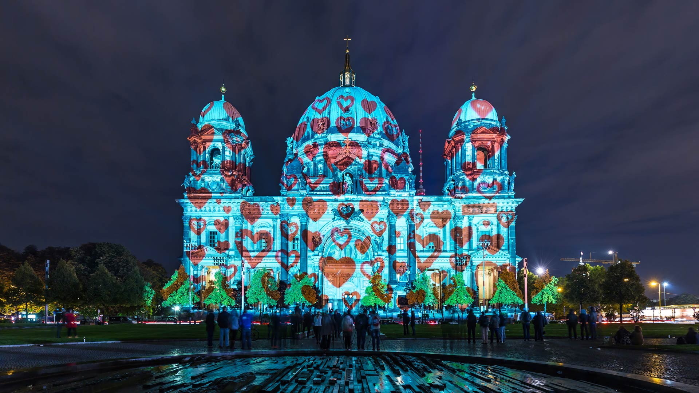
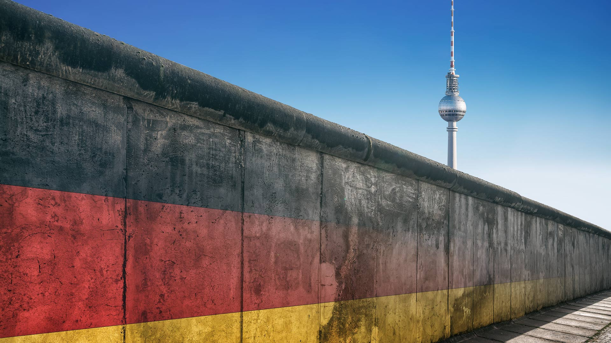
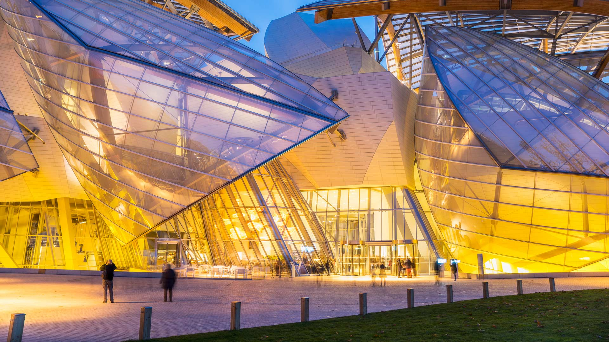
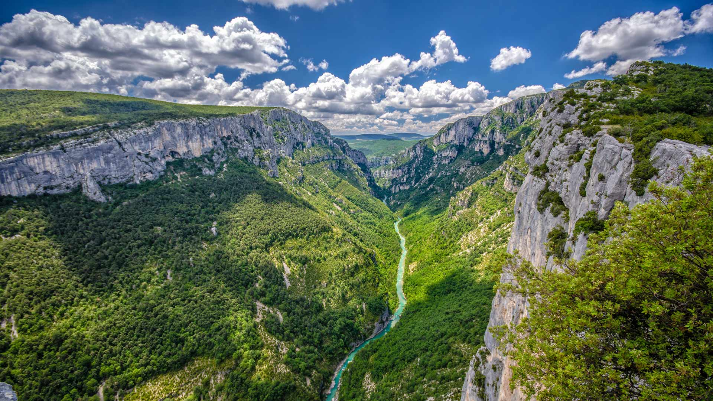
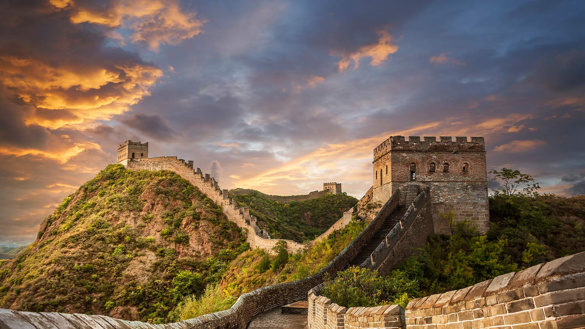

#### 20231008 Veined octopus in a giant clam shell, Sulawesi Sea, Indonesia (© Alex Mustard/Minden Pictures)

#### 20231008 志賀高原の澗満滝, 長野県 (© Twenty47studio/Getty Images)

#### 20231007 Brown bears fishing for salmon at Brooks Falls, Katmai National Park, Alaska (© oksana.perkins/Shutterstock)

#### 20231006 Taughannock Falls State Park in Trumansburg, New York (© Paul Massie Photography/Getty Images)

#### 20231006 Berliner Dom in Herz-Illumination, Tag der Lichter, Berlin (© fhm/Getty Images)

#### 20231005 Gentoo penguins, Antarctica (© Art Wolfe/Getty Images)

#### 20231004 Young stars forming in the Tarantula Nebula, James Webb Space Telescope (© NASA, ESA, CSA, STScI, Webb ERO Production Team)

#### 20231003 Whitehaven Beach, Whitsunday Island, Queensland, Australia (© Coral Brunner/Shutterstock)

#### 20231003 Berliner Mauer (© frankpeters/Getty Images)

#### 20231002 Louis Vuitton Foundation in the Bois de Boulogne, Paris, France (© Atlantide Phototravel/Getty Images)

#### 20231002 韦尔东峡谷，普罗旺斯-阿尔卑斯-蓝色海岸，法国 (© luisapuccini/Getty Images)

#### 20231001 雄伟壮丽的中国长城 (© Jeff_Hu/Getty Images)

#### 20231001 Lake Bled at sunrise, Slovenia (© Rasica/Getty Images)

#### 20231001 Mount Assiniboine Provincial Park, Canada (© matt macpherson/500px/Getty Images)

