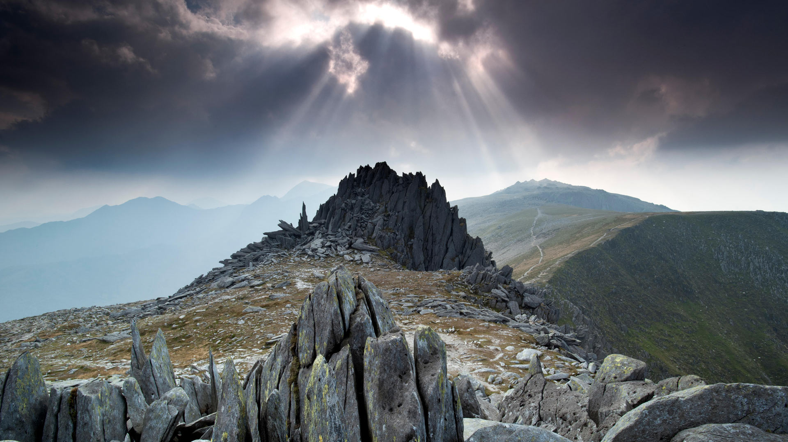
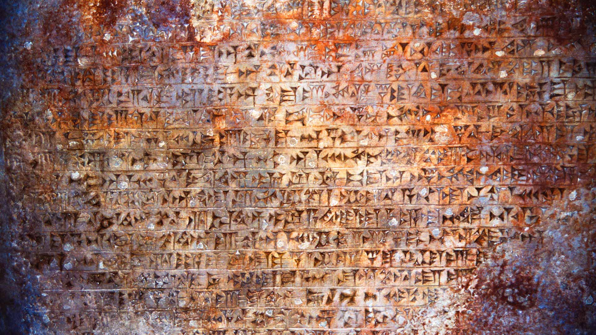
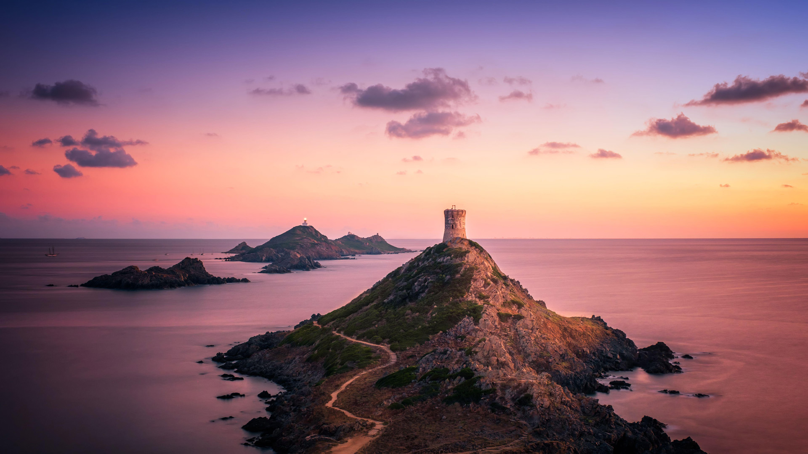
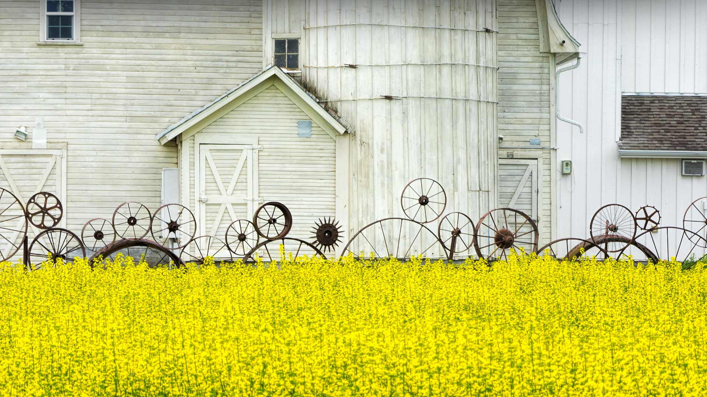
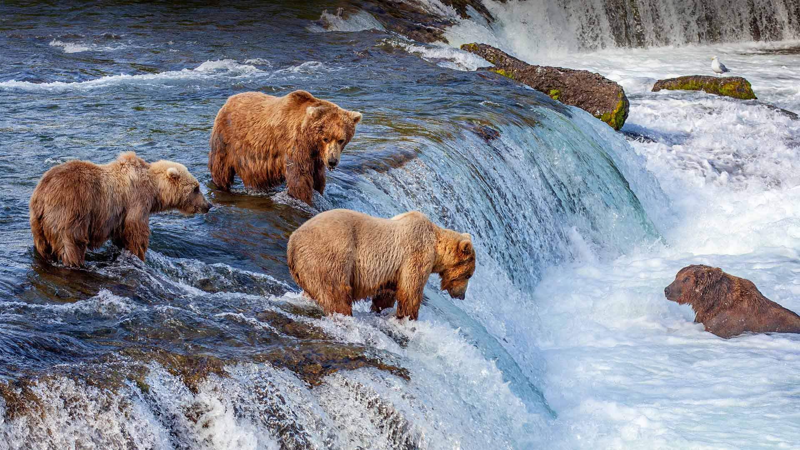
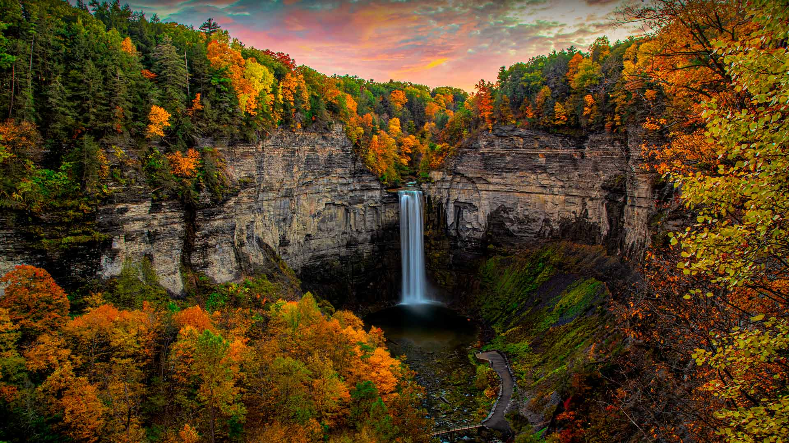
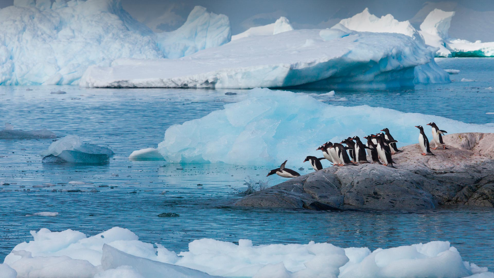
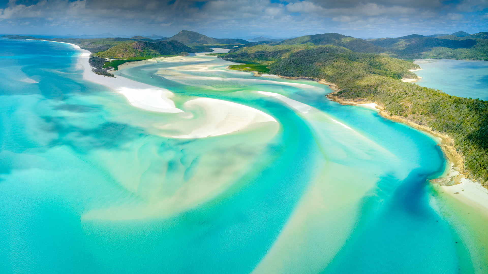

#### 20231025 大阶梯埃斯卡兰特国家纪念区中的棉白杨树，犹他州，美国 (© Jeff Foott/Minden Pictures)

#### 20231024 Stiftsbibliothek im Kloster Waldsassen, Oberpfalz, Bayern (© H.&D. Zielske/Image Professionals GmbH/Alamy Stock Foto)

#### 20231024 Füzér Castle in the Zemplén Mountains, Hungary (© ZGPhotography/Alamy)

#### 20231023 Corn maze in Saylorsburg, Pennsylvania (© Alex Potemkin/Getty Images)

#### 20231022 平安神宮, 京都府 京都市 (© Arif Iqball Photography-Japan/Alamy Stock Photo)

#### 20231022 Astoria-Megler Bridge on the Columbia River, Astoria, Oregon (© Dan Mihai/Getty Images)

#### 20231021 Reliefs in the ancient Persian city of Persepolis, Iran (© Ozbalci/Getty Images)

#### 20231020 Pygmy three-toed sloth baby, Isla Escudo de Veraguas, Panama (© Suzi Eszterhas/Minden Pictures)

#### 20231019 Water lily harvest, Mekong River Delta, Long An, Vietnam (© Khanh Phan/Solent News/Shutterstock)

#### 20231019 Castell y Gwynt，格莱德法赫山，雪墩山国家公园，英国北威尔士 (© Alan Novelli/Alamy Stock Photo)

#### 20231018 Kodiak National Wildlife Refuge, Kodiak Island, Alaska (© Ian Shive/Tandem Stills + Motion)

#### 20231017 Ancient carved texts from Persepolis, Iran (© George Hall/Alamy)

#### 20231017 帕拉塔塔,阿雅克肖,科西嘉岛,法国 (© Jon Ingall/Alamy)

#### 20231016 Golden larches and Prusik Peak, the Enchantments, Washington (© Jim Patterson/Tandem Stills + Motion)

#### 20231014 'Ring of fire' annular solar eclipse, Doha, Qatar (© Sorin Furcoi/Getty Images)

#### 20231014 第三只見川橋梁を渡る列車, 福島県 大沼郡 三島町 (© DoctorEgg/Getty Images)

#### 20231013 Vieste on the Gargano peninsula, Apulia, Italy (© Pilat666/Getty Images)

#### 20231013 Château du Haut-Koenigsbourg au lever du soleil, à Orschwiller, Alsace, Grand Est (© PATRICK HERTZOG/AFP via Getty Images)

#### 20231013 Milky Way over Athabasca Glacier in Jasper National Park, Canada (© Alan Dyer/Stocktrek Images/Getty Images)

#### 20231012 Schloss Neuschwanstein im Herbst, Schwangau, Bayern (© NNER/Shutterstock)

#### 20231012 Old barn and canola field, Palouse region, Washington (© Terry Eggers/Getty Images)

#### 20231012 European hedgehog sheltering in tree bark, Sussex, England (© Jules Cox/Minden Pictures)

#### 20231011 The Painted Hills in John Day Fossil Beds National Monument, Oregon (© Ben Herndon/Tandem Stills + Motion)

#### 20231010 Mount Sopris, Colorado (© Jason Hatfield/Tandem Stills + Motion)

#### 20231010 Basilique du Sacré Cœur de Montmartre (© Tuul & Bruno Morandi)

#### 20231009 A bowl full of cranberries, Ontario, Canada (© plainpicture/Design Pics/Julie DeRoche)

#### 20231009 Fremont Indian petroglyphs, Dinosaur National Monument, Jensen, Utah (© Dan Leeth/Alamy)

#### 20231008 Veined octopus in a giant clam shell, Sulawesi Sea, Indonesia (© Alex Mustard/Minden Pictures)

#### 20231008 志賀高原の澗満滝, 長野県 (© Twenty47studio/Getty Images)

#### 20231007 Brown bears fishing for salmon at Brooks Falls, Katmai National Park, Alaska (© oksana.perkins/Shutterstock)

#### 20231006 Taughannock Falls State Park in Trumansburg, New York (© Paul Massie Photography/Getty Images)

#### 20231006 Berliner Dom in Herz-Illumination, Tag der Lichter, Berlin (© fhm/Getty Images)

#### 20231005 Gentoo penguins, Antarctica (© Art Wolfe/Getty Images)

#### 20231004 Young stars forming in the Tarantula Nebula, James Webb Space Telescope (© NASA, ESA, CSA, STScI, Webb ERO Production Team)

#### 20231003 Whitehaven Beach, Whitsunday Island, Queensland, Australia (© Coral Brunner/Shutterstock)

#### 20231003 Berliner Mauer (© frankpeters/Getty Images)

#### 20231002 Louis Vuitton Foundation in the Bois de Boulogne, Paris, France (© Atlantide Phototravel/Getty Images)

#### 20231002 韦尔东峡谷，普罗旺斯-阿尔卑斯-蓝色海岸，法国 (© luisapuccini/Getty Images)

#### 20231001 雄伟壮丽的中国长城 (© Jeff_Hu/Getty Images)

#### 20231001 Lake Bled at sunrise, Slovenia (© Rasica/Getty Images)

#### 20231001 Mount Assiniboine Provincial Park, Canada (© matt macpherson/500px/Getty Images)

