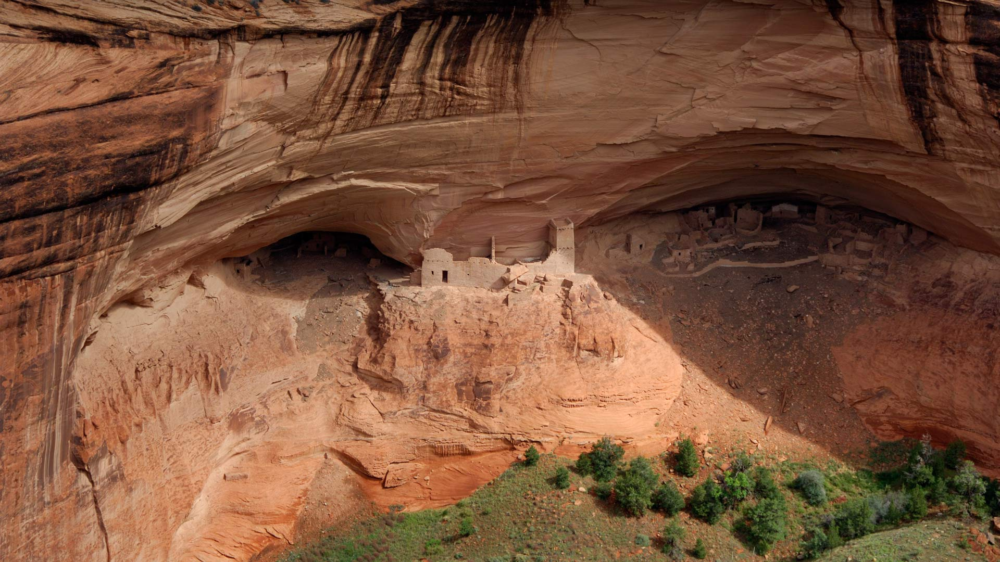
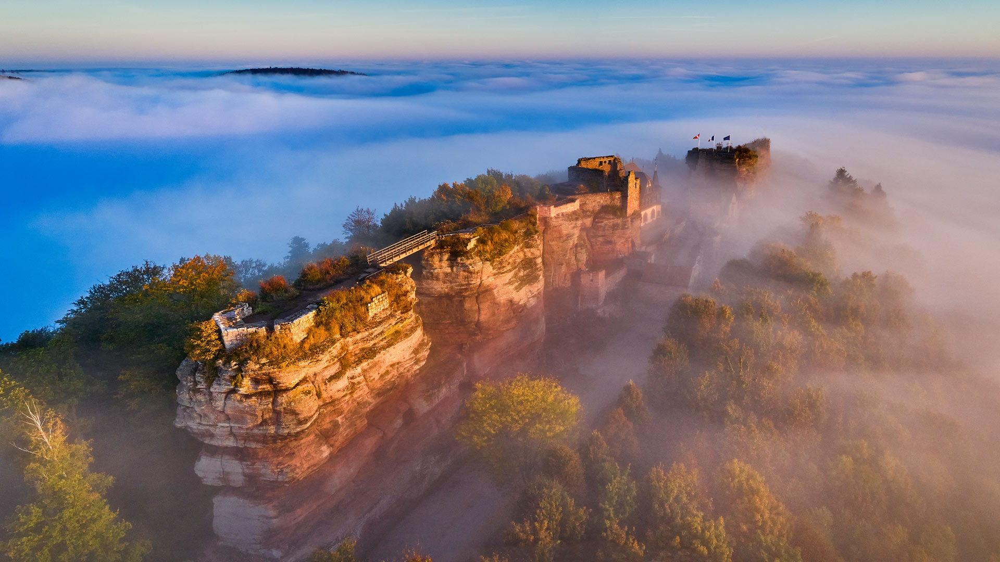

#### 20231101 Pumpkins and squashes (© bobkeenan/Getty Images)

#### 20231101 Mummy Cave ruins, Canyon de Chelly National Monument, Arizona (© Cindy Miller Hopkins/Danita Delimont)

#### 20231101 Kenny Lake at dawn, Lake Superior Provincial Park, Ontario, Canada (© Don Johnston/agefotostock)

#### 20231101 上巴尔城堡，阿尔萨斯，法国 (© Andrea Pistolesi/Getty Images)

