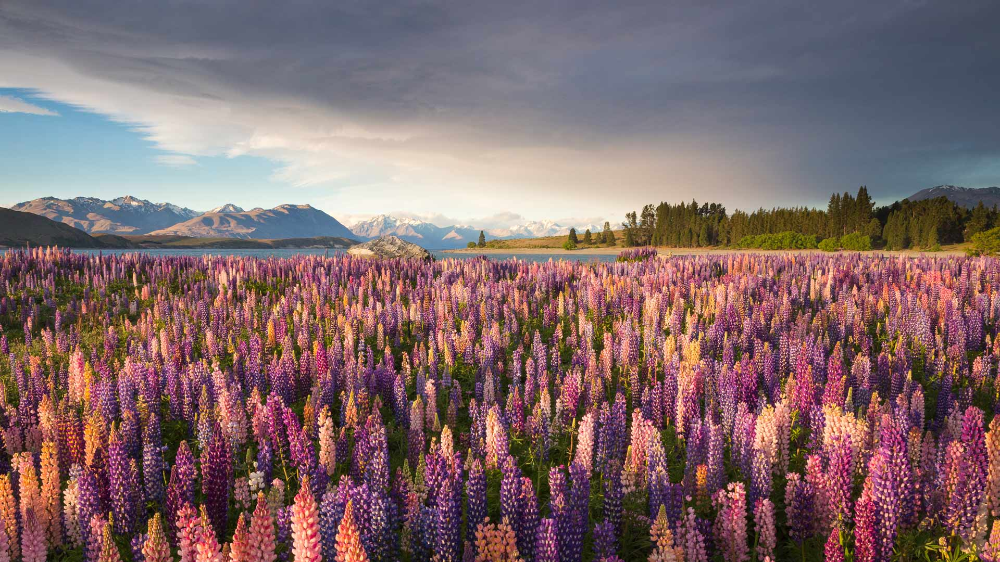
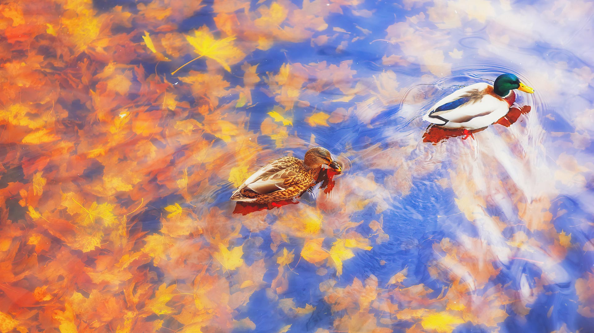
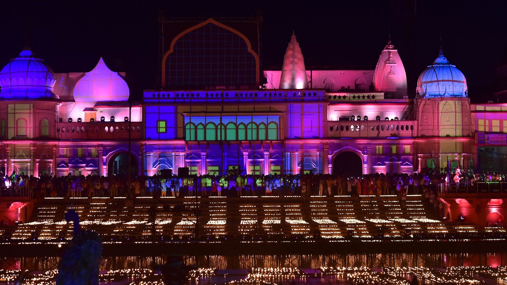
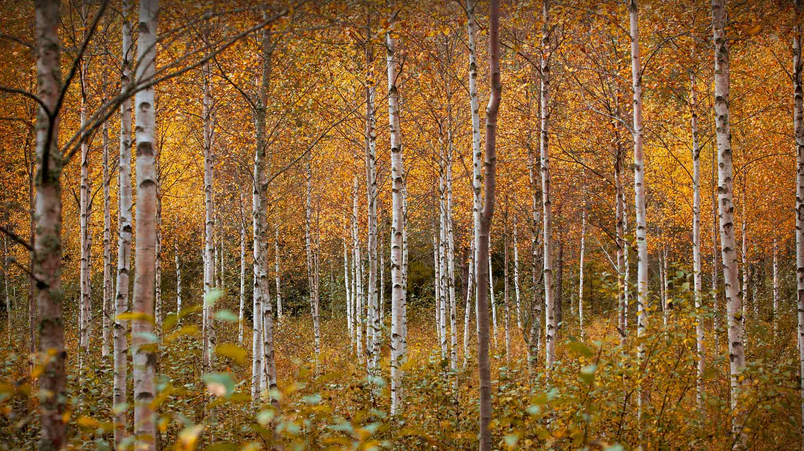
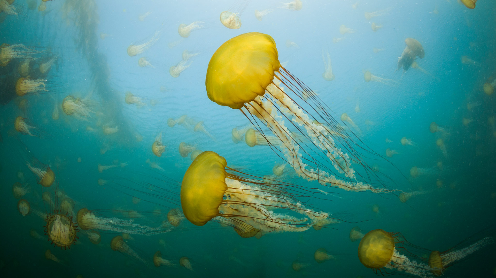
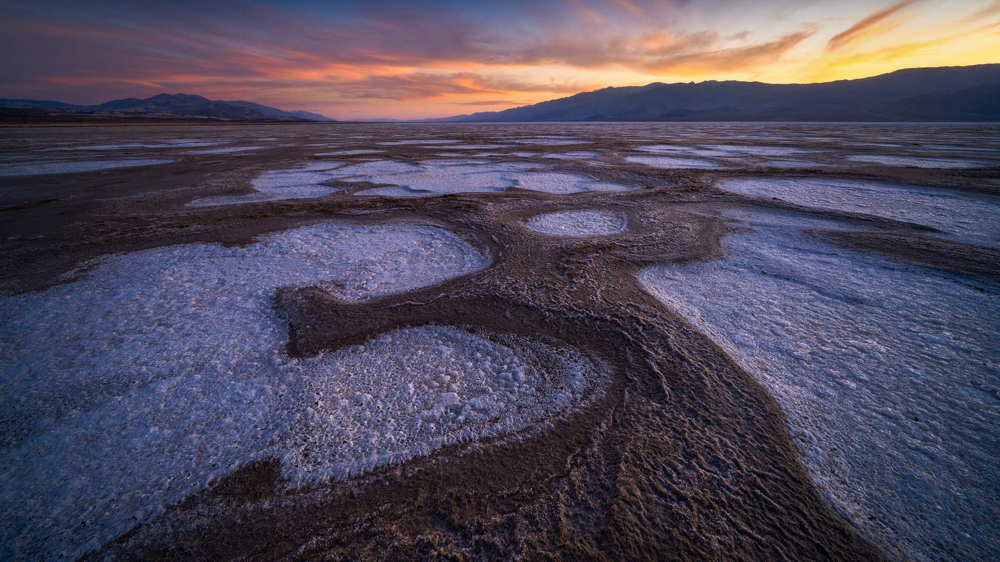

#### 20231114 特卡波湖沿岸的鲁冰花，南岛，新西兰 (© Jeffrey Lewis/Tandem Stills + Motion)

#### 20231114 Vielblättrige Lupinen am Lake Tekapo, Südinsel, Neuseeland (© Jeffrey Lewis/Tandem Stills + Motion)

#### 20231113 Old olive grove in the Serra Tramuntana range, Majorca, Spain (© cinoby/Getty Images)

#### 20231112 秋天池塘里的两只绿头鸭 (© sun ok/Shutterstock)

#### 20231112 Lamps on the banks of the Sarayu River for Diwali, Ayodhya, India (© SANJAY KANOJIA/AFP/Getty Images)

#### 20231111 Autumnal woodland and Young Peak, British Columbia, Canada (© David Noton/Minden)

#### 20231111 Sunset at the Washington Monument, Washington, DC (© Joe Daniel Price/Getty Images)

#### 20231111 富内斯山谷，背景是多洛米蒂山，南蒂罗尔，意大利 (© Achim Thomae/Getty Images)

#### 20231111 サレック国立公園, スウェーデン (© Hans Strand/Getty Images)

#### 20231111 Drapeau français sous l’Arc de Triomphe, Paris, France (© Wiliam Perry/Alamy Stock Photo)

#### 20231110 Das pittoreske Schweriner Schloss, Schwerin, Mecklenburg-Vorpommern (© Hannes Wendt/Shutterstock)

#### 20231110 Badlands National Park, South Dakota (© Grant Ordelheide/Tandem Stills + Motion)

#### 20231109 Birch trees in autumn, Drammen, Norway (© Baac3nes/Getty Images)

#### 20231108 West Indian manatee mother and baby, Three Sisters Springs, Crystal River, Florida (© Karine Aigner/Tandem Stills + Motion)

#### 20231108 干し柿, 山梨県 南都留郡 富士河口湖町 (© STEPHEN FLEMING/Alamy Stock Photo)

#### 20231108 黄山的日落，安徽省，中国 (© Nantapon Pattamakijsakul/Getty Images)

#### 20231107 Kirkilai lakes and lookout tower, Biržai Regional Park, Lithuania (© MNStudio/Shutterstock)

#### 20231106 Lake Pehoé, Torres del Paine National Park, Chile (© OST/Getty Images)

#### 20231105 Quartzite formation, Playa del Silencio, Asturias, Spain (© Jean-Philippe Delobelle/Minden Pictures)

#### 20231104 American bison, Yellowstone National Park, Wyoming (© Gary Gray/Getty Images)

#### 20231103 Pacific sea nettles off the coast of Carmel, California (© Jim Patterson/Tandem Stills + Motion)

#### 20231103 West Indian manatee mother and baby, Three Sisters Springs, Crystal River, Florida (© Karine Aigner/Tandem Stills + Motion)

#### 20231103 Hunsrück Hochwald, Herbstwald bei Deuselbach, Naherholungsgebiet Erbeskopf, Rheinland-Pfalz (© Hans-Peter Merten/Huber/eStock Photo)

#### 20231102 Salt flats in Badwater Basin, Death Valley National Park, California (© Jim Patterson/Tandem Stills + Motion)

#### 20231101 Pumpkins and squashes (© bobkeenan/Getty Images)

#### 20231101 Mummy Cave ruins, Canyon de Chelly National Monument, Arizona (© Cindy Miller Hopkins/Danita Delimont)

#### 20231101 Kenny Lake at dawn, Lake Superior Provincial Park, Ontario, Canada (© Don Johnston/agefotostock)

#### 20231101 上巴尔城堡，阿尔萨斯，法国 (© Andrea Pistolesi/Getty Images)

#### 20231101 コロンビア川とアストリア・メグラー橋, 米国 オレゴン州 (© Dan Mihai/Getty Images)

