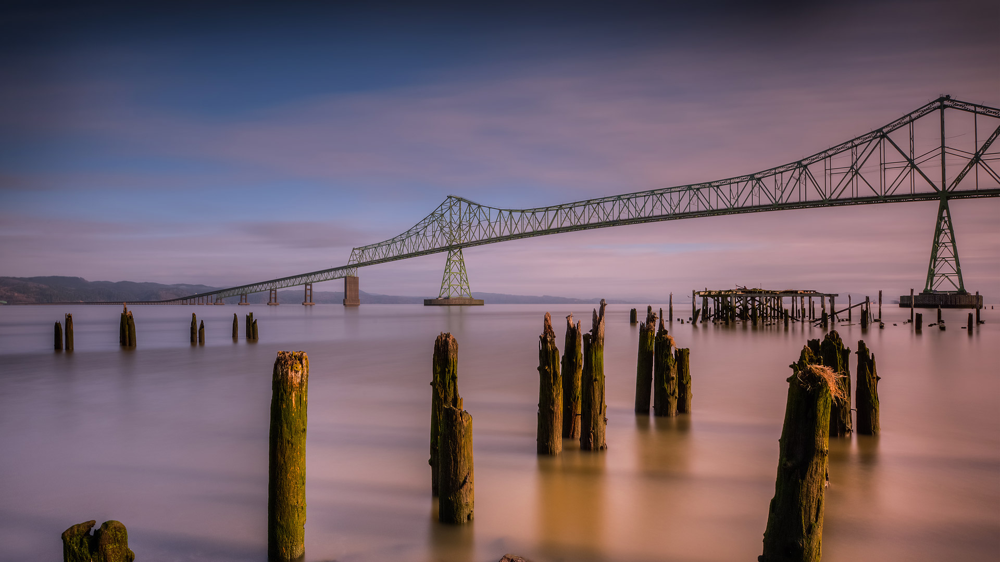

#### 20231107 Kirkilai lakes and lookout tower, Biržai Regional Park, Lithuania (© MNStudio/Shutterstock)

#### 20231106 Lake Pehoé, Torres del Paine National Park, Chile (© OST/Getty Images)

#### 20231105 Quartzite formation, Playa del Silencio, Asturias, Spain (© Jean-Philippe Delobelle/Minden Pictures)

#### 20231104 American bison, Yellowstone National Park, Wyoming (© Gary Gray/Getty Images)

#### 20231103 Pacific sea nettles off the coast of Carmel, California (© Jim Patterson/Tandem Stills + Motion)

#### 20231103 スリー・シスターズ・スプリングス, 米国 フロリダ州 クリスタルリバー市 (© Karine Aigner/Tandem Stills + Motion)

#### 20231103 Hunsrück Hochwald, Herbstwald bei Deuselbach, Naherholungsgebiet Erbeskopf, Rheinland-Pfalz (© Hans-Peter Merten/Huber/eStock Photo)

#### 20231102 Salt flats in Badwater Basin, Death Valley National Park, California (© Jim Patterson/Tandem Stills + Motion)

#### 20231101 Pumpkins and squashes (© bobkeenan/Getty Images)

#### 20231101 Mummy Cave ruins, Canyon de Chelly National Monument, Arizona (© Cindy Miller Hopkins/Danita Delimont)

#### 20231101 Kenny Lake at dawn, Lake Superior Provincial Park, Ontario, Canada (© Don Johnston/agefotostock)

#### 20231101 上巴尔城堡，阿尔萨斯，法国 (© Andrea Pistolesi/Getty Images)

#### 20231101 コロンビア川とアストリア・メグラー橋, 米国 オレゴン州 (© Dan Mihai/Getty Images)

