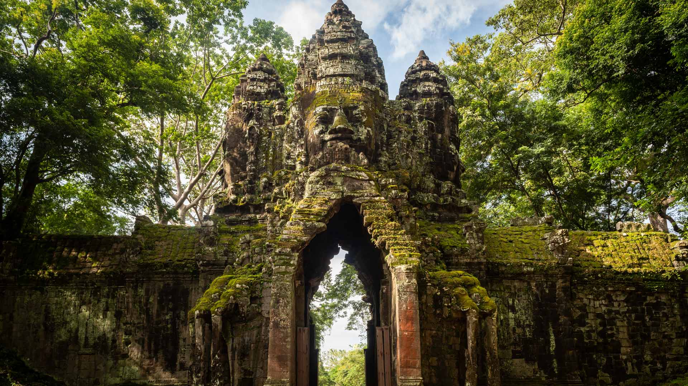

#### 20231211 Winter at Huangshan, China (© Hung Chung Chih/Shutterstock)

#### 20231210 Last rays of sun on a group of dunes, Sahara, Algeria (© AWL Images/DanitaDelimont.com)

#### 20231210 林帕达恩湖，斯诺登尼亚国家公园， 威尔士 (© Joe Daniel Price/Getty Images)

#### 20231209 Guanacos in Los Glaciares National Park, Patagonia, Argentina (© Yva Momatiuk and John Eastcott/Minden Pictures)

#### 20231208 Souvenirverkauf auf dem Christkindlesmarkt, Nürnberg (© AlpKaya/Shutterstock)

#### 20231208 Fête des Lumières, œuvre d'art de Daniel Knipper, nommée Regards, en hommage aux victimes de l'attentat de Paris 2015, Lyon, France (© Baptiste de Izarra/Alamy Stock Photo)

#### 20231208 La Rocque Harbour, St. Clement, Island of Jersey (© Reinhard Schmid/Huber/eStock Photo)

#### 20231207 白川郷の雪景色, 岐阜県 (© MIYAMOTO_Y/Getty Images)

#### 20231207 USS Arizona Memorial, Pearl Harbor, Oahu, Hawaii (© Douglas Peebles Photography/Alamy)

#### 20231207 韦尔东峡谷的雾蒙蒙的早晨，普罗旺斯-阿尔卑斯-蓝色海岸大区，法国 (© Hemis/Alamy)

#### 20231206 达尔达尼亚瀑布，博洛尼亚，意大利 (© Alberto Ghizzi Panizza/Minden)

#### 20231206 The Globe of Science and Innovation building, Meyrin, Switzerland (© Deyan Baric/Alamy)

#### 20231205 Neuschwanstein and Hohenschwangau castles, Bavarian Alps, Germany (© Harald Nachtmann/Getty Images)

#### 20231204 A mother cheetah and her cubs in the Maasai Mara National Reserve, Kenya (© Scott Davis/Tandem Stills + Motion)

#### 20231203 Sandstone rock formations, Vermilion Cliffs National Monument, Arizona (© Yva Momatiuk and John Eastcott/Minden Pictures)

#### 20231203 豪華絢爛な山車と花火, 埼玉県 秩父市 (© ASSOCIATED PRESS/AP)

#### 20231203 Die Adventszeit beginnt (© Muenz/Getty Images)

#### 20231202 Milky Way over Athabasca Glacier in Jasper National Park, Canada (© Alan Dyer/Getty Images)

#### 20231202 瓜廖尔堡，中央邦，印度 (© Dmitry Rukhlenko-Photos of India/Alamy)

#### 20231202 North Gate of Angkor Thom, Angkor Archaeological Park, Cambodia (© Amazing Travel Lifestyle/Shutterstock)

#### 20231201 Lake Minnewanka, Alberta, Canada (© Ken Phung/500px/Getty Images)

#### 20231201 Iceberg in the Ross Sea, Antarctica (© Michel Roggo/Minden Pictures)

