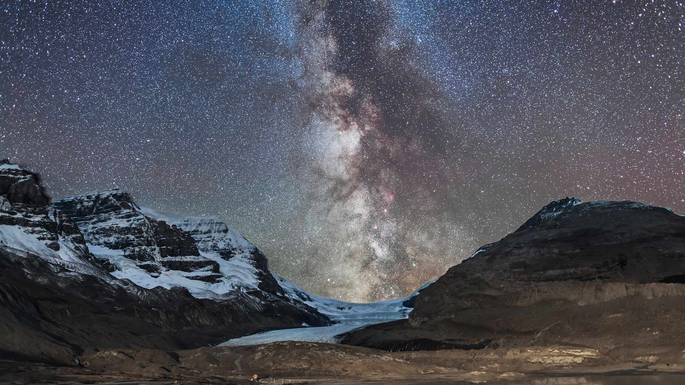
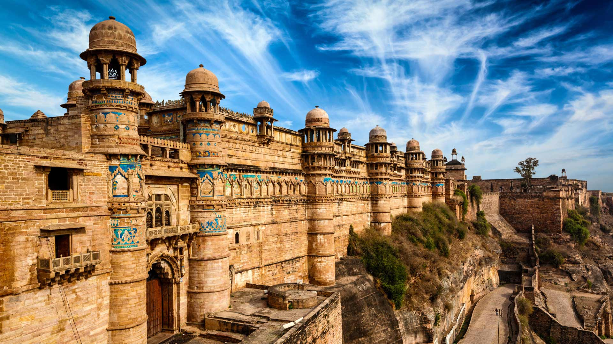

#### 20231202 Milky Way over Athabasca Glacier in Jasper National Park, Canada (© Alan Dyer/Getty Images)

#### 20231202 瓜廖尔堡，中央邦，印度 (© Dmitry Rukhlenko-Photos of India/Alamy)

#### 20231202 North Gate of Angkor Thom, Angkor Archaeological Park, Cambodia (© Amazing Travel Lifestyle/Shutterstock)

#### 20231201 Lake Minnewanka, Alberta, Canada (© Ken Phung/500px/Getty Images)

#### 20231201 Iceberg in the Ross Sea, Antarctica (© Michel Roggo/Minden Pictures)

