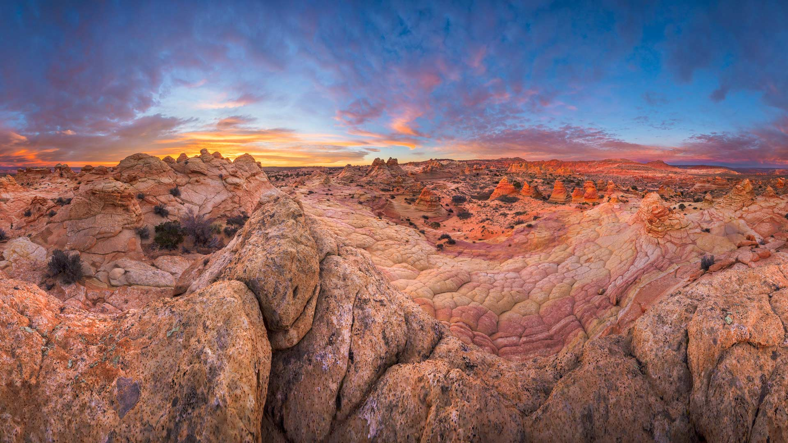

#### 20231205 天鹅堡和旧天鹅堡，巴伐利亚阿尔卑斯山，德国 (© Harald Nachtmann/Getty Images)

#### 20231204 A mother cheetah and her cubs in the Maasai Mara National Reserve, Kenya (© Scott Davis/Tandem Stills + Motion)

#### 20231203 Sandstone rock formations, Vermilion Cliffs National Monument, Arizona (© Yva Momatiuk and John Eastcott/Minden Pictures)

#### 20231203 豪華絢爛な山車と花火, 埼玉県 秩父市 (© ASSOCIATED PRESS/AP)

#### 20231203 Die Adventszeit beginnt (© Muenz/Getty Images)

#### 20231202 Milky Way over Athabasca Glacier in Jasper National Park, Canada (© Alan Dyer/Getty Images)

#### 20231202 瓜廖尔堡，中央邦，印度 (© Dmitry Rukhlenko-Photos of India/Alamy)

#### 20231202 North Gate of Angkor Thom, Angkor Archaeological Park, Cambodia (© Amazing Travel Lifestyle/Shutterstock)

#### 20231201 Lake Minnewanka, Alberta, Canada (© Ken Phung/500px/Getty Images)

#### 20231201 Iceberg in the Ross Sea, Antarctica (© Michel Roggo/Minden Pictures)

