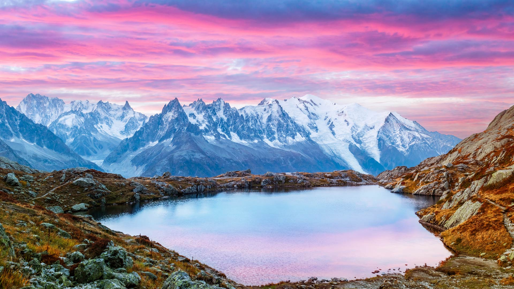
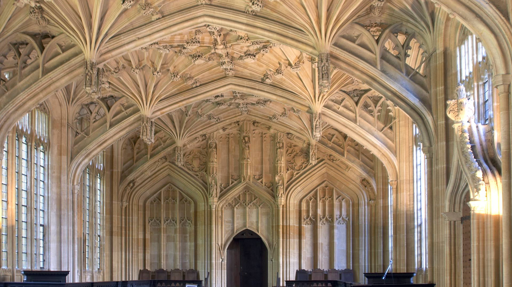
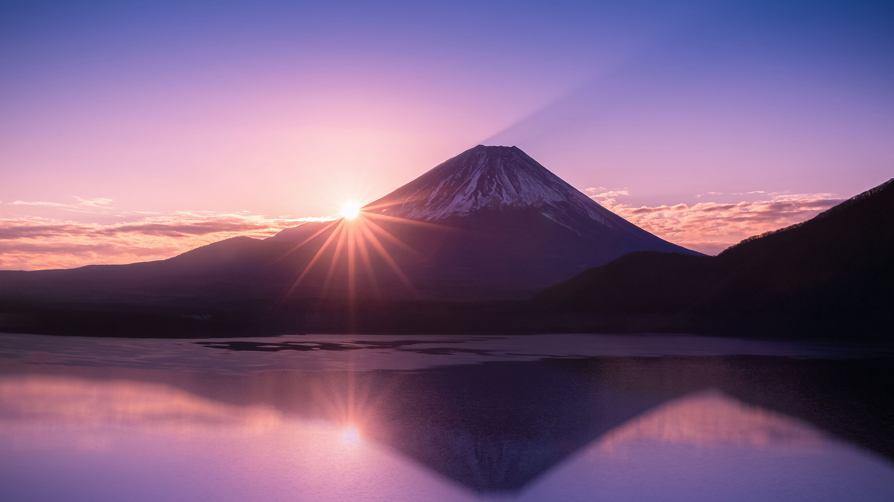

#### 20240104 金门大桥，旧金山，加利福尼亚州，美国 (© Jim Patterson/Tandem Stills + Motion)

#### 20240103 明尼汪卡湖，阿尔伯塔省，加拿大 (© Ken Phung/500px/Getty Images)

#### 20240103 Coucher de soleil sur les lacs des Chéserys, Chamonix-Mont Blanc, France (© Smit/Shutterstock)

#### 20240103 Bodleian Library, University of Oxford, England (© Andrew Holt/Getty Images)

#### 20240102 贾斯旺萨达陵墓和梅兰加尔古堡，焦特布尔，拉贾斯坦邦，印度 (© Twenty47studio/Getty images)

#### 20240102 Prayer flags in Phobjikha Valley, Bhutan (© John Warburton-Lee/DanitaDelimont.com)

#### 20240101 本栖湖から見る富士山の日の出, 山梨県 (© Sakarin Sawasdinaka/Shutterstock)

#### 20240101 Red fox sleeping in the snow, Abruzzo, Italy (© marco vancini/500px/Getty Images)

