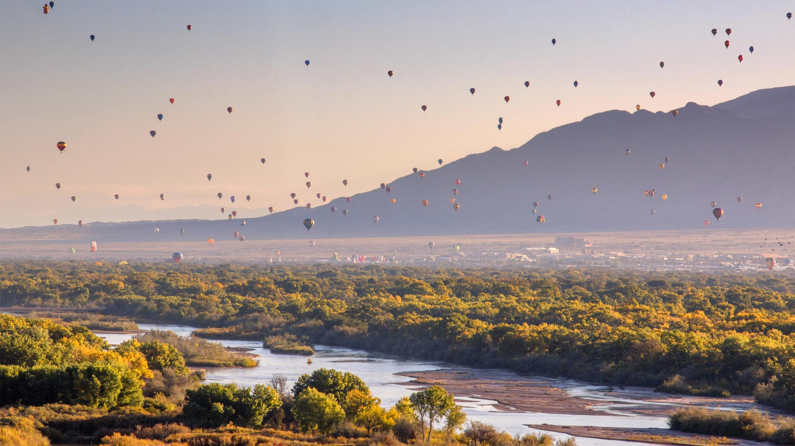
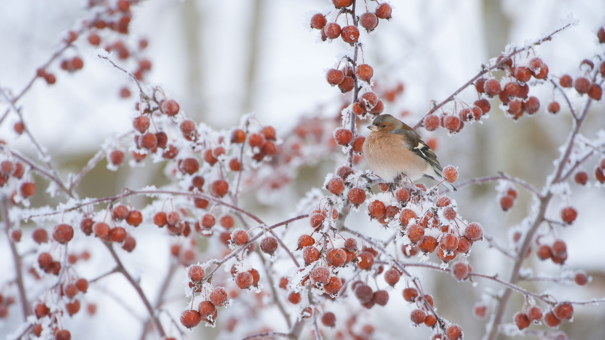
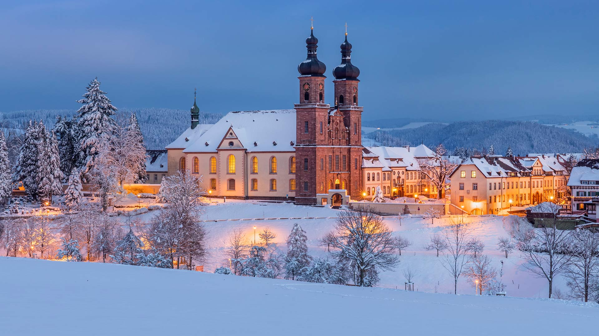
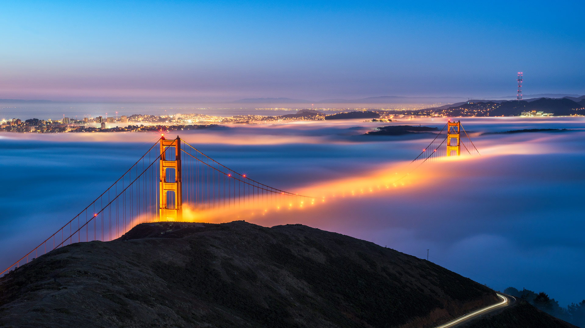

#### 20240110 Stairs on the shoreline at Mylopotamos Beach, Thessaly, Greece (© Orestis Zoumpos/Amazing Aerial Agency)

#### 20240110 Eurasischer Luchs im Schnee (© Jan Stria/Shutterstock)

#### 20240109 Hot air balloons over the Rio Grande, Albuquerque, New Mexico (© Jennifer MacCornack/Shutterstock)

#### 20240108 Skier at Bernina Pass, Graubünden, Switzerland (© Francesco Bergamaschi/Getty Images)

#### 20240107 Karlu Karlu/Devils Marbles Conservation Reserve, Australia (© Yva Momatiuk and John Eastcott/Minden Pictures)

#### 20240106 Vermilion Lakes, Banff, Canada (© Carlos Fernandez/Moment/Getty Images)

#### 20240106 Antilles françaises, Guadeloupe, brume sur le volcan de la Soufrière (© Walter Bibikow/Getty Images)

#### 20240106 Male chaffinch perched on a crab apple tree in winter (© Mark Hamblin/2020VISION/Minden Pictures)

#### 20240105 International Ice and Snow Sculpture Festival, Harbin, China (© WANG ZHAO/AFP/Getty Images)

#### 20240105 巴伐利亚阿尔卑斯山脉，德国 (© JFL Photography/Adobe Stock)

#### 20240104 Klosterkirche St. Peter auf dem Schwarzwald, Südschwarzwald, Baden-Württemberg (© Reinhard Schmid/Huber/eStock Photo)

#### 20240104 Golden Gate Bridge, San Francisco, California (© Jim Patterson/Tandem Stills + Motion)

#### 20240103 明尼汪卡湖，阿尔伯塔省，加拿大 (© Ken Phung/500px/Getty Images)

#### 20240103 Coucher de soleil sur les lacs des Chéserys, Chamonix-Mont Blanc, France (© Smit/Shutterstock)

#### 20240103 Bodleian Library, University of Oxford, England (© Andrew Holt/Getty Images)

#### 20240102 贾斯旺萨达陵墓和梅兰加尔古堡，焦特布尔，拉贾斯坦邦，印度 (© Twenty47studio/Getty images)

#### 20240102 Prayer flags in Phobjikha Valley, Bhutan (© John Warburton-Lee/DanitaDelimont.com)

#### 20240101 本栖湖から見る富士山の日の出, 山梨県 (© Sakarin Sawasdinaka/Shutterstock)

#### 20240101 Red fox sleeping in the snow, Abruzzo, Italy (© marco vancini/500px/Getty Images)

