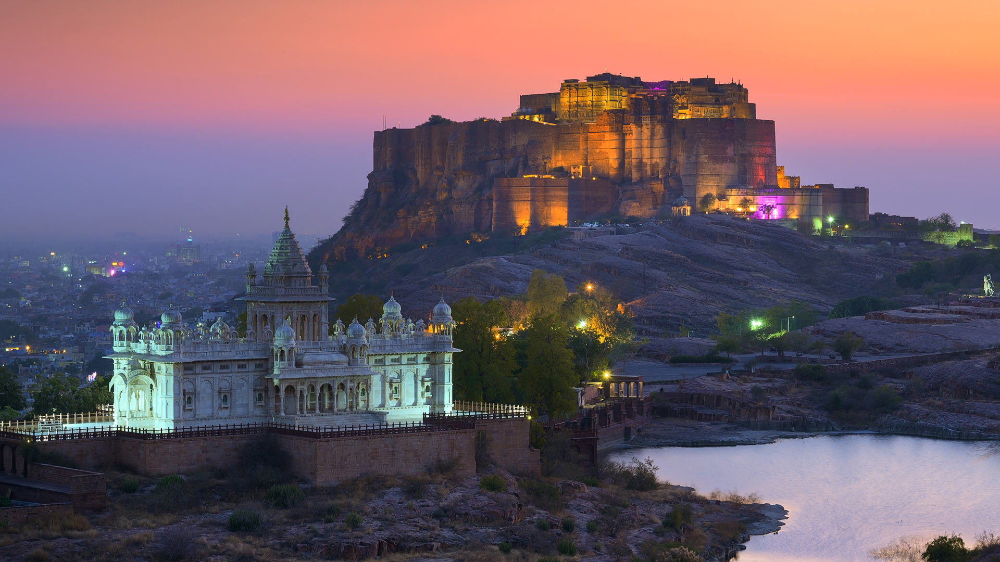
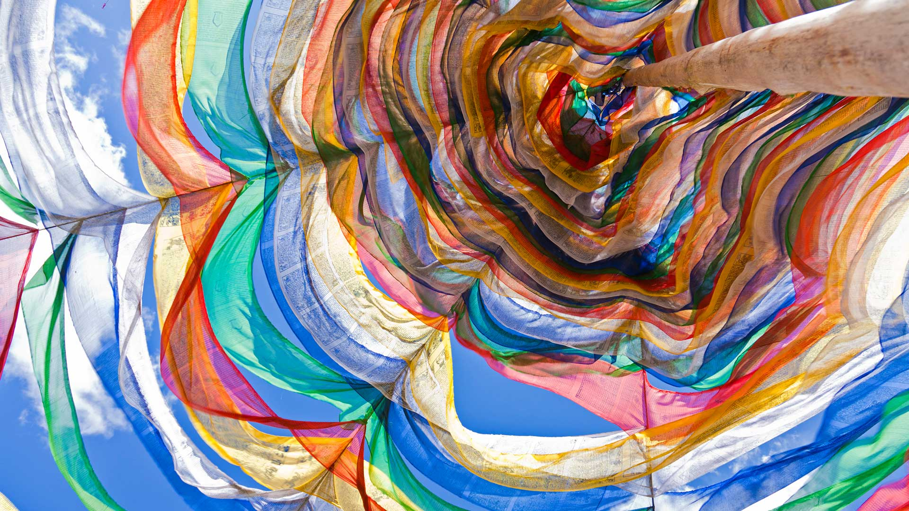

#### 20240102 贾斯旺萨达陵墓和梅兰加尔古堡，焦特布尔，拉贾斯坦邦，印度 (© Twenty47studio/Getty images)

#### 20240102 ポブジカ渓谷, ブータン (© John Warburton-Lee/DanitaDelimont.com)

#### 20240101 本栖湖から見る富士山の日の出, 山梨県 (© Sakarin Sawasdinaka/Shutterstock)

#### 20240101 Red fox sleeping in the snow, Abruzzo, Italy (© marco vancini/500px/Getty Images)

