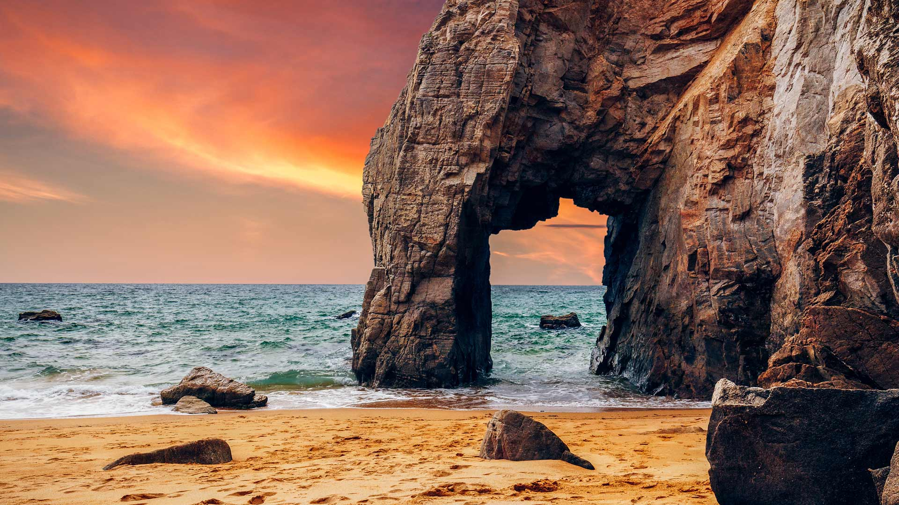
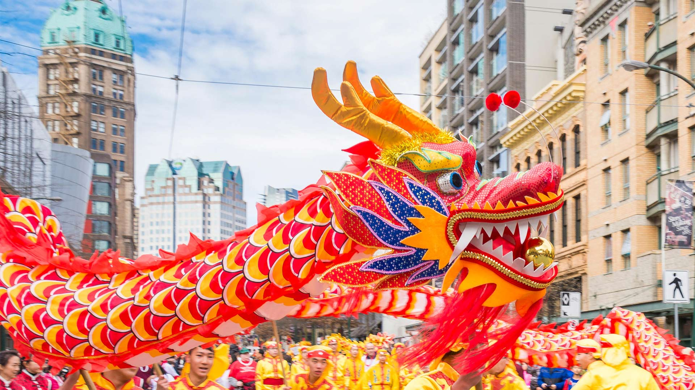
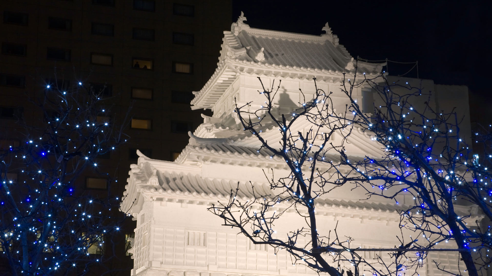
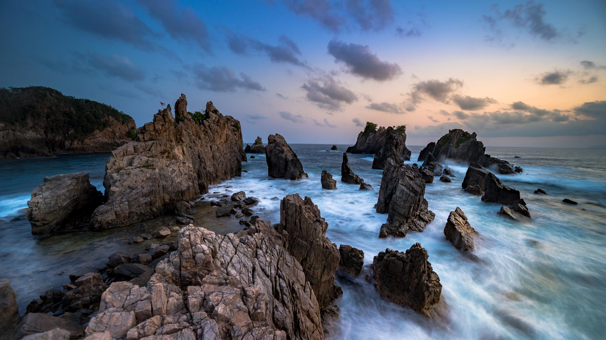
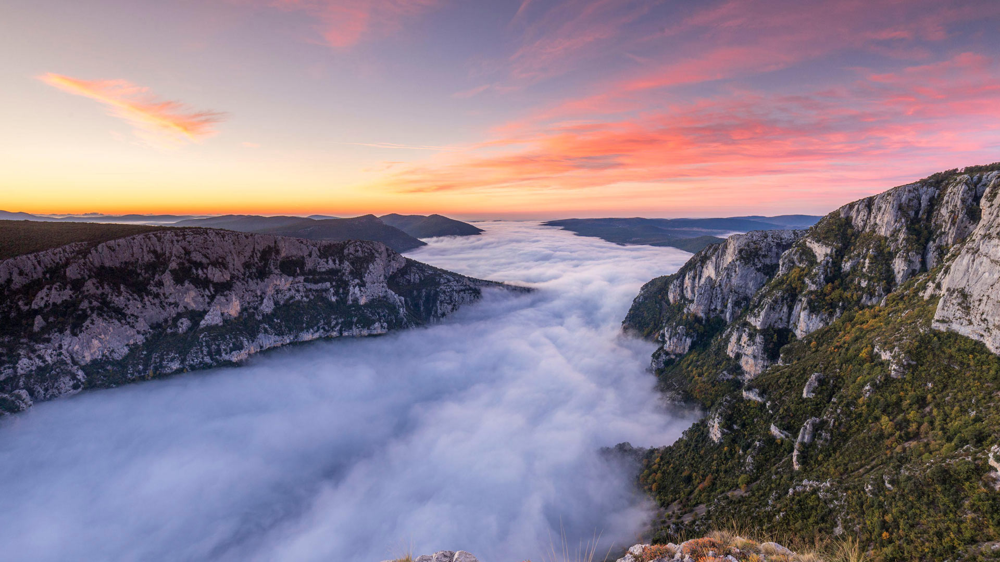
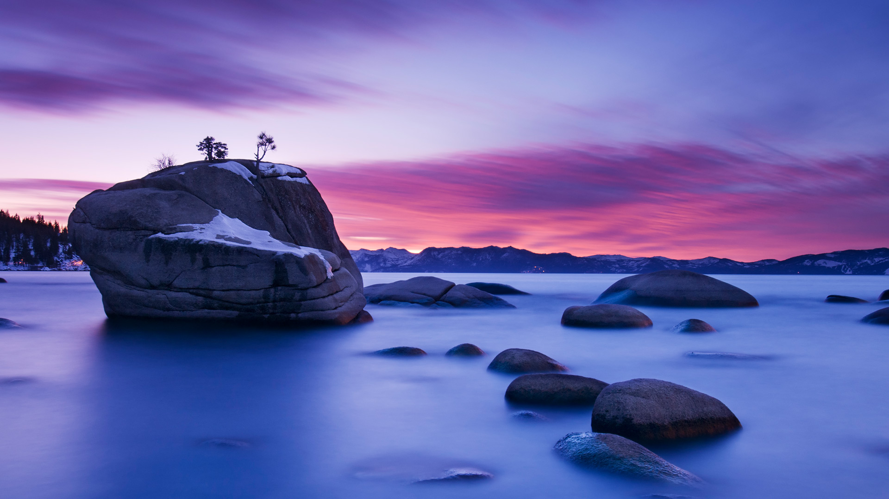
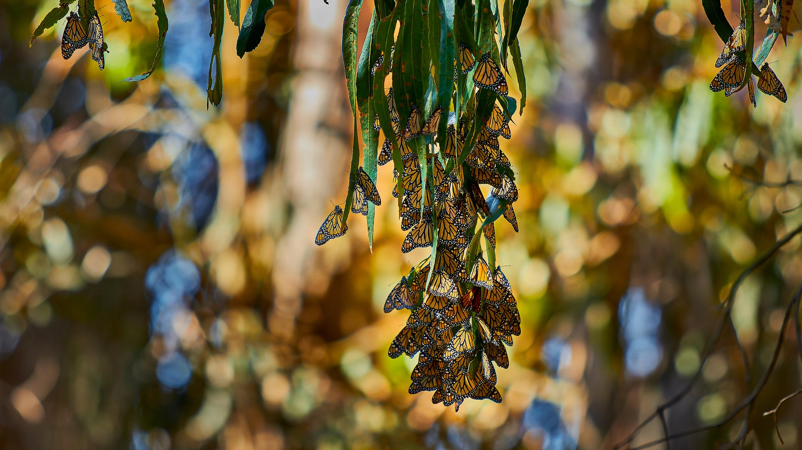
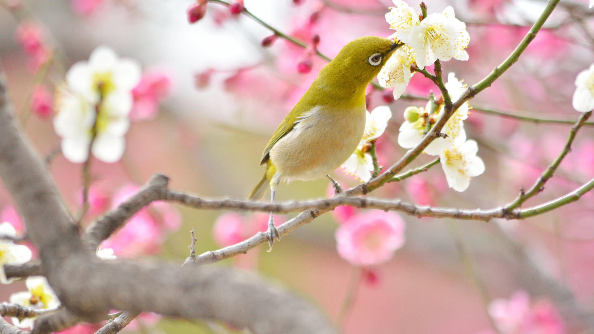
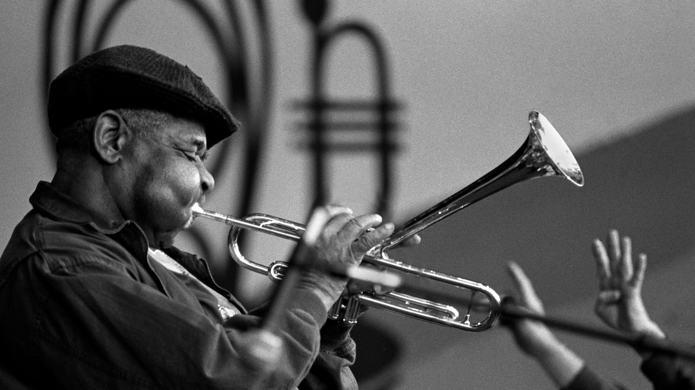

#### 20240214 L’arche de Port-Blanc, Saint-Pierre-Quiberon, France (© DaLiu/Getty Images)

#### 20240214 Red-crowned crane bowing to his mate in Hokkaido, Japan (© Steve Bloom Images/Alamy)

#### 20240213 Mardi Gras beads in the Marigny, New Orleans (© Erik Pronske Photography/Getty Images)

#### 20240212 Volcán Alcedo giant tortoises, Isabela Island, Galápagos, Ecuador (© Tui De Roy/Minden Pictures)

#### 20240211 Giant anteater in the Pantanal, Brazil (© Pedro Ferreira do Amaral/Getty Images)

#### 20240211 Chora, Folegandros Island, Cyclades, Greece (© Francesco Riccardo Iacomino/Getty Images)

#### 20240210 中国舞狮，大年初一 (© SENEZ/Getty Images)

#### 20240210 Chinese New Year Parade, Vancouver, British Columbia, Canada (© Michael Wheatley/Alamy Stock Photo)

#### 20240210 Artists performing the dragon dance for Chinese New Year, Luzhou, China (© Liu Guoxing/VCG via Getty Images)

#### 20240209 お城の雪像, 北海道 札幌市 (© Terry Donnelly/Alamy Stock Photo)

#### 20240209 Pegadung Rock, Lampung, Sumatra, Indonesia (© CK NG/500px/Getty Images)

#### 20240209 灯光秀点亮夜幕中的西安城墙，中国春节 (© Eastimages/Getty Images)

#### 20240208 Mount Hood, Oregon (© Inigo Cia/Getty Images)

#### 20240207 St. James Tidal Pool, Cape Town, South Africa (© AmazingAerialAgency/Adobe)

#### 20240207 ヴェルドン峡谷, フランス (© Hemis/Alamy)

#### 20240206 Bonsai Rock, Lake Tahoe, Nevada (© Jim Patterson/Tandem Stills + Motion)

#### 20240205 Monarch butterflies, Goleta, California (© Craig Rademacher/500px/Getty Images)

#### 20240205 テイデ国立公園, スペイン (© Javier Martínez Morán/Alamy)

#### 20240205 Innenansicht Münchner Nationaltheater Opernhaus, München, Bayern (© plainpicture/RelaxImages/WRIGHT)

#### 20240205 从奥索伊尼察观景点看日出时的布莱德湖，斯洛文尼亚 (© Rasica/Getty Images)

#### 20240204 梅の枝に止まるメジロ  (© pheeby/Adobe Stock)

#### 20240204 Devetashka Cave, Devetaki, Bulgaria (© Jasmine_K/Shutterstock)

#### 20240203 Grand Canal with Santa Maria della Salute Basilica, Venice, Italy (© RudyBalasko/Getty Images)

#### 20240203 函館山から見る夜景, 北海道 函館市 (© Hiro1775/Getty Images)

#### 20240202 L’arche de Port-Blanc, Saint-Pierre-Quiberon, France (© DaLiu/Getty Images)

#### 20240202 Marmot peeking out of its burrow (© Scacciamosche/Getty Images)

#### 20240201 Polar bear resting in rocky landscape, Churchill, Manitoba, Canada (© Warwick Sloss/NPL/Minden Pictures)

#### 20240201 吕根岛的萨斯尼茨灯塔，德国 (© Christian Back/eStock)

#### 20240201 Dizzy Gillespie in 1990 at the 32nd Monterey Jazz Festival, California (© Craig Lovell/Eagle Visions Photography/Alamy)

#### 20240201 Devetashka Cave, Devetaki, Bulgaria (© Jasmine_K/Shutterstock)

