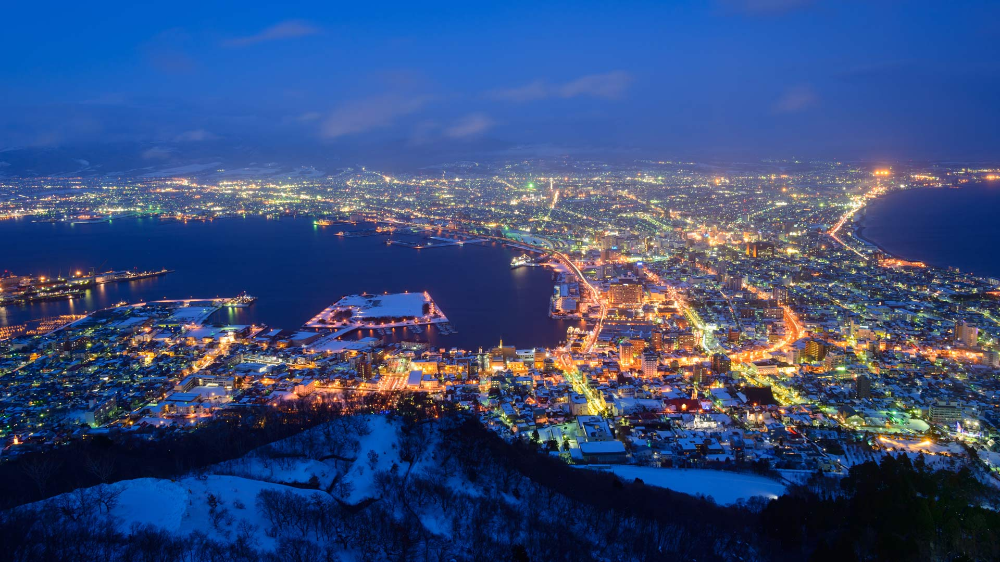
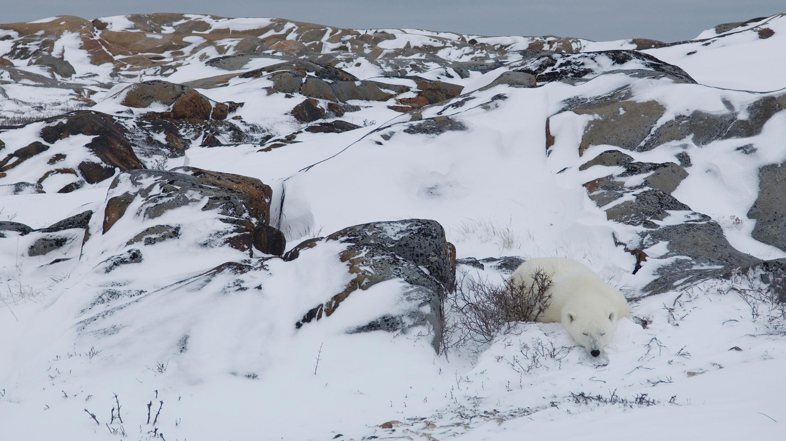
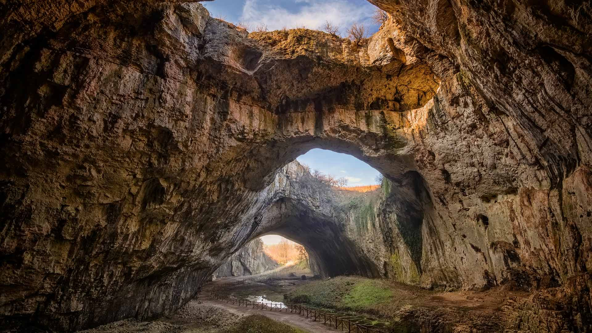

#### 20240204 梅の枝に止まるメジロ  (© pheeby/Adobe Stock)

#### 20240203 Grand Canal with Santa Maria della Salute Basilica, Venice, Italy (© RudyBalasko/Getty Images)

#### 20240203 函館山から見る夜景, 北海道 函館市 (© Hiro1775/Getty Images)

#### 20240202 L’arche de Port-Blanc, Saint-Pierre-Quiberon, France (© DaLiu/Getty Images)

#### 20240202 Marmot peeking out of its burrow (© Scacciamosche/Getty Images)

#### 20240201 Polar bear resting in rocky landscape, Churchill, Manitoba, Canada (© Warwick Sloss/NPL/Minden Pictures)

#### 20240201 吕根岛的萨斯尼茨灯塔，德国 (© Christian Back/eStock)

#### 20240201 Dizzy Gillespie in 1990 at the 32nd Monterey Jazz Festival, California (© Craig Lovell/Eagle Visions Photography/Alamy)

#### 20240201 Devetashka Cave, Devetaki, Bulgaria (© Jasmine_K/Shutterstock)

