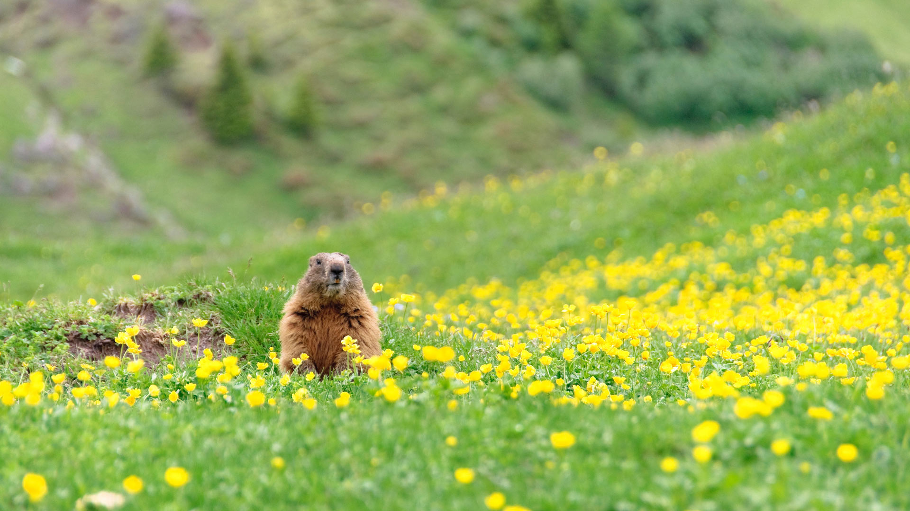
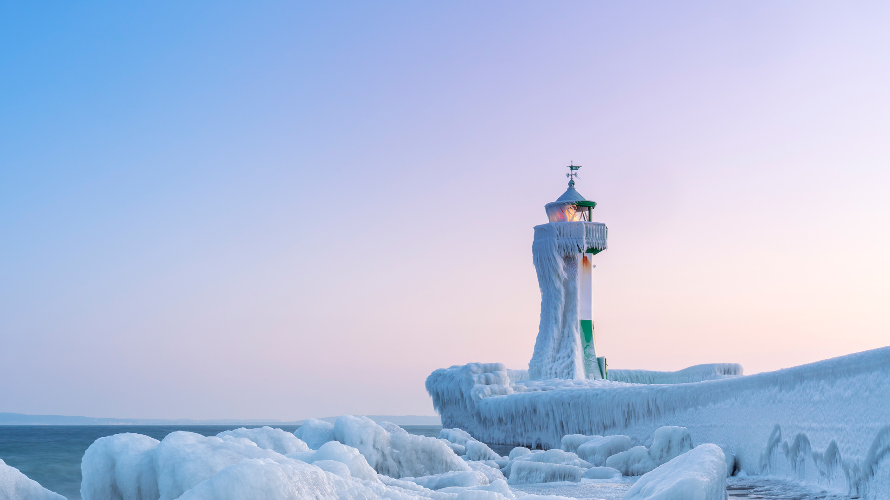

#### 20240202 L’arche de Port-Blanc, Saint-Pierre-Quiberon, France (© DaLiu/Getty Images)

#### 20240202 从洞穴中探出头的土拨鼠 (© Scacciamosche/Getty Images)

#### 20240201 Polar bear resting in rocky landscape, Churchill, Manitoba, Canada (© Warwick Sloss/NPL/Minden Pictures)

#### 20240201 吕根岛的萨斯尼茨灯塔，德国 (© Christian Back/eStock)

#### 20240201 Dizzy Gillespie in 1990 at the 32nd Monterey Jazz Festival, California (© Craig Lovell/Eagle Visions Photography/Alamy)

#### 20240201 デヴェタシュカ洞窟, ブルガリア (© Jasmine_K/Shutterstock)

