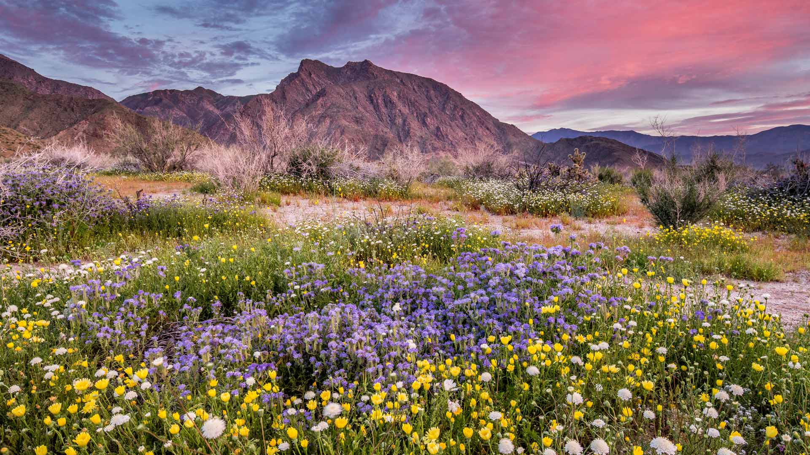
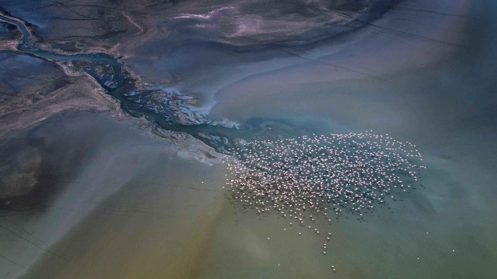
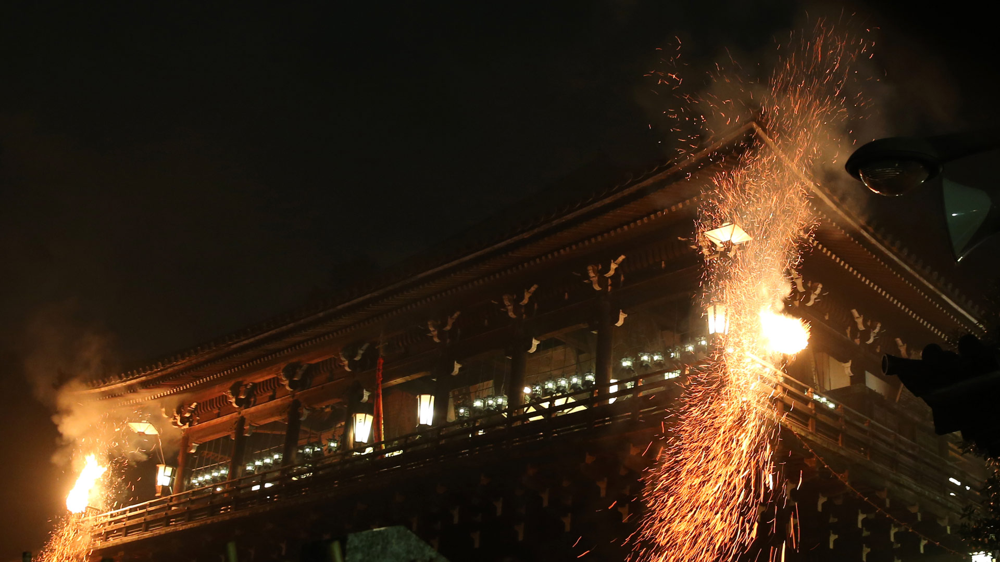
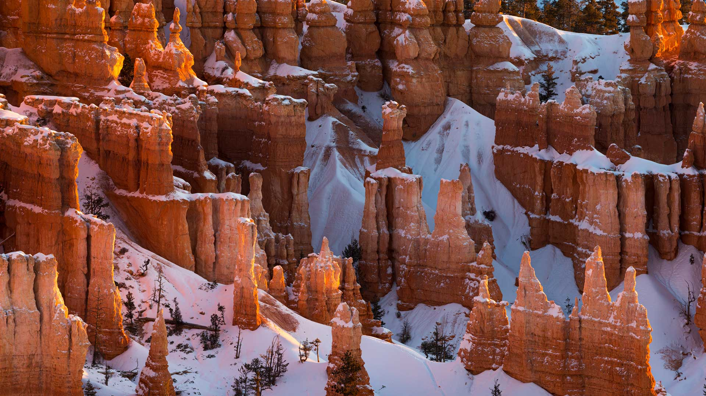
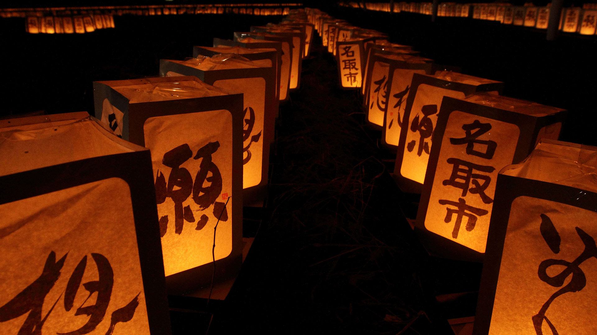
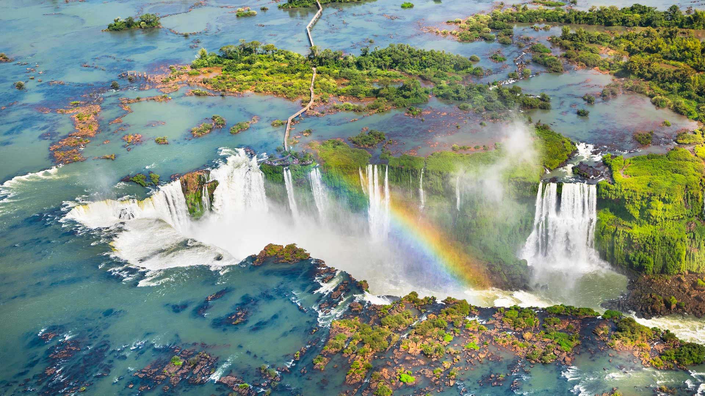
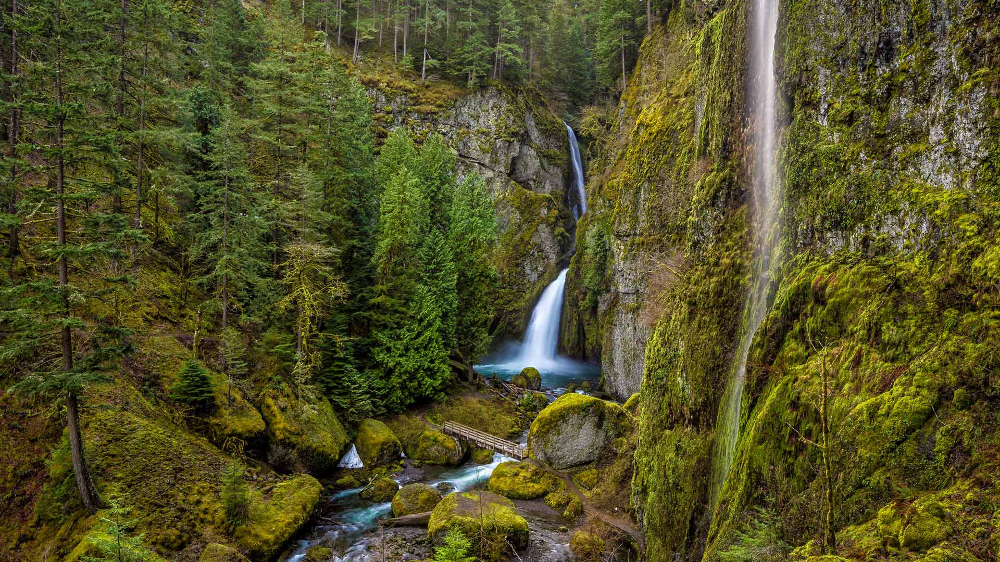

#### 20240315 安沙波利哥沙漠州立公园，美国加利福尼亚州 (© Stephen Matera/Tandem Stills + Motion)

#### 20240314 Wat Phra Ngam, Ayutthaya Historical Park, Thailand (© boonchai wedmakawand/Alamy)

#### 20240313 Lesser flamingos flying over Lake Magadi, Kenya (© Vicki Jauron, Babylon and Beyond Photography/Getty Images)

#### 20240312 東大寺, 奈良県 奈良市 (© Buddhika Weerasinghe/Getty Images)

#### 20240312 Bryce Canyon National Park, Utah (© Jim Patterson/Tandem Stills + Motion)

#### 20240311 A koala sleeping in a eucalyptus tree, Australia (© Anton Rogozin/Getty Images)

#### 20240311 Prosecco Hills of Conegliano and Valdobbiadene, Veneto, Italy (© Olimpio Fantuz/eStock Photo)

#### 20240311 追悼イベントの灯籠, 宮城県 名取市 (© Satoshi Takahashi/Getty Images)

#### 20240310 La Mer de Glace, Chamonix, massif du Mont-Blanc, Haute-Savoie, France (© Hagenmuller Jean-François/Hemis.fr)

#### 20240310 San Jacinto Building's mechanical clock, Beaumont, Texas (© Richard T. Nowitz/Getty Images)

#### 20240310 Rathaus Ulm, Astronomische Uhr aus dem 16. Jahrhundert, Ulm, Baden-Württemberg (© Hemis/Alamy Stock Photo)

#### 20240309 Bisti/De-Na-Zin Wilderness Area, New Mexico (© Ian Shive/Tandem Stills + Motion)

#### 20240308 Tate Modern lit up for International Women's Day, London, England (© Stephen Chung/Alamy Stock Photo)

#### 20240308 伊瓜苏大瀑布鸟瞰图，巴西 (© Nido Huebl/Shutterstock)

#### 20240307 Roques de Benet, Els Ports Natural Park, Catalonia, Spain (© Sergi Boixader/Alamy)

#### 20240306 Wahclella Falls in the Columbia River Gorge, Oregon (© Eric Vogt/Tandem Stills + Motion)

#### 20240305 Traffic circle and highway in Bangkok, Thailand (© Avigator Fortuner/Shutterstock)

#### 20240304 Arenal Volcano seen from Monteverde, Costa Rica (© Lukas Bischoff/Getty Images)

#### 20240303 下鴨神社の流し雛, 京都 (© masahiro Makino/Getty Images)

#### 20240302 Leopard in a tree, Kruger National Park, South Africa (© Tonino De Marco/Minden Pictures)

#### 20240301 Sunset colours over the icy Wheaton River, Yukon, Canada (© Robert Postma/All Canada Photos/Alamy Stock Photo)

#### 20240301 Women's suffrage parade on Fifth Avenue, Manhattan, New York City, October 23, 1915 (© Bettmann/Getty Images)

#### 20240301 德国草地上的蝴蝶 (© Albert Fertl/Getty Images)

#### 20240301 Modica, Sicily, Italy (© Sandro Bisaro/Getty Images)

#### 20240301 Blaireau européen (© Milan Zygmunt/Shutterstock)

