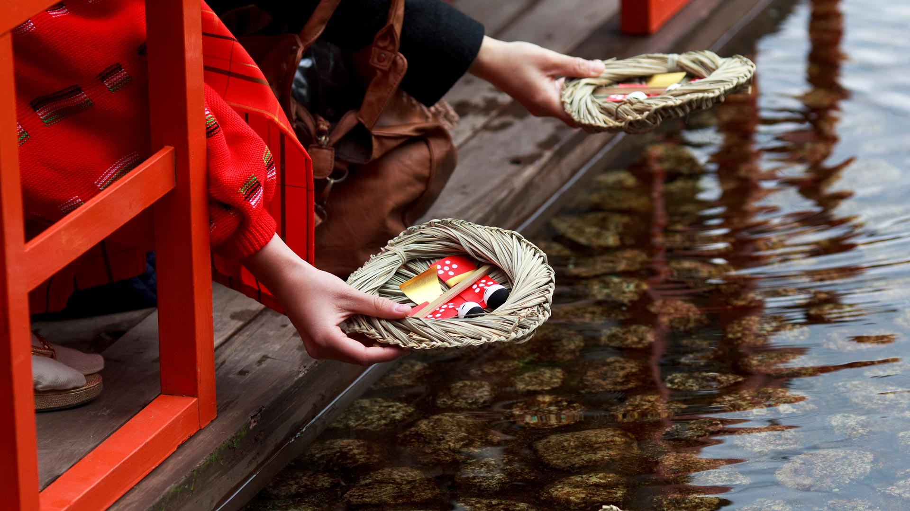
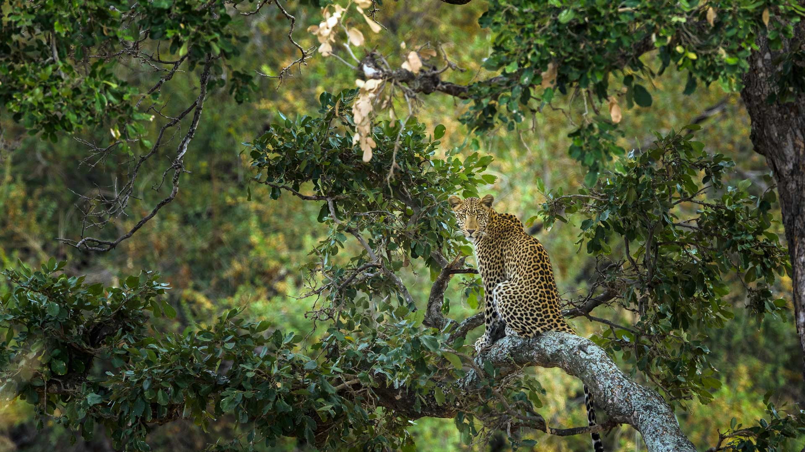
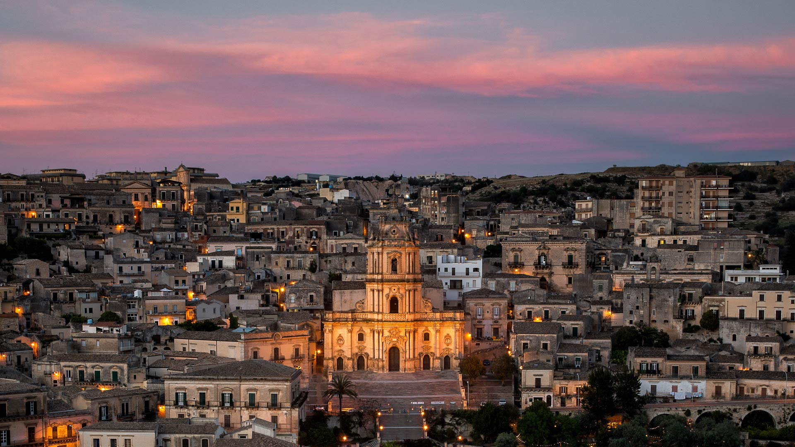

#### 20240303 下鴨神社の流し雛, 京都 (© masahiro Makino/Getty Images)

#### 20240302 Leopard in a tree, Kruger National Park, South Africa (© Tonino De Marco/Minden Pictures)

#### 20240301 Sunset colours over the icy Wheaton River, Yukon, Canada (© Robert Postma/All Canada Photos/Alamy Stock Photo)

#### 20240301 Women's suffrage parade on Fifth Avenue, Manhattan, New York City, October 23, 1915 (© Bettmann/Getty Images)

#### 20240301 德国草地上的蝴蝶 (© Albert Fertl/Getty Images)

#### 20240301 Modica, Sicily, Italy (© Sandro Bisaro/Getty Images)

#### 20240301 Blaireau européen (© Milan Zygmunt/Shutterstock)

