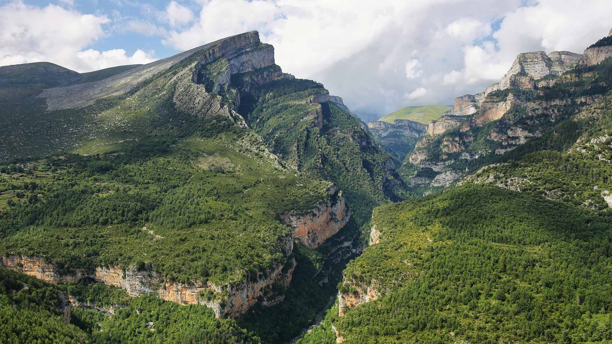
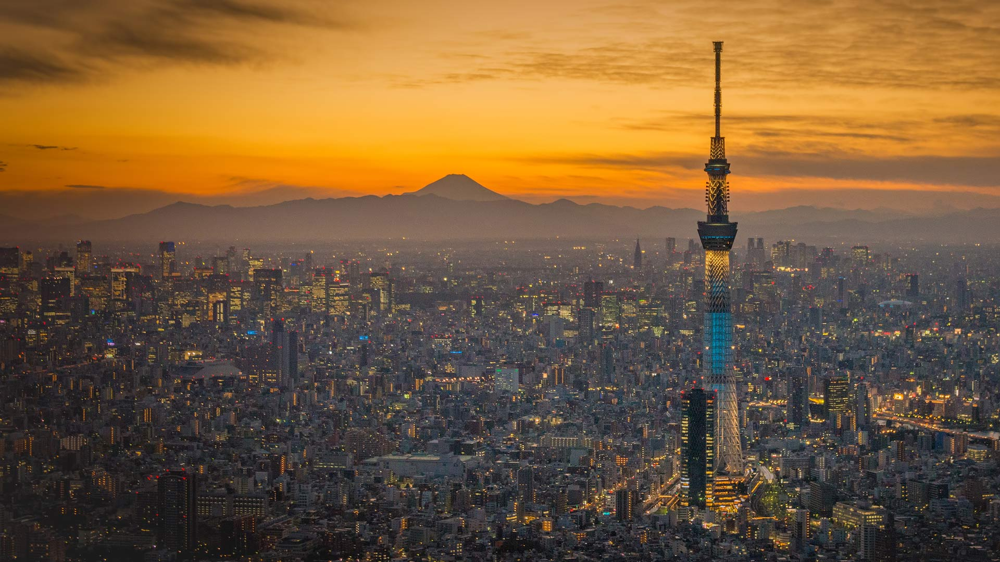
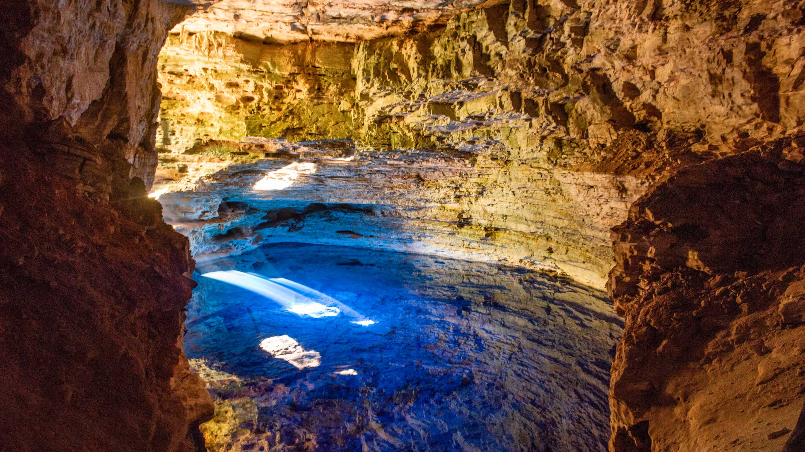
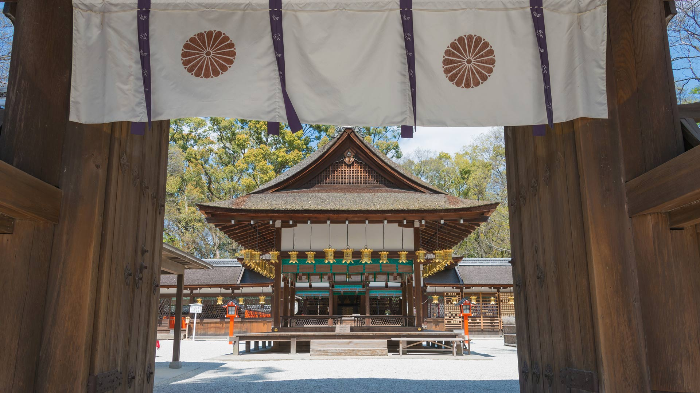
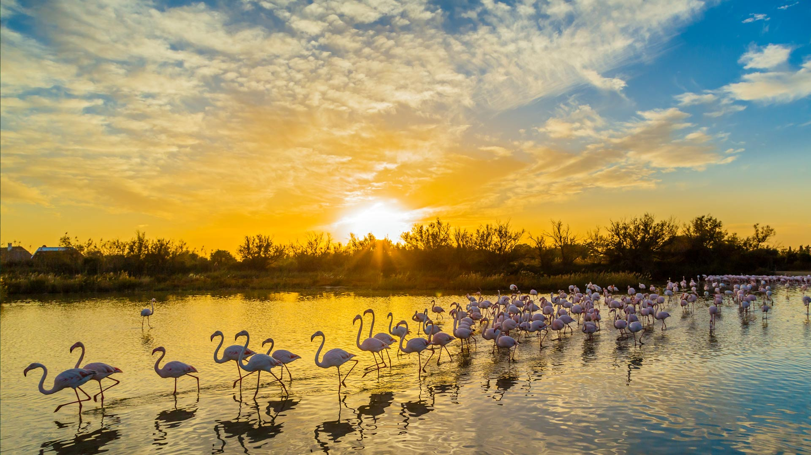
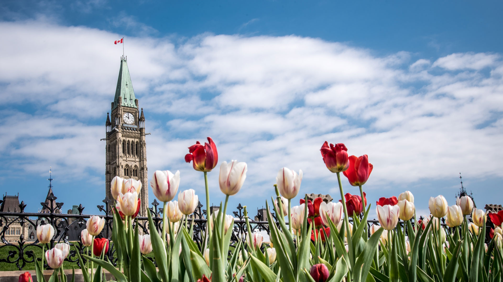
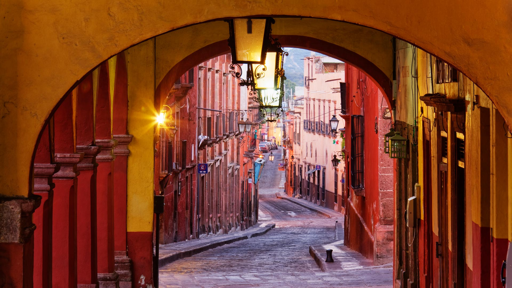
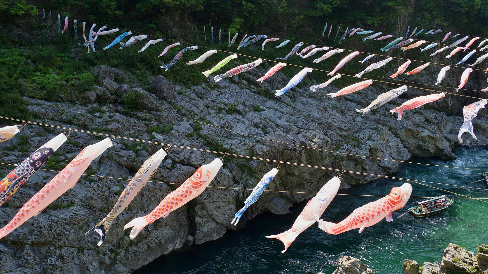

#### 20240525 Aït Benhaddou, Morocco (© Grant Faint/Getty Images)

#### 20240524 Añisclo Canyon, Ordesa y Monte Perdido National Park, Huesca, Spain (© Marisa Estivill/Shutterstock)

#### 20240523 Indian star tortoise, Sri Lanka (© Robin Chittenden/Minden Pictures)

#### 20240522 Tasmanian snow gum trees, Mount Field National Park, Tasmania, Australia (© Ignacio Palacios/Getty Images)

#### 20240522 夕暮れの東京スカイツリー,  東京 (© Saha Entertainment/Getty Images)

#### 20240522 Poço Encantado cave in Chapada Diamantina, Bahia, Brazil (© Cavan Images/Getty Images)

#### 20240521 Cameron Highlands tea plantation, Malaysia (© alex cheong/Getty Images)

#### 20240520 Parliament Hill in Ottawa, Ontario, Canada (© f11photo/iStock/Getty Images)

#### 20240520 Bee tending a honeycomb (© Simun Ascic/Alamy)

#### 20240519 Die Büste der Königin Nofretete, Ägyptisches Museum, Museumsinseln Berlin (© Christophe Gateau/picture alliance via Getty Images)

#### 20240518 Village of Vernazza, Cinque Terre, Liguria, Italy (© Roberto Moiola/Sysaworld/Getty Images)

#### 20240518 破碎群岛，环太平洋国家公园保护区，不列颠哥伦比亚省温哥华岛，加拿大 (© Ron Watts/Design Pics/Getty Images)

#### 20240518 日本科学未来館, 東京都 江東区 (© cowardlion/Shutterstock)

#### 20240518 Blue whale skeleton in the Natural History Museum, London, England (© Bailey-Cooper Photography/Alamy)

#### 20240517 A family of African elephants in Tarangire National Park, Tanzania (© Vicki Jauron, Babylon and Beyond Photography/Getty Images)

#### 20240516 维戈的兰德大桥，西班牙 (© Julio Conde/Getty Images)

#### 20240516 'Feelings are Facts,' by artist Olafur Eliasson and architect Ma Yansong, Beijing, China (© Feng Li/Getty Images News)

#### 20240515 Blick über den Fluss Neckar auf das Stadtbild von Heidelberg, Baden-Württemberg (© Juergen Sack/Getty Images)

#### 20240515 The Blue City of Jodhpur, India (© cinoby/Getty Images)

#### 20240515 下鴨神社, 京都 (© beibaoke/Shutterstock)

#### 20240514 Walkway leading into the Big Room, Carlsbad Caverns, New Mexico (© Doug Meek/Getty Images)

#### 20240513 Fish River Canyon, Namibia (© R. M. Nunes/Getty Images)

#### 20240512 Guanaco mother and newborn baby in grassland, La Pampa Province, Argentina (© Gabriel Rojo/Minden Pictures)

#### 20240512 Flamants roses, réserve naturelle de Pont de Gau, Camargue, France (© Yann Guichaoua-Photos/Getty Images)

#### 20240511 An indigo bunting perched on a branch, Texas (© Jeff R Clow/Getty Images)

#### 20240510 Tulips in front of the Parliament Buildings during the Tulip Festival in Ottawa (© Danielle Donders/Moment/Getty Images)

#### 20240509 Misool, Raja Ampat Islands, Indonesia (© Giordano Cipriani/Getty Images)

#### 20240509 Tulips at Emirgan Park in Istanbul, Türkiye (© Ozbalci/Getty Images)

#### 20240508 View of Château d'If in the port of Marseille, France (© Sergii Figurnyi/Alamy)

#### 20240507 Titan RT - Fußgänger-Hängebrücke über Rappbodetalsperre und Rappbode im Nationalpark Harz, Sachsen-Anhalt (© Sander Meertins/Getty Images)

#### 20240507 Heidelberg on the river Neckar in Baden-Württemberg, Germany (© Juergen Sack/Getty Images)

#### 20240507 A duckling swimming in a water meadow, Suffolk, England (© Nick Hurst/Getty Images)

#### 20240507 The Blue City of Jodhpur, India (© cinoby/Getty Images)

#### 20240506 The Roaches, Peak District, England (© George W Johnson/Getty Images)

#### 20240505 Colonnade in San Miguel de Allende, Guanajuato, Mexico (© Mint Images/Getty Images)

#### 20240505 Kalaloch Tree of Life, Kalaloch Beach, Olympic National Park, Washington (© Abbie Warnock-Matthews/Shutterstock)

#### 20240505 大歩危峡に泳ぐ鯉のぼり, 徳島県 (© fz750/Getty Images)

#### 20240504 Ruins of an ancient monastery on the island of Skellig Michael, Ireland (© MNStudio/Getty Images)

#### 20240503 Brittlebushes blooming in springtime, Sonoran Desert, Arizona (© Charles Harker/Getty Images)

#### 20240502 Blue Dragon Lava Flow, Craters of the Moon National Monument, Idaho (© Alan Majchrowicz/Getty Images)

#### 20240501 和束町の茶畑, 京都府 (© Tuul & Bruno Morandi/Getty Images)

#### 20240501 Weg durch den Gespensterwald bei Sonnenaufgang, Nienhagen, Mecklenburg-Vorpommern (© Martin Ruegner/Getty Images)

#### 20240501 Hawaiian lei flower garlands (© Jotika Pun/Shutterstock)

