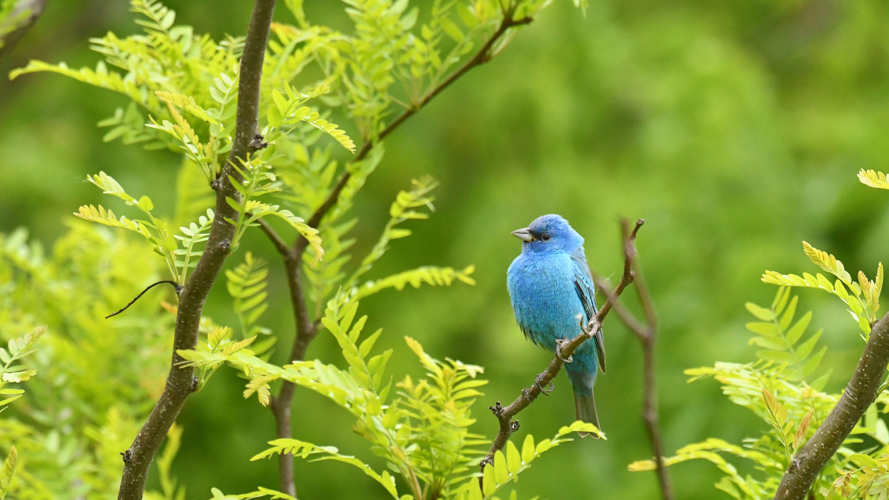
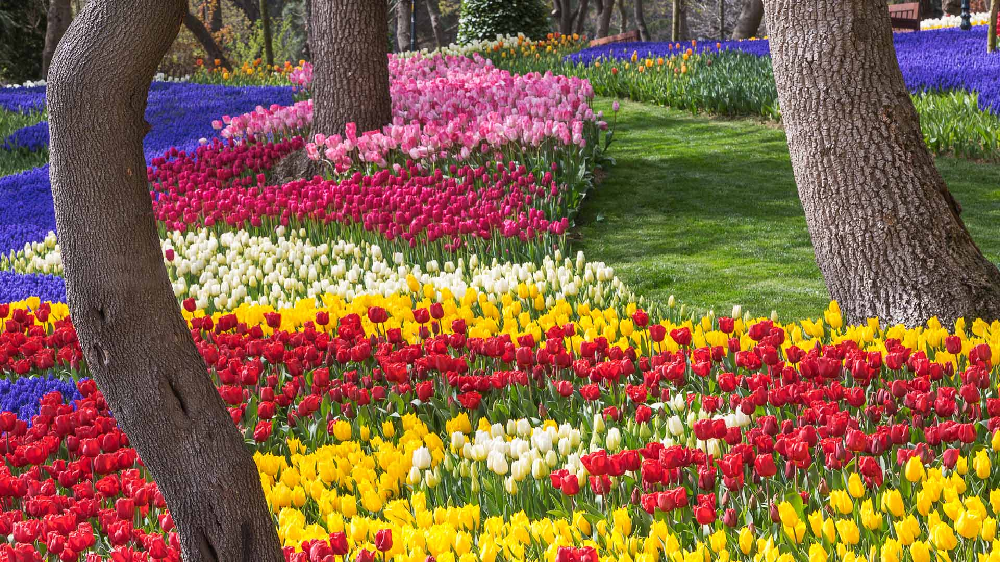
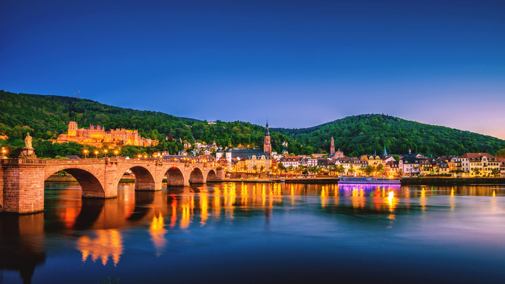

#### 20240513 Fish River Canyon, Namibia (© R. M. Nunes/Getty Images)

#### 20240512 Guanaco mother and newborn baby in grassland, La Pampa Province, Argentina (© Gabriel Rojo/Minden Pictures)

#### 20240512 Flamants roses, réserve naturelle de Pont de Gau, Camargue, France (© Yann Guichaoua-Photos/Getty Images)

#### 20240511 An indigo bunting perched on a branch, Texas (© Jeff R Clow/Getty Images)

#### 20240510 Tulips in front of the Parliament Buildings during the Tulip Festival in Ottawa (© Danielle Donders/Moment/Getty Images)

#### 20240509 Misool, Raja Ampat Islands, Indonesia (© Giordano Cipriani/Getty Images)

#### 20240509 Tulips at Emirgan Park in Istanbul, Türkiye (© Ozbalci/Getty Images)

#### 20240508 View of Château d'If in the port of Marseille, France (© Sergii Figurnyi/Alamy)

#### 20240507 Titan RT - Fußgänger-Hängebrücke über Rappbodetalsperre und Rappbode im Nationalpark Harz, Sachsen-Anhalt (© Sander Meertins/Getty Images)

#### 20240507 Heidelberg on the river Neckar in Baden-Württemberg, Germany (© Juergen Sack/Getty Images)

#### 20240507 A duckling swimming in a water meadow, Suffolk, England (© Nick Hurst/Getty Images)

#### 20240507 ジョードプル, インド ラージャスターン州 (© cinoby/Getty Images)

#### 20240506 The Roaches, Peak District, England (© George W Johnson/Getty Images)

#### 20240505 Colonnade in San Miguel de Allende, Guanajuato, Mexico (© Mint Images/Getty Images)

#### 20240505 Kalaloch Tree of Life, Kalaloch Beach, Olympic National Park, Washington (© Abbie Warnock-Matthews/Shutterstock)

#### 20240505 大歩危峡に泳ぐ鯉のぼり, 徳島県 (© fz750/Getty Images)

#### 20240504 Ruins of an ancient monastery on the island of Skellig Michael, Ireland (© MNStudio/Getty Images)

#### 20240503 Brittlebushes blooming in springtime, Sonoran Desert, Arizona (© Charles Harker/Getty Images)

#### 20240502 Blue Dragon Lava Flow, Craters of the Moon National Monument, Idaho (© Alan Majchrowicz/Getty Images)

#### 20240501 和束町の茶畑, 京都府 (© Tuul & Bruno Morandi/Getty Images)

#### 20240501 Weg durch den Gespensterwald bei Sonnenaufgang, Nienhagen, Mecklenburg-Vorpommern (© Martin Ruegner/Getty Images)

#### 20240501 Hawaiian lei flower garlands (© Jotika Pun/Shutterstock)

