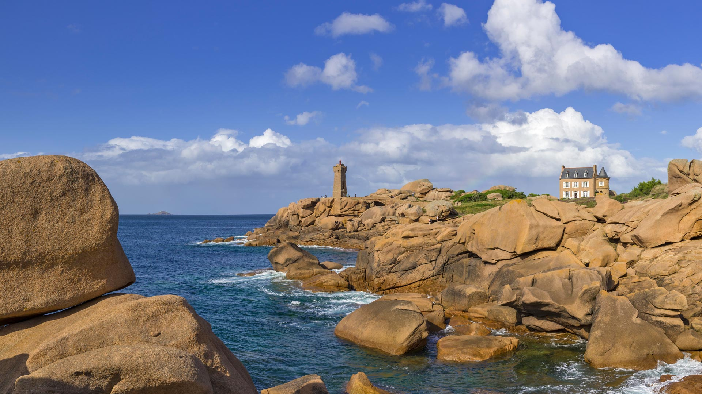
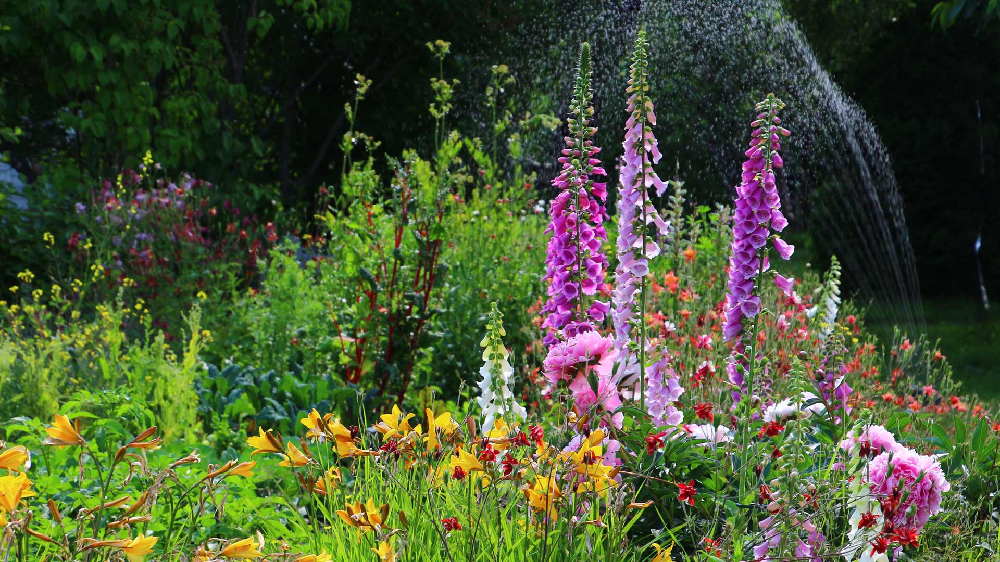

#### 20240605 马达加斯加的马苏阿拉国家公园 (© Dennis van de Water/Shutterstock)

#### 20240604 Chestnut-headed bee-eaters, Bardia National Park, Nepal (© PACO COMO/Shutterstock)

#### 20240603 Bicycles in Copenhagen, Denmark (© Alphotographic/Getty Images)

#### 20240602 みなとみらい 21 地区, 神奈川県 横浜市 (© SeanPavonePhoto/Getty Images)

#### 20240602 普卢马纳克的灯塔，阿摩尔滨海省，法国 (© Christian Handl/Getty Images)

#### 20240602 Flowers blooming in a garden, Alaska (© jet 67/Shutterstock)

#### 20240602 Female Anna's hummingbird, Canada (© Devonyu/iStock/Getty Images)

#### 20240601 San Francisco City Hall lit up in rainbow lights for Pride, California (© Josh Edelson/AFP via Getty Images)

#### 20240601 帝王棕榈树，里约热内卢植物园，巴西 (© Marcia Silva de Mendonca/Getty Images)

