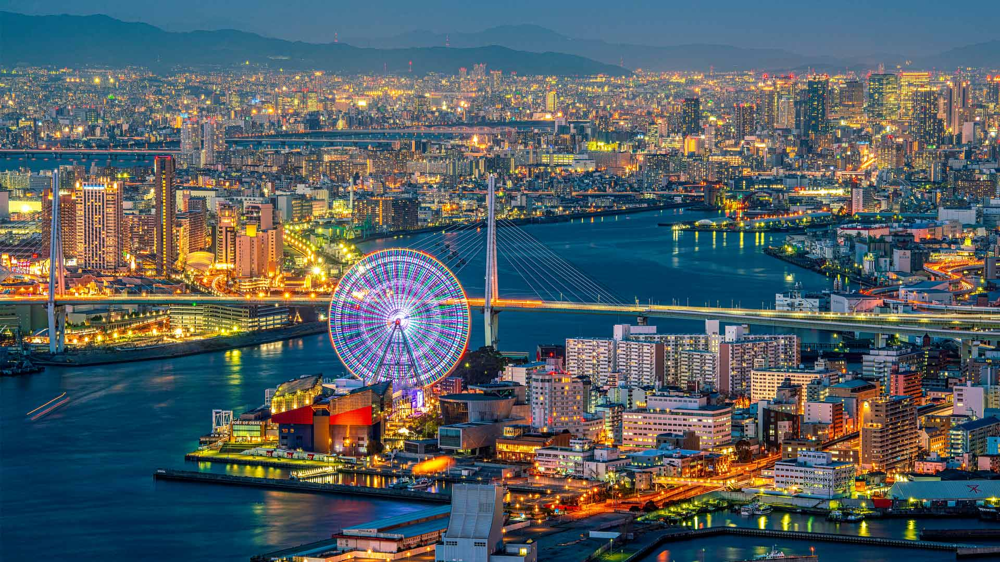
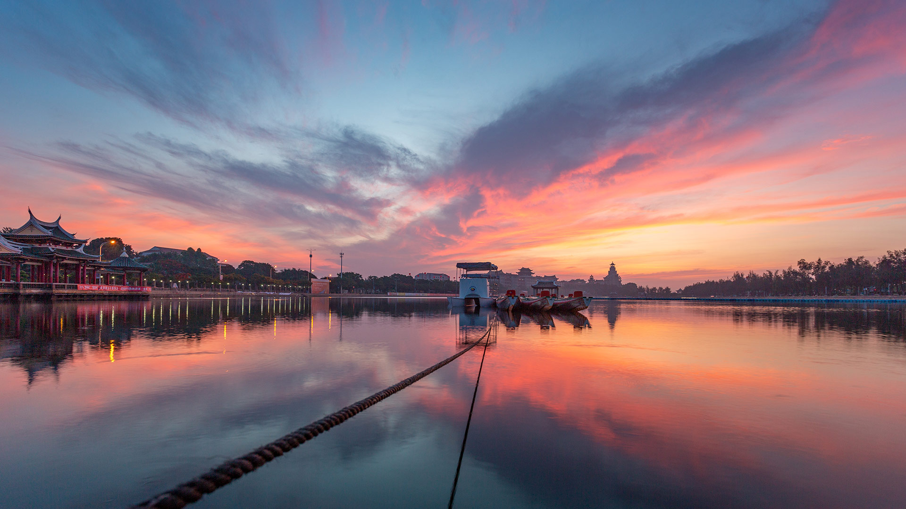
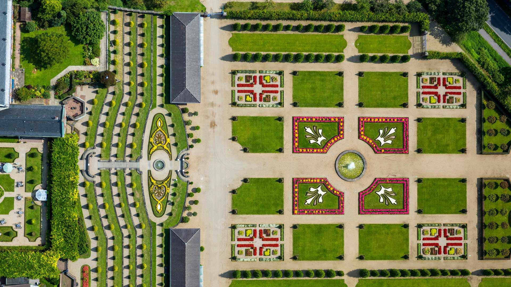
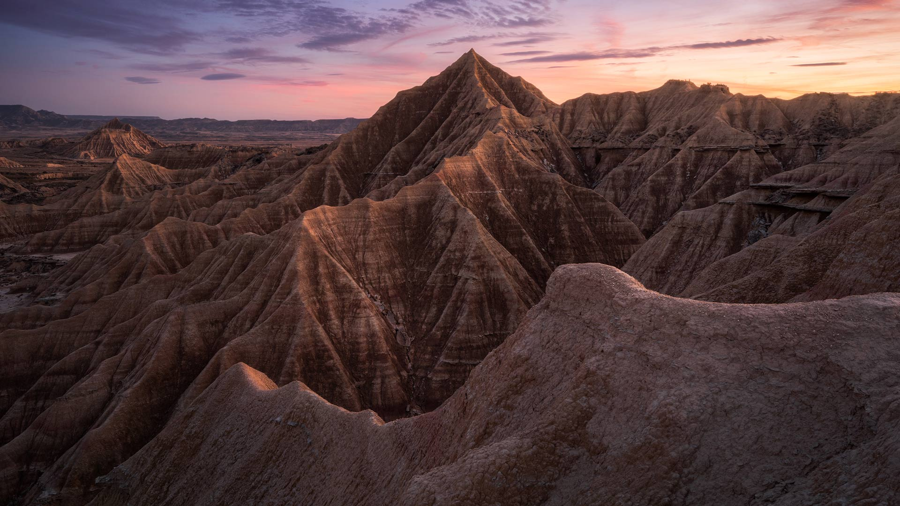
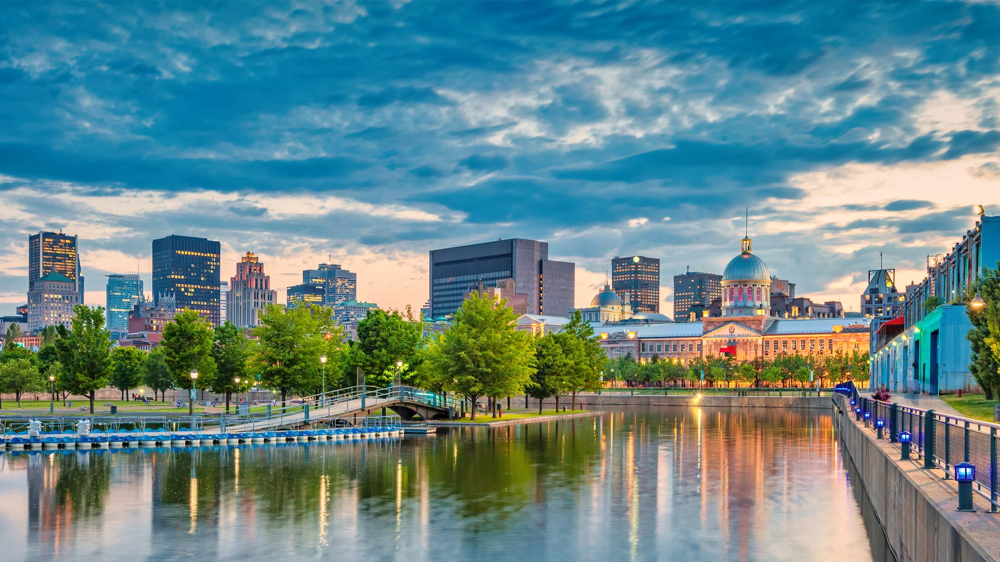
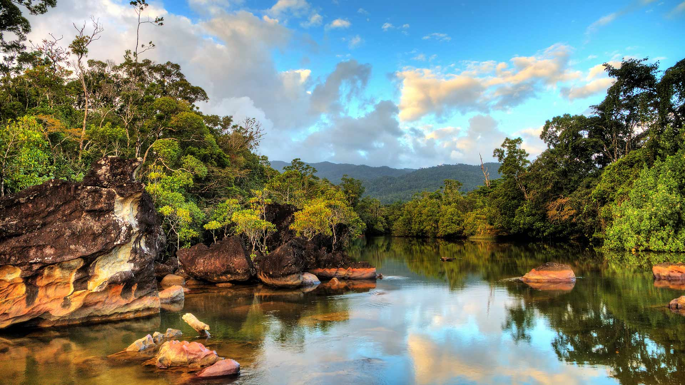
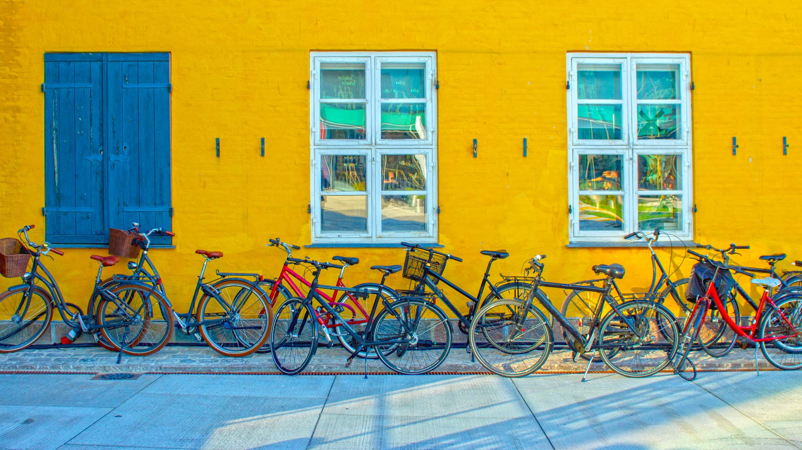
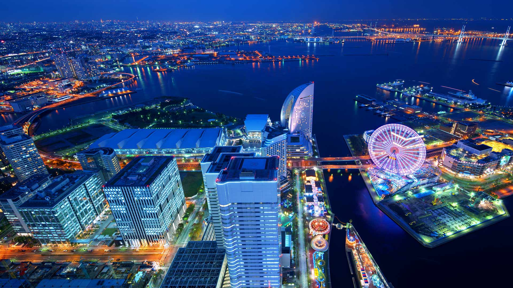
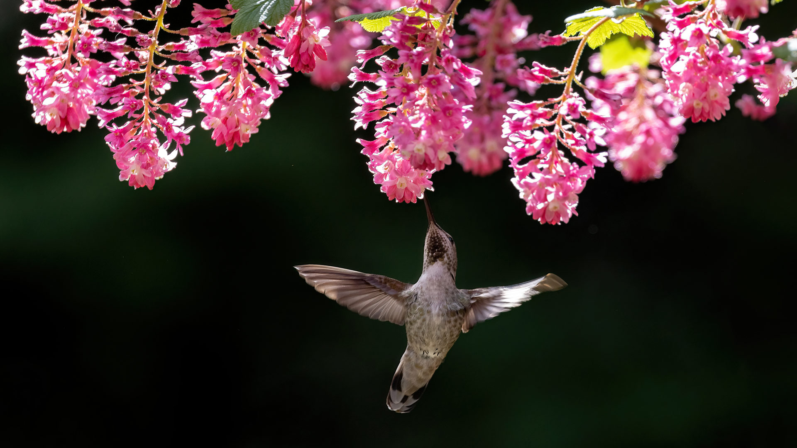
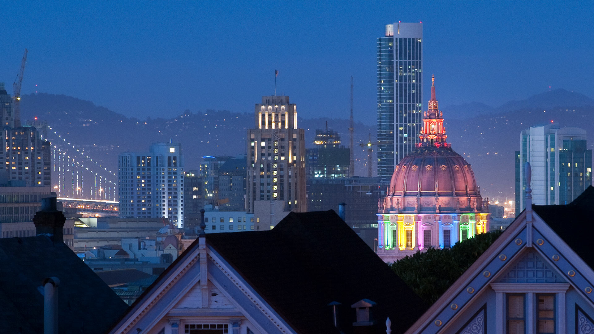

#### 20240610 Osaka at night, Japan (© wichianduangsri/Getty Images)

#### 20240610 龙舟池日出，集美区，厦门，中国 (© outcast85/Getty images)

#### 20240609 Kloster Kamp mit Terrassengarten und Klosterbarockgarten, Kamp-Lintfort, Niederrhein (© Hans Blossey/Alamy)

#### 20240609 Bardenas Reales Biosphere Reserve and Natural Park, Bardenas, Navarra, Spain (© Aliaume Chapelle/Tandem Stills + Motion)

#### 20240608 Confluence of Easter Creek and Killik River, Gates of the Arctic National Park, Alaska (© Patrick J. Endres/Getty Images)

#### 20240608 Skyline of Downtown Montreal, Quebec, Canada (© benedek/E+/Getty Images)

#### 20240607 Family of humpback whales, Dutch Harbor, Alaska (© Jude Newkirk/Amazing Aerial Agency)

#### 20240606 Luftaufnahme der Rossfeld-Panoramastraße, Berchtesgaden, Deutschland (© DieterMeyrl/Getty Images)

#### 20240606 Les Braves monument on Omaha Beach, Normandy, France (© Christopher Furlong/Getty Images)

#### 20240606 オリックスの群れ, ボツワナ (© Karine Aigner/Tandem Stills + Motion)

#### 20240606 蓬德高鸟类公园的大红鹳，卡玛格，法国 (© Yann Guichaoua-Photos/Getty Images)

#### 20240605 Masoala National Park in Madagascar (© Dennis van de Water/Shutterstock)

#### 20240604 Chestnut-headed bee-eaters, Bardia National Park, Nepal (© PACO COMO/Shutterstock)

#### 20240603 Bicycles in Copenhagen, Denmark (© Alphotographic/Getty Images)

#### 20240602 みなとみらい 21 地区, 神奈川県 横浜市 (© SeanPavonePhoto/Getty Images)

#### 20240602 普卢马纳克的灯塔，阿摩尔滨海省，法国 (© Christian Handl/Getty Images)

#### 20240602 Flowers blooming in a garden, Alaska (© jet 67/Shutterstock)

#### 20240602 Female Anna's hummingbird, Canada (© Devonyu/iStock/Getty Images)

#### 20240601 San Francisco City Hall lit up in rainbow lights for Pride, California (© Josh Edelson/AFP via Getty Images)

#### 20240601 帝王棕榈树，里约热内卢植物园，巴西 (© Marcia Silva de Mendonca/Getty Images)

