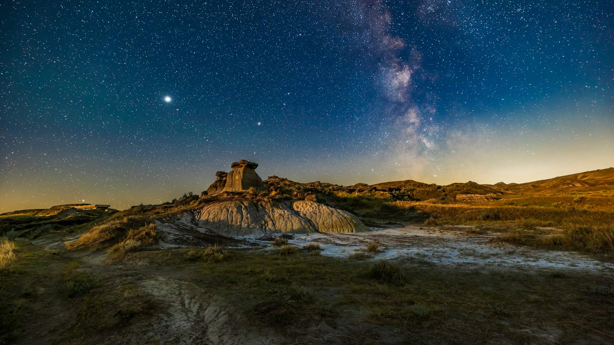
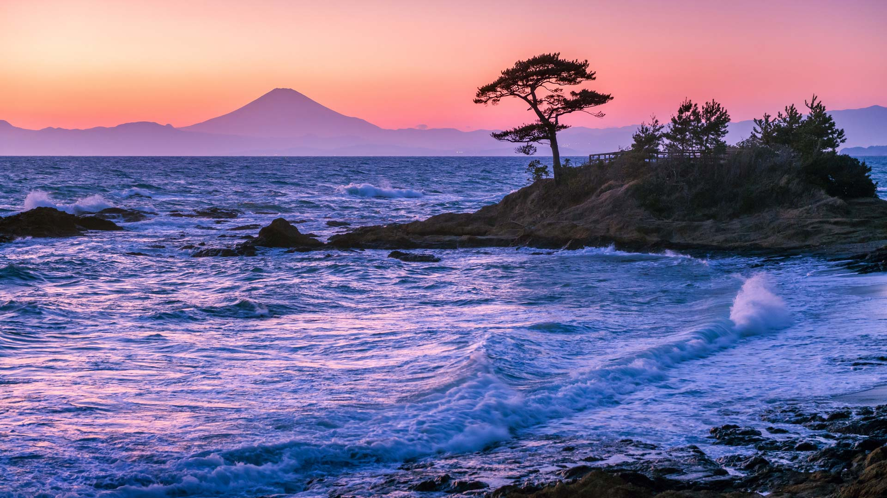
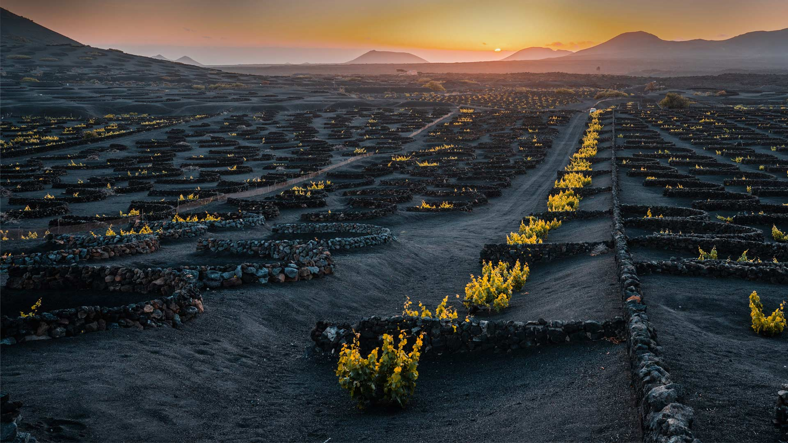
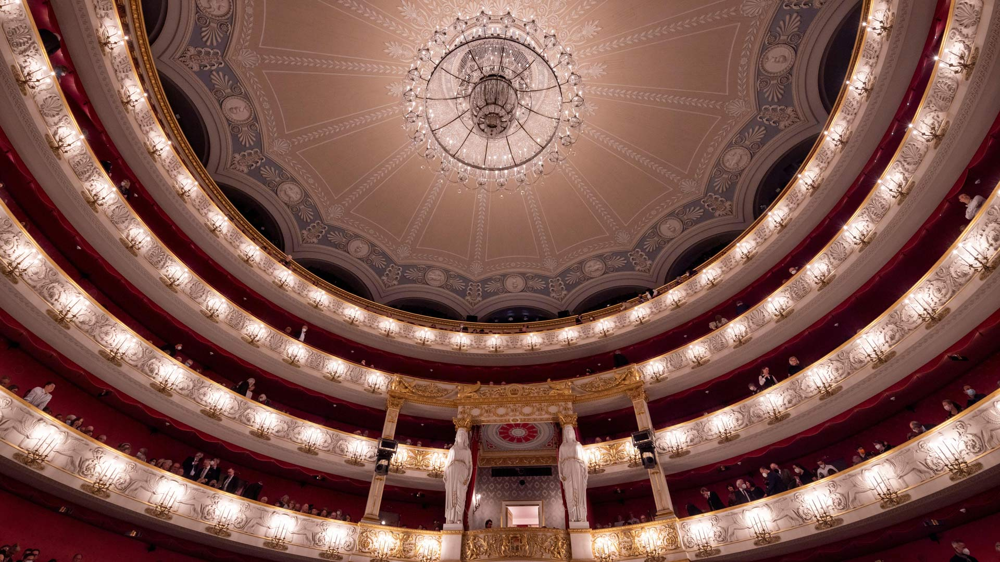
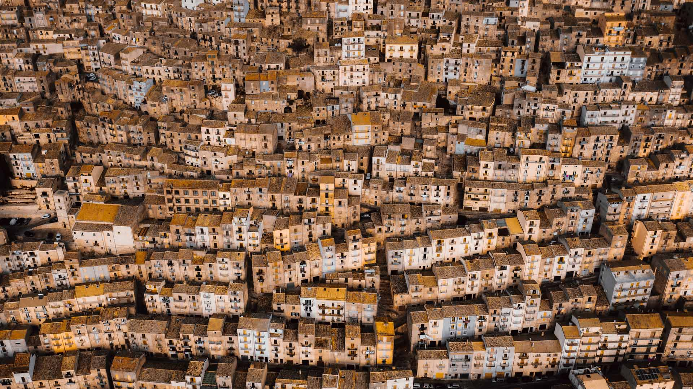
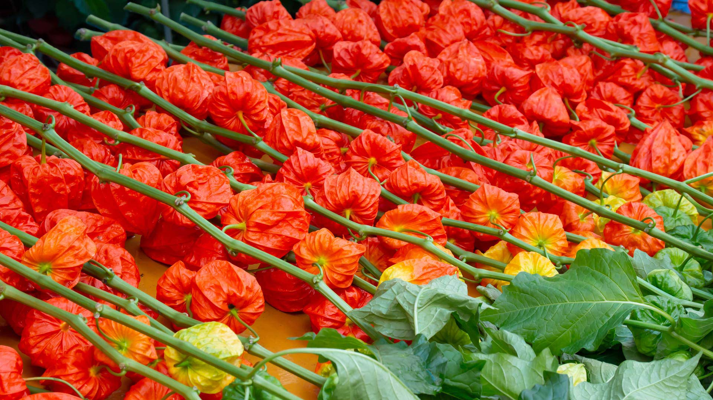
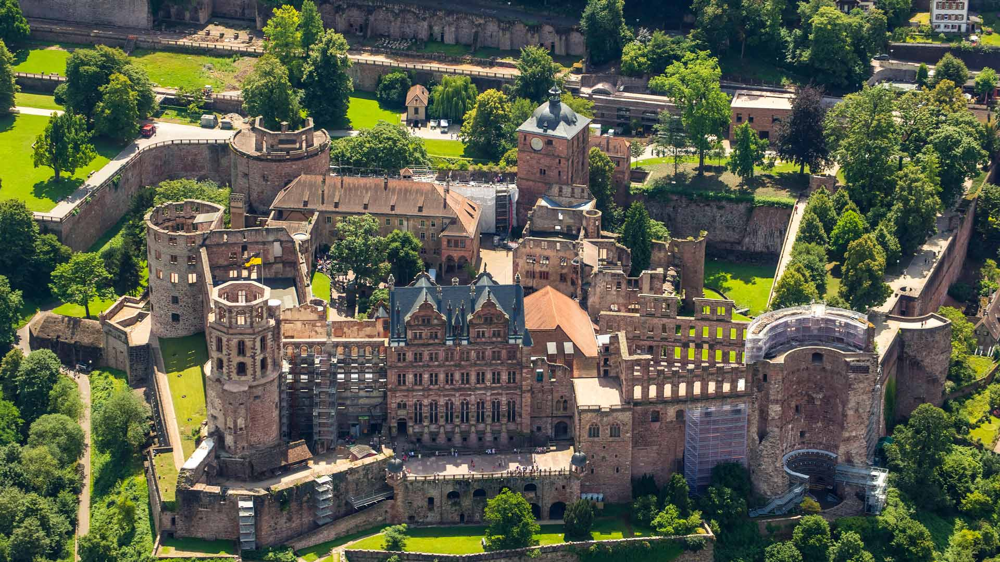

#### 20240716 Summer Milky Way over the badlands formations at Dinosaur Provincial Park, Alberta, Canada (© Alan Dyer/Stocktrek Images/Getty Images)

#### 20240716 斯卡拉布雷的新石器时代遗迹,奥克尼群岛,苏格兰 (© Paul Williams - FunkyStock/Getty Images)

#### 20240715 Tateishi Park, Kanagawa Prefecture, Japan (© blew_s/Shutterstock)

#### 20240714 女王花园群岛的镰形真鲨，古巴 (© Christian Vizl/Tandem Stills + Motion)

#### 20240714 Baia del Silenzio in Sestri Levante, Liguria, Italy (© StevanZZ/Getty Images)

#### 20240714 ベルリンの「博物館島」, ドイツ (© Rudy Balasko/Shutterstock)

#### 20240714 Volcanic vineyard in the La Geria wine region of Lanzarote, Canary Islands, Spain (© Pol Albarrán/Getty Images)

#### 20240714 Münchner Opernfestspiele, München (© B.O'Kane/Alamy Stock Photo)

#### 20240714 La Patrouille de France au-dessus de la pyramide du Louvre pendant la cérémonie du 14 juillet, Paris (© Aurélien Meunier/Getty Images)

#### 20240713 Fairy chimneys and cave dwellings in Cappadocia, Türkiye (© Storm Is Me/Shutterstock)

#### 20240712 Wildflowers in Mount Rainier National Park, Washington (© RomanKhomlyak/Getty Images)

#### 20240711 Gangi, Sicily, Italy (© Andrea Caruso/Amazing Aerial Agency)

#### 20240710 浅草寺のほおずき市, 東京 (© c11yg/Getty Images)

#### 20240710 Collared aracari, Costa Rica (© Juan Carlos Vindas/Getty Images)

#### 20240709 Talampaya National Park, La Rioja province, Argentina (© Gonzalo Azumendi/Getty Images)

#### 20240708 Pont de pierre, Bordeaux (© SergiyN/Getty Images)

#### 20240708 Blueberries growing in the wild (© Baac3nes/Getty Images)

#### 20240707 越中おわら節の踊り, 東京 (© Keith Tsuji/特派員/Getty Images)

#### 20240706 Conwy Castle looking over the River Conwy, Wales (© David Chapman/Alamy)

#### 20240705 Noah Beach in Daintree Rainforest, Queensland, Australia (© bjeayes/Getty Images)

#### 20240704 扎哈拉德拉谢拉，安达卢西亚，西班牙 (© Francesco Carovillano/eStock Photo)

#### 20240704 Rice terraces of Mù Cang Chải, Yên Bái province, Vietnam (© Kiatanan Sugsompian/Getty Images)

#### 20240704 Abbaye Notre-Dame de Sénanque, Gordes, Provence (© Brzozowska/Getty Images)

#### 20240704 Fireworks over the Hudson River on the Fourth of July, New York (© New York on Air/Shutterstock)

#### 20240703 Meerkat family (© anetapics/Shutterstock)

#### 20240702 The Roman amphitheater of Italica, near Seville, Spain (© Moses Palermo/Amazing Aerial Agency)

#### 20240701 Schloss Heidelberg, Heidelberg, Baden-Württemberg (© Hans Blossey/Alamy)

#### 20240701 Fisgard Lighthouse, Esquimalt Harbor, Colwood, British Columbia, Canada (© davemantel/Getty Images)

#### 20240701 Canada Day firework show behind the National Gallery of Canada, Ottawa (© gqxue/iStock Editorial/Gettty Images)

