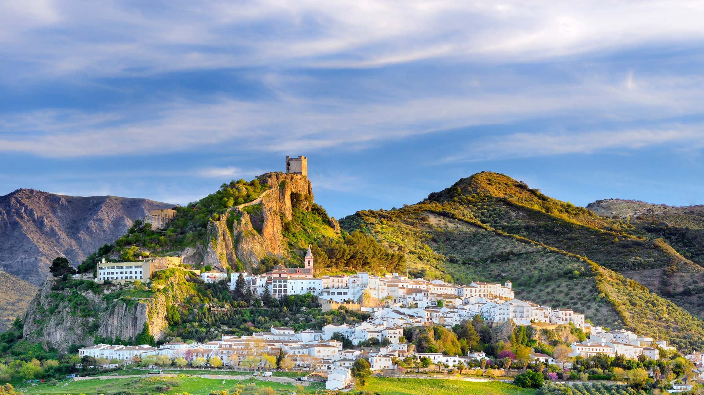
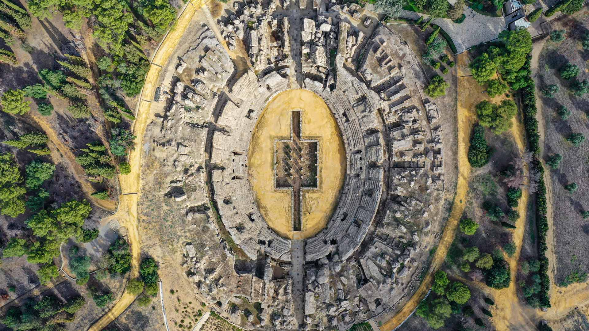

#### 20240704 扎哈拉德拉谢拉，安达卢西亚，西班牙 (© Francesco Carovillano/eStock Photo)

#### 20240704 ムーカンチャイ県, ベトナム (© Kiatanan Sugsompian/Getty Images)

#### 20240703 Meerkat family (© anetapics/Shutterstock)

#### 20240702 The Roman amphitheater of Italica, near Seville, Spain (© Moses Palermo/Amazing Aerial Agency)

#### 20240701 Schloss Heidelberg, Heidelberg, Baden-Württemberg (© Hans Blossey/Alamy)

#### 20240701 Fisgard Lighthouse, Esquimalt Harbor, Colwood, British Columbia, Canada (© davemantel/Getty Images)

#### 20240701 Canada Day firework show behind the National Gallery of Canada, Ottawa (© gqxue/iStock Editorial/Gettty Images)

