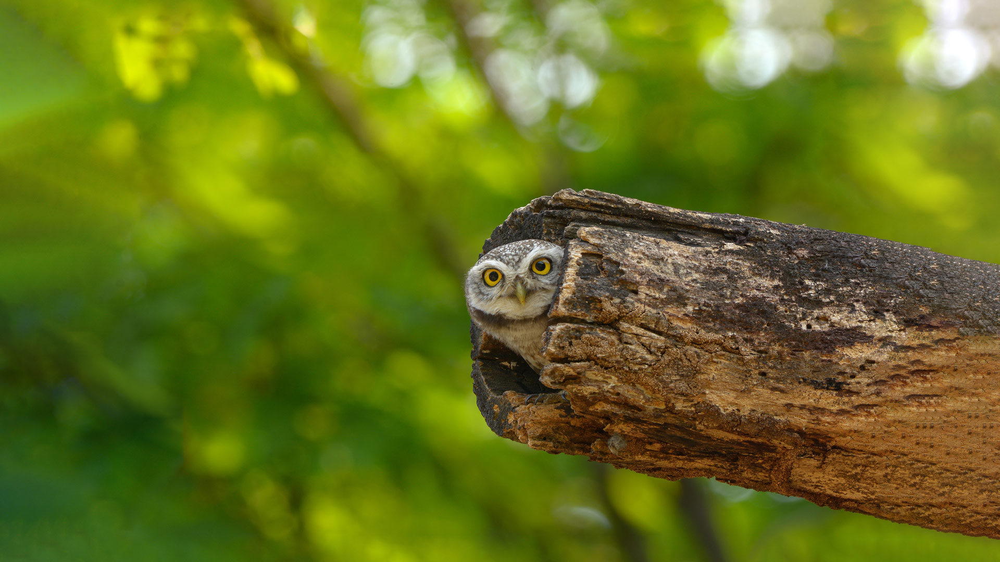
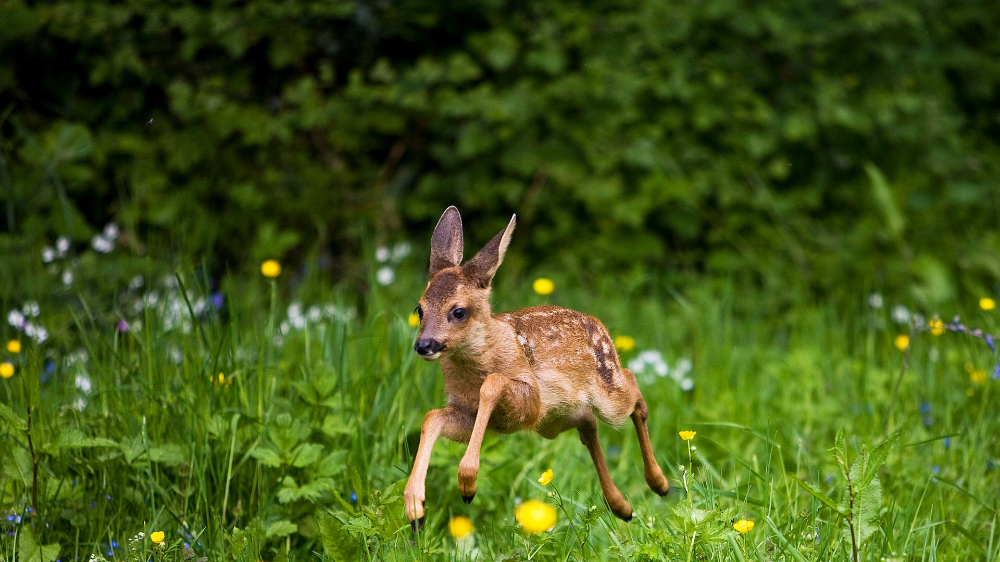

#### 20240809 库斯科附近的萨克塞华曼印加遗址，秘鲁 (© SL_Photography/Getty Images)

#### 20240808 Spotted owlet, Bangkok, Thailand (© Tfilm/Getty Images)

#### 20240807 St. Joseph North Pier Inner and Outer Lights, Michigan (© Kenneth Keifer/Getty Images)

#### 20240806 巨大な吹き流し, 宮城県 仙台市 (© rujin/Shutterstock)

#### 20240806 Molokini Crater, Maui, Hawaii (© Douglas Peebles/eStock Photo)

#### 20240805 Lavender field, Hertfordshire, England (© George W Johnson/Getty Images)

#### 20240804 Sellin Seebrücke, Sellin, Rügen (© SW Travel Imagery/Alamy Foto de stock)

#### 20240803 Three Natural Bridges, Wulong Karst National Geology Park, China (© Pav-Pro Photography Ltd/Shutterstock)

#### 20240803 Faon chevreuil, Normandie (© slowmotiongli/Getty Images)

#### 20240803 Sunset over Anse Champagne beach in Saint-François, Guadeloupe, Caribbean (© Fyletto/Getty Images)

#### 20240802 Trunk Bay, St. John, Virgin Islands National Park (© cdwheatley/Getty Images)

#### 20240802 A family of Canadian geese swimming in a lake in Banff National Park, Alberta (© Chase Dekker Wild-Life Images/Moment/Getty Images)

#### 20240801 豪華絢爛なねぷた, 青森県 弘前市 (© David Parker/Alamy)

#### 20240801 Floating market, Kaptai Lake, Rangamati, Bangladesh (© Azim Khan Ronnie/Amazing Aerial Agency)

