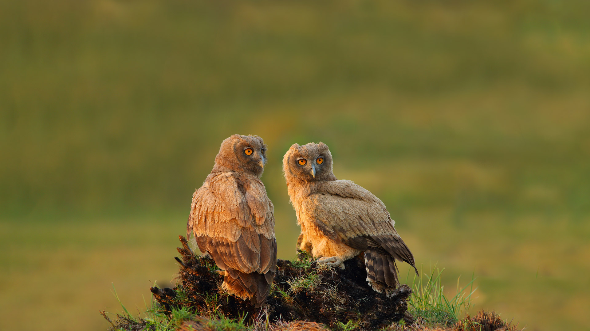
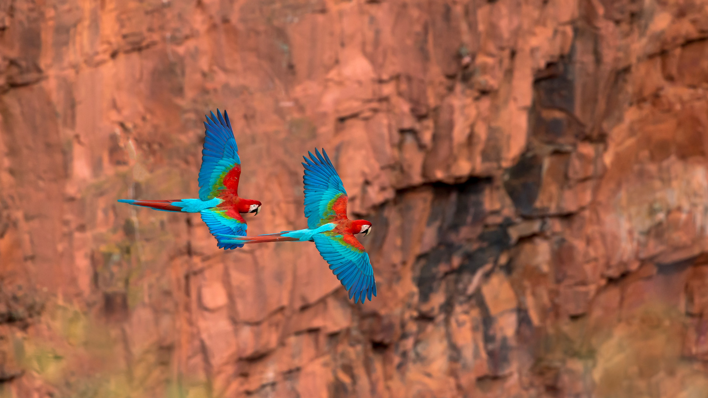

#### 20240906 郡上八幡城, 岐阜県 郡上市 (© ta2funk ito/500px/Getty Images)

#### 20240906 古老山毛榉树，格莱纳里夫森林公园，安特里姆郡，北爱尔兰 (© Dawid K Photography/Shutterstock)

#### 20240905 Toronto city skyline seen from Lake Ontario, Canada (© Roberto Machado Noa/Getty Images)

#### 20240904 Dusky eagle-owls, Pakistan (© zahoor salmi/Getty Images)

#### 20240903 Crystal Lake in the Enchantments, Alpine Lakes Wilderness, Washington (© Mitch Pittman/Tandem Stills + Motion)

#### 20240902 Les Pénitents des Mées, Alpes-de-Haute-Provence (© Cavalier Michel/Hemis/Alamy Stock Photo)

#### 20240902 'Power of the Titans' mural by Andrei Krautsou, North Kansas City, Missouri (© Stephen Taylor/Alamy)

#### 20240902 Milky Way over the Elbow River in southern Alberta, Canada (© Alan Dyer/Stocktrek Images/Getty Images)

#### 20240902 红绿金刚鹦鹉，南马托格罗索州，巴西 (© Ellen Goff/Danita Delimont)

#### 20240901 River Thames, London, England (© Puthipong Worasaran/Getty Images)

