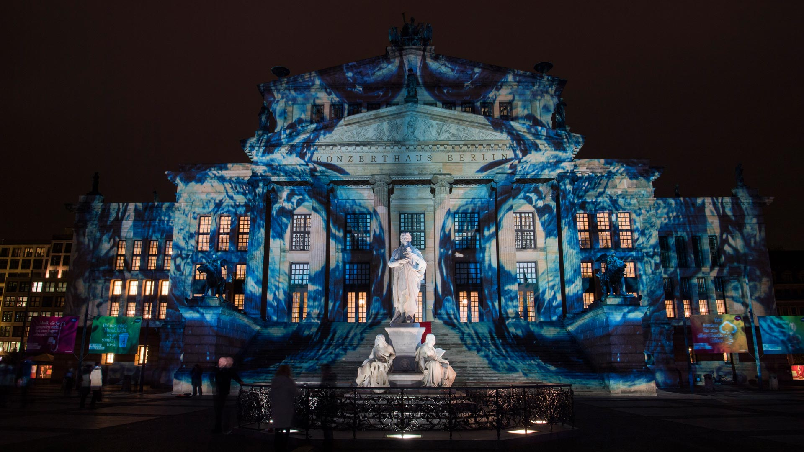
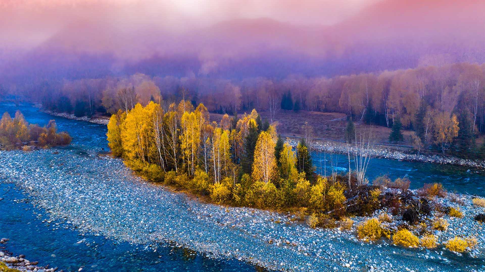
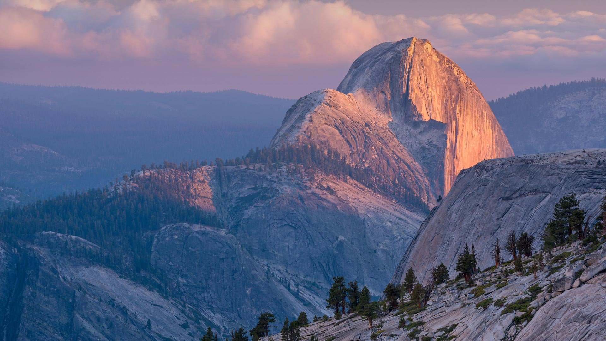

#### 20241015 Great wildebeest migration at Mara River, Kenya (© Ayzenstayn/Getty Images)

#### 20241015 ジュラシック・コーストの化石, イギリス ドーセット州 (© Nature Picture Library/Alamy)

#### 20241014 東京駅, 東京都 (© phutthiseth thongtae/Getty Images)

#### 20241014 Ancestral Pueblo granaries at Nankoweap, Grand Canyon National Park, Arizona (© Andrew Peacock/Tandem Stills + Motion)

#### 20241014 Bateaux dans la baie de Marigot, Terre-de-Haut, archipel des Saintes, Guadeloupe (© Tan Yilmaz/Getty Images)

#### 20241014 可可海滩上的渔船，果阿邦，印度 (© Abhinav Sah/Shutterstock)

#### 20241013 Courtyard of the Maidens, Alcázar of Seville, Spain (© Danny Lehman/Getty Images)

#### 20241012 Wood duck, Quebec, Canada (© Maxime Riendeau/Getty Images)

#### 20241011 黄山云海，安徽省，中国 (© yangyang1991/Getty Images)

#### 20241011 Cape Breton Highlands, Nova Scotia, Canada (© Cavan Images/Alamy)

#### 20241009 Potsdamer Platz in Berlin (© franckreporter/Getty Images)

#### 20241009 Aspens in the White River National Forest, Colorado (© Jason Hatfield/Tandem Stills + Motion)

#### 20241008 Mototi octopus, Lembeh Strait, Indonesia (© Howard Chew/Alamy)

#### 20241008 秋の八甲田ロープウェイ,  青森県 青森市 (© Torsakarin/Getty Images)

#### 20241008 Aerial view of Bora Bora in French Polynesia (© GLF Media/Shutterstock)

#### 20241007 The Elbphilharmonie concert hall in Hamburg, Germany (© Canetti/Shutterstock)

#### 20241007 Cottonwoods through an arch in Coyote Gulch, Glen Canyon Recreation Area, Utah, USA (© Stephen Matera/TANDEM Stills + Motion)

#### 20241006 Sorano, Tuscany, Italy (© Luigi Vaccarella/eStock Photo)

#### 20241006 Kochia, Ibaraki prefecture, Japan (© DigiPub/Getty Images)

#### 20241006 Festival of Lights, Berlin (© JOHN MACDOUGALL/Getty Images)

#### 20241005 African elephants in Tsavo East National Park, Kenya (© Neil Bowman/Minden Pictures)

#### 20241004 Toronto Sign, Nathan Phillips Square, Canada (© Bruce Christie/Moment/Getty Images)

#### 20241004 Jupiter's icy moon Europa (© NASA/JPL-Caltech/SETI Institute)

#### 20241003 Taj Mahal in Agra, Uttar Pradesh, India (© Tanarch/Getty Images)

#### 20241003 Tag der Deutschen Einheit, Berlin (© pensatyva/Getty Images)

#### 20241002 Autumn in the Ogilvie Mountains, Yukon,Canada (© Theo Allofs/Minden Pictures)

#### 20241002 Wind River, Brooks Range, Arctic National Wildlife Refuge, Alaska (© Design Pics/Danita Delimont)

#### 20241001 禾木村的风景，新疆，中国 (© snvv18870020330/Shutterstock)

#### 20241001 Last light on Half Dome, Yosemite National Park, California (© Adam Burton/Alamy)

#### 20241001 Vue aérienne de Bora-Bora, Polynésie française (© GLF Media/Shutterstock)

