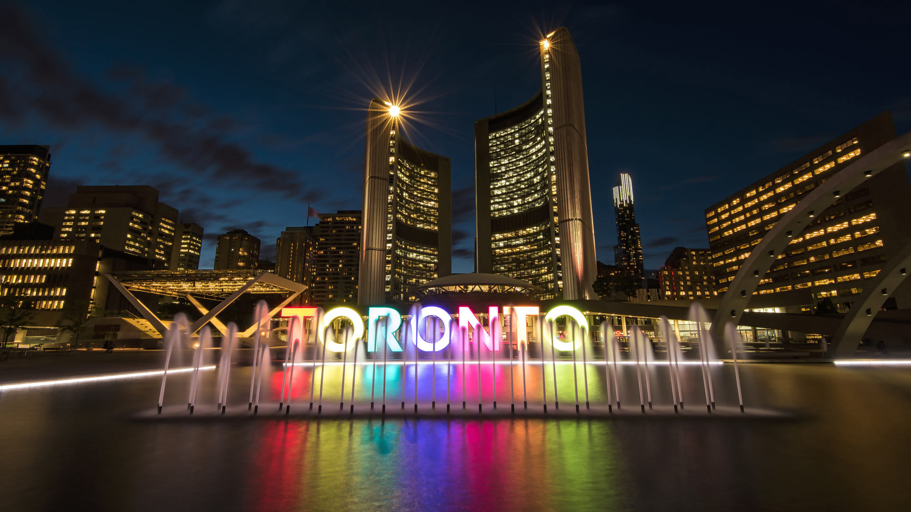
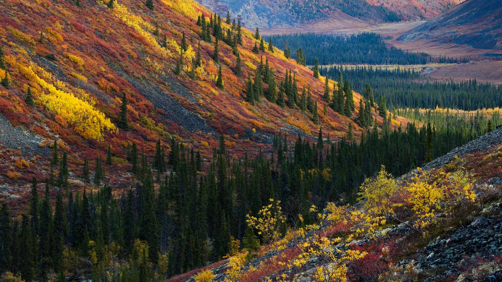

#### 20241005 African elephants in Tsavo East National Park, Kenya (© Neil Bowman/Minden Pictures)

#### 20241004 Toronto Sign, Nathan Phillips Square, Canada (© Bruce Christie/Moment/Getty Images)

#### 20241004 Jupiter's icy moon Europa (© NASA/JPL-Caltech/SETI Institute)

#### 20241003 Tag der Deutschen Einheit, Berlin (© pensatyva/Getty Images)

#### 20241002 Autumn in the Ogilvie Mountains, Yukon,Canada (© Theo Allofs/Minden Pictures)

#### 20241002 Wind River, Brooks Range, Arctic National Wildlife Refuge, Alaska (© Design Pics/Danita Delimont)

#### 20241001 禾木村的风景，新疆，中国 (© snvv18870020330/Shutterstock)

#### 20241001 Last light on Half Dome, Yosemite National Park, California (© Adam Burton/Alamy)

#### 20241001 Vue aérienne de Bora-Bora, Polynésie française (© GLF Media/Shutterstock)

